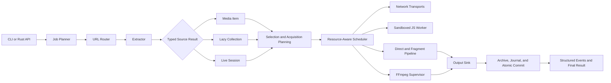
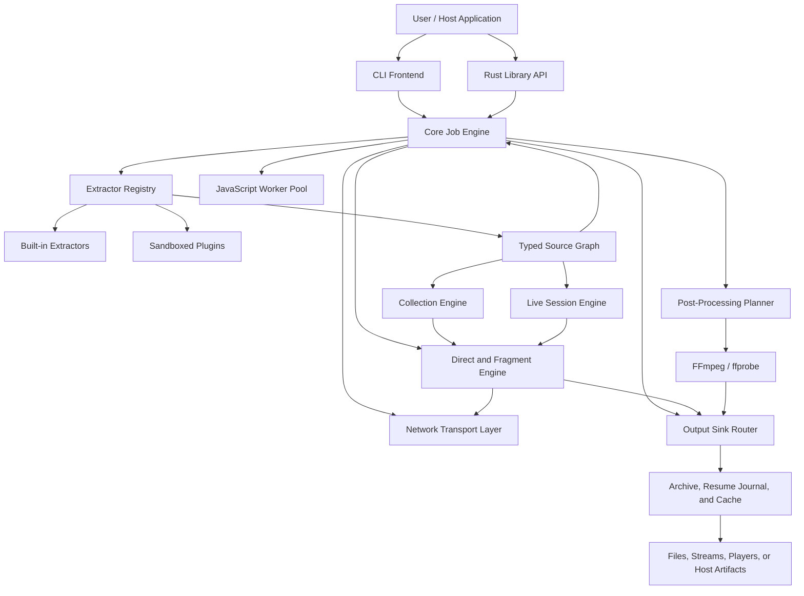
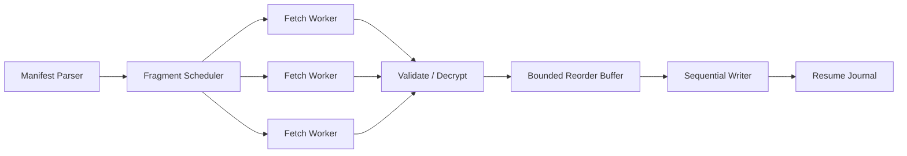

# Ferric Forager — Technical Design

> **Ferric Forager — a Rust-native media extraction and acquisition engine**  
> **Canonical CLI command:** `fforager`  
> **Review status:** Draft for technical peer review  
> **Baseline:** yt-dlp `2026.07.04`  
> **Deployment model:** Standalone project with a first-class Handshake adapter  
> **Primary objective:** Complete Rust rewrite with behavioral compatibility and measurably lower control-plane CPU, memory use, filesystem churn, and orchestration overhead.

---

## Table of Contents

1. [Preamble](#1-preamble)
2. [Executive Summary](#2-executive-summary)
3. [Problem Statement](#3-problem-statement)
4. [Goals](#4-goals)
5. [Non-Goals](#5-non-goals)
6. [Design Principles](#6-design-principles)
7. [Baseline System and Constraints](#7-baseline-system-and-constraints)
8. [Proposed System Architecture](#8-proposed-system-architecture)
9. [Workspace and Module Layout](#9-workspace-and-module-layout)
10. [Core Domain Model](#10-core-domain-model)
11. [Extractor Architecture](#11-extractor-architecture)
12. [URL Routing and Extractor Selection](#12-url-routing-and-extractor-selection)
13. [Networking Architecture](#13-networking-architecture)
14. [Cookie, Authentication, and Session Handling](#14-cookie-authentication-and-session-handling)
15. [Manifest and Fragment Pipeline](#15-manifest-and-fragment-pipeline)
16. [Scheduler and Resource Governance](#16-scheduler-and-resource-governance)
17. [Collection, Playlist, Channel, Feed, and Live Processing](#17-collection-playlist-channel-feed-and-live-processing)
18. [JavaScript Challenge Execution](#18-javascript-challenge-execution)
19. [FFmpeg and Post-Processing Integration](#19-ffmpeg-and-post-processing-integration)
20. [CLI and Behavioral Compatibility](#20-cli-and-behavioral-compatibility)
21. [Plugin System](#21-plugin-system)
22. [CPU, Memory, and I/O Efficiency Design](#22-cpu-memory-and-io-efficiency-design)
23. [Persistence, Resume, and Crash Recovery](#23-persistence-resume-and-crash-recovery)
24. [Security Model](#24-security-model)
25. [Observability and Diagnostics](#25-observability-and-diagnostics)
26. [Testing and Verification Strategy](#26-testing-and-verification-strategy)
27. [Benchmark Plan and Performance Gates](#27-benchmark-plan-and-performance-gates)
28. [Implementation Sequence](#28-implementation-sequence)
29. [Compatibility and Migration Policy](#29-compatibility-and-migration-policy)
30. [Risks and Mitigations](#30-risks-and-mitigations)
31. [Acceptance Criteria](#31-acceptance-criteria)
32. [Peer-Review Questions](#32-peer-review-questions)
33. [Decision Log](#33-decision-log)
34. [References](#34-references)
35. [Appendix A — Example Data Types](#appendix-a--example-data-types)
36. [Appendix B — Example Execution Flow](#appendix-b--example-execution-flow)
37. [Appendix C — Benchmark Matrix](#appendix-c--benchmark-matrix)
38. [Appendix D — Review Checklist](#appendix-d--review-checklist)

---

# 1. Preamble

## 1.1 Reason for the Rust rewrite

Ferric Forager is proposed as a standalone Rust-native media extraction and acquisition engine. Its behavioral baseline is yt-dlp, whose current implementation is mature, broad, and operationally useful, but whose architecture has accumulated around a large Python application, thousands of site-specific extractors, mutable dictionaries, synchronous orchestration, thread-based fragment concurrency, external media tools, optional browser-impersonation transports, and increasingly complex JavaScript challenge handling.

The rewrite is not proposed because every slow download is caused by Python. Download speed is often constrained by the remote server, network path, CDN throttling, disk throughput, or FFmpeg. A language rewrite cannot remove those external limits.

The rewrite is proposed because a native Rust implementation creates an opportunity to redesign the parts that the downloader does control:

- process startup and module initialization;
- URL routing and extractor activation;
- metadata parsing and allocation behavior;
- asynchronous network orchestration;
- fragment scheduling and ordered assembly;
- playlist pipelining;
- retry and backoff policy;
- filesystem churn and resume bookkeeping;
- progress-event overhead;
- process supervision;
- cancellation and shutdown behavior;
- plugin isolation;
- memory safety and concurrency safety;
- integration as a reusable native library rather than only a command-line program.

The intended result is not a literal transliteration of Python classes into Rust. A line-for-line port would preserve most architectural costs while adding migration risk. The intended result is a behaviorally compatible Rust-native system with a cleaner execution model and benchmarked efficiency improvements.

## 1.2 Goal

Build **Ferric Forager**, a complete Rust-native replacement for yt-dlp, that:

1. requires no Python runtime or Python fallback in production builds;
2. preserves the practical command-line behavior and extraction capabilities users depend on;
3. supports direct media, HLS, DASH, Microsoft Smooth Streaming (MSS), heterogeneous collections, playlists, channels, feeds, live sessions, subtitles, thumbnails, metadata, authentication, cookies, proxies, format selection, resume, archive tracking, output sinks, and post-processing;
4. treats individual media, collections, and live sessions as first-class typed source results rather than forcing every URL into a single-file video model;
5. retains FFmpeg as a supervised external media engine rather than attempting to rewrite codecs;
6. supports modern YouTube challenge execution through a sandboxed JavaScript-engine abstraction;
7. reduces avoidable CPU consumption, memory allocation, context switching, file operations, and duplicated parsing;
8. remains maintainable as sites change;
9. can be embedded as a Rust library in a larger application without spawning a new downloader process for every URL.

## 1.3 How the finished system should look

The finished system should be a standalone native executable and reusable Rust library built from the same core crates. Its canonical CLI executable is `fforager`. The CLI should feel familiar to yt-dlp users, while the internal architecture should be a typed, bounded, event-driven pipeline.

The primary resolved object is a **source graph**, not immediately a destination file. A source graph may describe one media item, a lazy collection, or a live session. The planner converts that graph into one or more acquisition plans and output sinks. This permits the same resolved source to be saved, streamed to a player, piped to another process, inspected without downloading, or passed into Handshake without duplicating extractor logic.

Ferric Forager must remain independently buildable, testable, versioned, distributable, and usable without Handshake. Handshake integrates it through a dedicated adapter over the library API or an isolated local-worker protocol. The dependency direction is strictly `Handshake -> Ferric Forager`; the Ferric Forager core must not import Handshake concepts, schemas, UI state, or storage models.

At a high level:



The `fforager` executable should start quickly, initialize only the components required for the current URL, and remain efficient when used as a long-running ingestion service or Handshake-managed worker.

## 1.4 Why this shape is preferred

This shape separates responsibilities that are entangled in many mature downloader implementations:

- **Extractors describe media.** They do not own global execution policy.
- **The scheduler governs resources.** Extractors do not create arbitrary threads or subprocesses.
- **The network layer owns transport correctness.** Cookie scoping, redirects, proxying, TLS behavior, and impersonation are centralized.
- **The fragment pipeline owns ordering and recovery.** Individual HLS or DASH extractors do not reimplement download mechanics.
- **FFmpeg remains isolated.** Codec complexity and native crashes do not enter the Rust process address space.
- **JavaScript execution remains sandboxed.** Untrusted or rapidly changing challenge code is not granted unrestricted process access.
- **Compatibility is tested externally.** The Rust implementation must match observable behavior, not copy internal Python structure.

---

# 2. Executive Summary

Ferric Forager is a full rewrite of yt-dlp in Rust, with no Python dependency. It preserves external tools only where replacing them would constitute a different project: FFmpeg for media processing and a JavaScript engine for modern site challenge execution.

The design uses yt-dlp as the broad extraction and compatibility baseline, while deliberately studying three adjacent systems for capabilities that yt-dlp does not make central: gallery-dl for heterogeneous collections, filters, metadata sidecars, and archive-backed duplicate prevention; Streamlink for reconnectable live sessions and multiple player/output transport modes; and N_m3u8DL-RE for specialized HLS/DASH/MSS track selection, partial ranges, live recording, fragment validation, and mux workflows.[R10][R11][R12][R13][R14][R15] These projects are reference architectures, not runtime dependencies.

The design uses:

- a generated URL-routing index;
- statically compiled built-in extractors;
- strongly typed extraction results with an extension map for uncommon metadata;
- an asynchronous network runtime with bounded concurrency;
- separate resource classes for network, CPU-light parsing, CPU-heavy work, disk I/O, JavaScript, muxing, and transcoding;
- a streaming HLS/DASH/MSS fragment pipeline with a bounded reorder buffer;
- a unified source-result model for media items, lazy collections, and live sessions;
- collection filters, ranges, archive-backed duplicate prevention, and metadata sidecars;
- output sinks for files, standard output, named pipes, local HTTP delivery, players, and host callbacks;
- append-only, crash-safe resume state;
- persistent HTTP pools and persistent JavaScript workers;
- direct argument-vector process spawning without shell interpolation;
- capability-limited third-party plugins;
- differential compatibility tests against a pinned yt-dlp release;
- benchmark gates that reject unproven “optimizations.”

The main engineering difficulty is not downloading bytes. It is maintaining extraction logic for a large and changing set of sites while preserving edge-case behavior. The design therefore treats extractor maintainability, fixtures, routing, reusable site families, and differential testing as first-class concerns.

---

# 3. Problem Statement

## 3.1 User-visible problem

Users can observe high startup overhead, high CPU use during metadata or batch operations, excessive resource use when downloading fragmented media, serial execution across playlist stages, process churn, or high disk activity. Some CPU load may actually come from FFmpeg transcoding or JavaScript execution rather than yt-dlp itself, but the current command does not always make the ownership of that cost obvious.

## 3.2 Architectural problem

The baseline system is a large Python application in which:

- the central `YoutubeDL` object receives a broad dictionary of options;
- extractors are registered and selected according to whether they report that they can handle a URL;
- extractors return dynamic information dictionaries;
- the central object processes results and selects a downloader;
- fragmented downloads can use a `ThreadPoolExecutor`;
- fragment data can be written to individual temporary files, reopened, read, appended, flushed, journaled, and removed;
- full YouTube support requires external JavaScript challenge scripts and a supported JavaScript runtime;
- some sites require browser-request impersonation because of TLS fingerprinting;
- plugins are imported as executable code and are explicitly trusted by the user.

These behaviors are not necessarily defects. They reflect years of compatibility work. They do, however, identify where a new implementation can establish stricter ownership boundaries and lower overhead.

## 3.3 Scope problem

A full rewrite must solve three coupled problems:

1. **Source resolution:** rapidly changing, site-specific reverse engineering and normalization.
2. **Acquisition execution:** networking, scheduling, direct and fragmented transfer, output sinks, resume, formatting, post-processing, logging, and state.
3. **Collection and live semantics:** lazy traversal, hierarchy, filters, archive identity, reconnect behavior, live-window refresh, and partial-result finalization.

The execution engine can be redesigned centrally. The extractor corpus must be migrated and maintained continuously. Collection and live semantics must be represented in the core model rather than added as CLI-only special cases. Success requires all three.

---

# 4. Goals

## 4.1 Functional goals

- Full Rust-native command-line application and library.
- No Python runtime in production.
- Broad behavioral parity with the pinned yt-dlp baseline.
- Direct HTTP and HTTPS downloads.
- HLS, DASH, Microsoft Smooth Streaming (MSS), and common segmented-media workflows.
- Live and video-on-demand handling with explicit session, reconnect, and finalization policy.
- Playlist, channel, gallery, album, post, feed, and heterogeneous collection traversal.
- Lazy collection consumption with bounded look-ahead.
- Collection filtering by metadata, date, size, media type, language, index/range, and extractor-defined fields.
- Archive-backed duplicate prevention with stable source identities.
- Output sinks for atomic files, standard output, named pipes, local HTTP delivery, players, host callbacks, and null/inspection mode.
- Partial segment and time-range acquisition where protocol semantics permit it.
- Multi-track selection for video, audio, and subtitles.
- Format listing, filtering, sorting, and selection.
- Subtitle, thumbnail, chapter, and metadata handling.
- Cookie-file and browser-cookie import.
- Authentication and per-site credentials.
- Proxy support and per-request headers.
- Browser impersonation where required.
- Resume and crash recovery.
- Archive tracking and duplicate prevention.
- FFmpeg probing, muxing, remuxing, transcoding, metadata embedding, and progress reporting.
- JavaScript challenge execution.
- Extensible extractor and post-processing plugin system.
- Windows, Linux, and macOS support.

## 4.2 Performance goals

- Lower cold-start CPU and latency.
- Lower metadata-only CPU use.
- Lower allocation count and peak resident memory.
- Fewer temporary files and filesystem metadata operations.
- Bounded memory under high concurrency.
- Better utilization overlap between extraction, collection traversal, downloading, live refresh, and post-processing.
- Bounded live-session memory independent of stream duration.
- Fast archive membership checks for large collections.
- No throughput regression for direct downloads.
- Efficient multi-job operation in a persistent process.
- Predictable CPU usage through resource-specific concurrency limits.

## 4.3 Quality goals

- Memory-safe core implementation.
- Deterministic and typed state transitions.
- Explicit error taxonomy.
- Structured diagnostics.
- Reproducible benchmark corpus.
- Differential behavior tests.
- Reference-behavior tests for collection, live-session, output-sink, and manifest workflows.
- Fuzz-tested parsers for untrusted manifests and metadata.
- Security boundaries around plugins, JavaScript, filenames, cookies, and subprocesses.

---

# 5. Non-Goals

The first complete release will not attempt to:

- rewrite FFmpeg, libavcodec, or media codecs in Rust;
- implement a new JavaScript language runtime;
- guarantee binary compatibility with Python yt-dlp plugins;
- guarantee byte-identical logs or progress-bar rendering;
- copy the internal class hierarchy of yt-dlp;
- reproduce every option or user-interface convention from gallery-dl, Streamlink, or N_m3u8DL-RE;
- become a general-purpose web crawler or search engine;
- make remote servers, CDNs, or ISP paths faster;
- reduce CPU consumed by an explicitly requested FFmpeg transcode beyond avoiding unnecessary transcoding and scheduling it correctly;
- bypass access controls, DRM, payment systems, or authorization requirements;
- discover, extract, purchase, or obtain decryption keys; only explicitly supplied lawful keys for supported non-DRM encryption may be used;
- preserve undocumented implementation quirks that are not required for practical compatibility unless a compatibility test demonstrates user impact.

---

# 6. Design Principles

## 6.1 Behavioral parity over structural parity

The implementation must reproduce useful external behavior, not Python internals.

## 6.2 Measure before and after

No optimization is accepted solely because it appears theoretically faster. Every significant optimization must include a benchmark or profile demonstrating its effect.

## 6.3 Bounded concurrency everywhere

Tasks, queues, fragment buffers, subprocesses, retries, and pending collection entries must have explicit limits.

## 6.4 Streaming by default

Media bytes, large playlists, manifests, and event output should be streamed rather than fully materialized when the operation permits it.

## 6.5 Strongly typed core, extensible edges

Core fields and state transitions should be typed. Rare or site-specific metadata may use a namespaced extension map.

## 6.6 No shell invocation

External tools are launched with an executable path and argument vector. User-controlled values are never interpolated into a shell command.

## 6.7 Resource ownership is explicit

Each operation declares whether it consumes network, CPU, disk, JavaScript, FFmpeg mux, or FFmpeg transcode capacity.

## 6.8 Compatibility is versioned

The project tests against a pinned baseline release and records intentional divergences. “Latest yt-dlp behavior” is not a stable specification.

## 6.9 Failures are resumable where safe

Interrupted downloads should preserve verified work without preserving untrusted or ambiguous final artifacts.

## 6.10 Security boundaries are default, not optional documentation

Plugins, JavaScript workers, output paths, redirects, cookies, and external downloaders are treated as security-sensitive components.

## 6.11 Source semantics precede destination policy

Extractors identify what a source contains. They do not decide whether the result is saved, streamed, inspected, piped, or registered with a host application. Destination behavior belongs to acquisition planning and output sinks.

## 6.12 Collections and live sessions are not disguised playlists

A finite ordered playlist, an incrementally discovered gallery, a nested feed, and a live sliding manifest have different identity, ordering, retry, and completion semantics. The model may share interfaces where useful, but it must preserve those distinctions.

---

# 7. Baseline System and Constraints

## 7.1 Baseline release

This document uses yt-dlp `2026.07.04` as the fixed behavioral and source baseline. The official project describes yt-dlp as a feature-rich command-line audio/video downloader supporting thousands of sites. The baseline supports CPython and PyPy, recommends FFmpeg and ffprobe, requires `yt-dlp-ejs` for full YouTube support, and uses an external JavaScript runtime such as Deno, Node, or QuickJS for those challenge scripts.[R1][R2]

## 7.2 Extraction and processing flow

The baseline `YoutubeDL` documentation states that information extractors are registered in order, the first suitable extractor extracts information, and `YoutubeDL` processes that information, potentially using a file downloader.[R3]

This produces an observable pipeline that the Rust design must preserve conceptually:

```text
URL -> extractor selection -> extraction result -> format selection
    -> downloader selection -> download -> post-processing -> final output
```

## 7.3 Fragmented downloading

The baseline exposes concurrent native HLS/DASH fragment downloading, with a default concurrency of one.[R4] The pinned fragment implementation uses a thread pool when concurrency exceeds one. It downloads fragments through temporary fragment files, reads fragment contents, appends them to the destination, flushes output, updates a `.ytdl` JSON state file, and removes fragment files unless retention is requested.[R5]

This provides compatibility and granular resume behavior, but it also creates a clear design target for reducing file operations and duplicate I/O.

## 7.4 JavaScript challenges

The baseline requires external challenge scripts and a supported JavaScript runtime for full YouTube support. Deno is recommended and runs code with restricted filesystem and network permissions. The previous native interpreter approach is no longer used for YouTube.[R2][R6]

The Rust rewrite must therefore provide a JavaScript-engine abstraction and sandbox. Rewriting Python in Rust does not remove the need to execute JavaScript supplied or transformed from site player code.

## 7.5 Browser impersonation

The baseline recommends `curl_cffi`/`curl-impersonate` for browser-request impersonation, which may be required for sites using TLS fingerprinting.[R1]

A standard Rust HTTP client alone is not sufficient for full compatibility. The transport layer must model browser fingerprints or provide a compatibility transport.

## 7.6 FFmpeg

The baseline identifies FFmpeg and ffprobe as strongly recommended and required for merging separate audio/video files and many post-processing operations.[R1] FFmpeg supports stream copy, which avoids re-encoding when the source streams can be placed directly in the target container.[R7]

The Rust rewrite should preserve FFmpeg as an external process and prefer stream copy whenever it satisfies the requested output.

## 7.7 Plugin trust

The baseline documentation warns that plugins are imported even when not invoked and that plugin code is not checked.[R8]

The Rust design should not reproduce this trust model by default.

## 7.8 Security lessons from recent releases

The baseline release history includes fixes concerning command injection, cookie leakage, unsafe output file types, and arbitrary code execution through external downloader handling.[R9]

These classes of failure inform the subprocess, cookie, filename, manifest, and plugin designs below.


## 7.9 Adjacent reference architectures

Ferric Forager is not designed only from yt-dlp. Three adjacent projects expose mature behaviors that should inform the Rust design.

| Project | Primary strength | Adopted design lessons | Explicit non-copying boundary |
|---|---|---|---|
| gallery-dl | Galleries, posts, albums, metadata-rich collections | Lazy extractor initialization, collection ranges and filters, metadata sidecars, hierarchical child extraction, archive-backed duplicate prevention, configurable naming and post-processing | Ferric Forager will not copy gallery-dl's Python object model or configuration grammar verbatim |
| Streamlink | Live-stream resolution and player delivery | A live session as a durable object; stream qualities; reconnect/refresh policy; transport to players through stdin, named pipe, HTTP, or passthrough; low-latency options as explicit policy | Ferric Forager will not be playback-only and will retain archival, metadata, and collection capabilities |
| N_m3u8DL-RE | Specialized HLS/DASH/MSS acquisition | Track selection, concurrent media-track download, custom segment/time ranges, segment-count validation, live recording controls, real-time or post-download muxing, and explicit user-supplied-key adapters | Ferric Forager will not make a direct manifest URL mandatory, acquire keys, bypass DRM, or move webpage/source resolution into the protocol engine |

Official gallery-dl documentation describes galleries and collections, file ranges and filters, SQLite/PostgreSQL-backed archives, metadata files, and post-processors.[R10][R11][R12] Streamlink documents a plugin-oriented live-stream resolver and three primary player transports: standard input, named pipe, and HTTP, with optional URL passthrough.[R13][R14] N_m3u8DL-RE identifies itself as a cross-platform DASH/HLS/MSS downloader and exposes track selectors, thread counts, partial ranges, live recording, segment validation, real-time muxing, and post-download muxing.[R15][R16]

These references establish requirements and comparison tests. They are not runtime dependencies, compatibility promises, or permission to duplicate implementation details.

---

# 8. Proposed System Architecture

## 8.1 System context



## 8.2 Main layers

### Frontends

- CLI parser and compatibility aliases.
- Rust library API.
- Optional daemon/service frontend.

### Core planning

- configuration resolution;
- job creation;
- URL normalization;
- extractor routing;
- source-graph validation;
- collection and live-session policy resolution;
- format and track selection;
- output-sink and path planning;
- execution graph creation.

### Execution services

- networking;
- cookies and sessions;
- JavaScript workers;
- HLS/DASH/MSS manifest parsing;
- fragment downloading;
- direct downloading;
- collection traversal and filtering;
- live refresh and reconnect control;
- output sinks and disk writer;
- archive, deduplication, and cache;
- FFmpeg supervision.

### Extension boundary

- built-in extractors are statically linked;
- third-party extractors run behind a versioned capability-limited interface;
- post-processors use the same policy.

## 8.3 Job graph

Each media operation is represented as a directed acyclic graph where possible. Live streams may use a controlled cyclic refresh loop inside a node, but the external job state remains explicit.

```mermaid
flowchart LR
    A[Resolve URL] --> B[Acquire Session]
    B --> C[Extract Source Graph]
    C --> D{Source Kind}
    D -- Media --> E[Select Formats and Tracks]
    D -- Collection --> F[Apply Range, Filter, Archive, and Ordering Policy]
    D -- Live --> G[Create Live Session and Refresh Policy]
    F --> H[Resolve Entries Lazily]
    H --> E
    G --> E
    E --> I{JS Challenge Required?}
    I -- Yes --> J[Solve Challenge]
    I -- No --> K[Build Acquisition Plan]
    J --> K
    K --> L{Direct or Manifest?}
    L -- Direct --> M[Direct Transfer]
    L -- HLS/DASH/MSS --> N[Fetch and Refresh Manifest]
    N --> O[Download, Validate, and Order Fragments]
    M --> P[Output Sink]
    O --> P
    P --> Q{Post-process?}
    Q -- No --> R[Archive and Finalize]
    Q -- Yes --> S[FFmpeg Plan and Execute]
    S --> R
```



## 8.4 Control plane and data plane

The design separates small metadata and planning operations from bulk media movement.

**Control plane:**

- configuration;
- URL matching;
- extraction;
- metadata parsing;
- format selection;
- scheduling;
- state transitions;
- events.

**Data plane:**

- media response bodies;
- fragment buffers;
- direct file writes;
- decrypt/pack operations;
- FFmpeg input/output.

This separation allows the control plane to remain typed and low-allocation while the data plane uses streaming buffers and backpressure.

---

# 9. Workspace and Module Layout

The repository should be a Cargo workspace. Built-in extractor modules should be grouped by shared infrastructure rather than creating one crate per site.

```text
ferric-forager/
├── Cargo.toml
├── crates/
│   ├── fforager-cli/
│   ├── fforager-api/
│   ├── fforager-core/
│   ├── fforager-config/
│   ├── fforager-model/
│   ├── fforager-events/
│   ├── fforager-error/
│   ├── fforager-extractor-api/
│   ├── fforager-extractor-registry/
│   ├── fforager-format-selector/
│   ├── fforager-output-template/
│   ├── fforager-network/
│   ├── fforager-cookies/
│   ├── fforager-manifest/
│   ├── fforager-collection/
│   ├── fforager-live/
│   ├── fforager-sink/
│   ├── fforager-downloader/
│   ├── fforager-fragment-pipeline/
│   ├── fforager-scheduler/
│   ├── fforager-persistence/
│   ├── fforager-archive/
│   ├── fforager-dedup/
│   ├── fforager-javascript/
│   ├── fforager-ffmpeg/
│   ├── fforager-plugin-host/
│   ├── fforager-protocol/
│   ├── fforager-worker/
│   ├── fforager-compatibility/
│   └── fforager-testkit/
├── extractors/
│   ├── generic/
│   ├── youtube-family/
│   ├── social/
│   ├── streaming/
│   ├── news/
│   ├── audio/
│   ├── education/
│   └── shared/
├── integrations/
│   └── handshake-fforager/
├── fixtures/
├── integration-tests/
├── fuzz/
├── benches/
└── docs/
```

## 9.1 Crate-boundary rules

- `model` contains data structures only and must not depend on networking or FFmpeg.
- `extractor-api` exposes a narrow host interface.
- extractors may request network operations only through the extraction context.
- extractors do not spawn tasks, threads, or processes directly.
- `scheduler` owns concurrency permits.
- `collection` owns traversal, filtering, hierarchy, range, and archive-check orchestration.
- `live` owns refresh, reconnect, continuity, and partial-finalization state.
- `sink` owns delivery to files, pipes, HTTP, players, and host callbacks.
- `network` owns request execution and credential policy.
- `ffmpeg` owns all FFmpeg and ffprobe process interaction.
- `persistence` owns resume journals, cache metadata, and atomic commits.
- frontends depend on core; core does not depend on frontends.
- `handshake-fforager` is an integration adapter and must not be a dependency of any Ferric Forager core crate.
- the standalone CLI, worker protocol, and Rust library are peers over the same core engine.

## 9.2 Dependency direction

```text
fforager-cli / fforager-worker / external adapters
   ↓
core / compatibility
   ↓
extractor-api / scheduler / downloader / ffmpeg / javascript
   ↓
model / events / error / persistence primitives
```

Cycles between crates are prohibited.

---

# 10. Core Domain Model

## 10.1 Typed source-result model

The baseline's dynamic information dictionary is flexible but makes field validity, ownership, and cloning difficult to reason about. Ferric Forager should type common fields, preserve uncommon metadata in a namespaced extension map, and distinguish source semantics before execution planning.

```rust
pub enum SourceResult {
    Media(MediaItem),
    Collection(MediaCollection),
    Live(LiveSessionDescriptor),
    Redirect(SourceRedirect),
    TransparentRedirect(TransparentRedirect),
}
```

A `MediaItem` describes one logical item and may contain multiple alternative or complementary assets. A `MediaCollection` describes a finite or incrementally discovered hierarchy of entries. A `LiveSessionDescriptor` describes a currently changing source whose completion is controlled by stop policy rather than source exhaustion.

```rust
pub struct MediaCollection {
    pub id: CollectionId,
    pub kind: CollectionKind,
    pub title: Option<String>,
    pub ordering: CollectionOrdering,
    pub estimated_len: Option<u64>,
    pub entries: Box<dyn CollectionEntryStream>,
    pub archive_namespace: ArchiveNamespace,
    pub extensions: ExtensionMap,
}

pub struct LiveSessionDescriptor {
    pub id: LiveSessionId,
    pub variants: Vec<MediaFormat>,
    pub refresh: RefreshPolicy,
    pub reconnect: ReconnectPolicy,
    pub continuity: ContinuityPolicy,
    pub finalization: PartialFinalizationPolicy,
}
```

A media item contains:

- stable extractor key and source identity;
- canonical webpage URL;
- title and description;
- uploader/channel metadata;
- timestamps and durations;
- alternative and complementary media assets;
- subtitles, thumbnails, chapters, and attachments;
- comments or auxiliary data where requested;
- typed availability and access status;
- namespaced extension metadata.

The acquisition planner maps a `SourceResult` plus user policy into one or more `AcquisitionPlan` objects. This separates source discovery from destination choice.

## 10.2 Format model

A `MediaFormat` must distinguish:

- direct URL versus manifest reference;
- video, audio, subtitle, image, attachment, document, or combined stream;
- container;
- codecs;
- bitrate;
- resolution and frame rate;
- language;
- dynamic-range and color metadata;
- protocol;
- fragment information;
- required request headers;
- cookie/session binding;
- DRM or unsupported protection indication;
- expiration time where known.

## 10.3 Validity states

Extraction data may be incomplete or provisional. The model should represent that explicitly rather than using sentinel values.

Examples:

```rust
pub enum Availability {
    Public,
    AuthenticationRequired,
    SubscriptionRequired,
    GeoRestricted,
    PasswordRequired,
    Scheduled,
    Processing,
    Removed,
    Unavailable,
    Unknown,
}
```

## 10.4 Ownership and allocation

- Response bodies use reference-counted immutable byte buffers.
- Parsers borrow from buffers where lifetime and complexity remain manageable.
- Long-lived normalized fields are allocated once.
- Metadata is not cloned merely to cross pipeline stages; stages share immutable records and produce explicit deltas.
- Large optional fields are loaded on demand.

## 10.5 Extension fields

The extension map must be namespaced to avoid collisions:

```text
youtube.po_token_context
soundcloud.track_station_urn
site_name.custom_field
```

Extension values must be serializable and size-limited.


## 10.6 Acquisition and output-sink model

The same resolved media source may have multiple destinations. Output is represented explicitly rather than inferred only from a filename.

```rust
pub enum OutputSinkSpec {
    AtomicFile { path: PathBuf },
    Stdout,
    NamedPipe { path: PathBuf },
    LocalHttp { bind: SocketAddr, token: Option<Secret> },
    Player { executable: PathBuf, transport: PlayerTransport },
    HostCallback { endpoint: HostSinkId },
    Null,
}

pub enum PlayerTransport {
    Stdin,
    NamedPipe,
    LocalHttp,
    UrlPassthrough,
}
```

The sink contract includes backpressure, cancellation, seekability, expected lifetime, atomicity, and whether post-processing may require a temporary seekable file. Streamlink's documented stdin, named-pipe, HTTP, and passthrough player modes motivate these transport classes.[R14]

---

# 11. Extractor Architecture

## 11.1 Extractor contract

An extractor receives a normalized URL and a restricted context. It returns structured extraction data or a typed error.

```rust
pub trait Extractor: Send + Sync {
    fn descriptor(&self) -> &'static ExtractorDescriptor;

    fn extract<'a>(
        &'a self,
        context: &'a ExtractionContext,
        url: &'a CanonicalUrl,
    ) -> ExtractFuture<'a>;
}
```

The context exposes:

- scoped HTTP requests;
- cookie/session access;
- credential lookup;
- cache access;
- JavaScript challenge requests;
- logging and trace spans;
- cancellation;
- extractor arguments;
- recursion/redirect budget.

It does not expose:

- arbitrary process spawning;
- unrestricted filesystem access;
- raw scheduler internals;
- global mutable configuration;
- unrestricted cookie stores belonging to other sessions.

## 11.2 Extractor descriptors

Each built-in extractor declares static metadata:

```rust
pub struct ExtractorDescriptor {
    pub key: &'static str,
    pub display_name: &'static str,
    pub domains: &'static [&'static str],
    pub path_prefixes: &'static [&'static str],
    pub url_patterns: &'static [PatternId],
    pub priority: i32,
    pub capabilities: ExtractorCapabilities,
}
```

Descriptors are collected by a build step into the generated registry.

## 11.3 Shared extractor families

Many site extractors share APIs, players, embeds, or authentication systems. The port should identify and build shared families before migrating individual sites.

Examples of shared components:

- common embedded-player parsers;
- GraphQL clients;
- JSON-LD and Open Graph parsing;
- WordPress media extraction;
- Brightcove-family extraction;
- Vimeo embeds;
- common HLS/DASH normalizers;
- shared social-platform APIs;
- common login/token flows.

## 11.4 Extractor determinism

Given the same fixture responses, configuration, and clock inputs, an extractor should produce the same normalized result. Nondeterministic values such as current time, random request IDs, and temporary tokens are supplied through the context and can be controlled in tests.

## 11.5 Extractor maintenance requirements

Every extractor must include:

- URL-routing tests;
- at least one recorded metadata fixture where legally and technically possible;
- expected normalized result snapshot;
- error-case tests;
- declared network endpoints;
- authentication requirements;
- known live-only behavior;
- ownership or maintenance group;
- last verified date.

---

# 12. URL Routing and Extractor Selection

## 12.1 Problem

Evaluating a large set of full regular expressions against every input URL wastes CPU and complicates priority behavior.

## 12.2 Routing pipeline

```text
Parse URL
  -> normalize scheme and host
  -> domain/suffix index
  -> path-prefix index
  -> candidate extractor list
  -> final pattern validation
  -> priority resolution
  -> generic fallback
```

## 12.3 Generated index

The build process generates:

- exact-domain map;
- domain-suffix trie;
- path-prefix index;
- candidate arrays sorted by priority;
- precompiled final matchers;
- collision report.

The registry must support inspection:

```text
--explain-extractor URL
```

Expected output:

```text
Normalized host: www.example.com
Domain candidates: example:video, example:playlist
Path candidates: example:video
Selected extractor: example:video
Reason: full URL pattern matched; priority 100
```

## 12.4 Lazy initialization

Only the selected extractor and its shared dependencies are initialized. Built-in registry metadata is static. Expensive state such as API clients, token managers, or JavaScript workers is acquired only when required.

## 12.5 Generic fallback

The generic extractor is always last. It must not mask a more specific extractor failure unless compatibility policy explicitly allows fallback.

---

# 13. Networking Architecture

## 13.1 Transport abstraction

A single transport cannot guarantee both maximum native efficiency and compatibility with all fingerprint-sensitive sites. The network layer therefore exposes a common request interface over multiple transport implementations.

```rust
pub trait HttpTransport: Send + Sync {
    fn execute<'a>(&'a self, request: HttpRequest) -> HttpFuture<'a>;
    fn capabilities(&self) -> TransportCapabilities;
}
```

Planned transports:

1. **Native Rust transport** for standard HTTP/1.1, HTTP/2, proxies, compression, ranges, and connection pooling.
2. **Browser-impersonating transport** for sites requiring specific TLS and HTTP fingerprints.
3. **External downloader adapter** only where explicitly selected, with strict argument handling and credential policy.
4. **WebSocket transport** where an extractor requires it.

## 13.2 Transport selection

Selection is based on:

- extractor request requirements;
- explicit user setting;
- site compatibility policy;
- proxy type;
- protocol support;
- fingerprint profile;
- security restrictions.

The transport decision is visible in debug output.

## 13.3 Connection pools

Connection pools are keyed by security-relevant context:

- scheme;
- origin;
- proxy;
- impersonation profile;
- client certificate context;
- cookie/session partition where required.

Connections must not be reused across incompatible credential or fingerprint contexts.

## 13.4 Request model

Requests use typed headers and immutable bodies. Header cloning should be minimized through shared base-header sets plus small per-request overlays.

Request fields include:

- method;
- URL;
- scoped headers;
- optional body;
- redirect policy;
- retry class;
- timeout class;
- expected response type;
- credential policy;
- byte range;
- transport requirement;
- response-size limit for metadata requests.

## 13.5 Redirect policy

On cross-origin redirects:

- authorization headers are stripped unless explicitly allowed;
- cookies are re-evaluated against the destination URL;
- origin-bound headers are removed;
- redirect count is bounded;
- downgrade from HTTPS to HTTP is rejected by default;
- local-network destinations are governed by configurable SSRF policy.

## 13.6 Retries

Retries are classified, not blanket repeated.

Retryable examples:

- transient connection reset;
- timeout;
- selected 5xx responses;
- selected 429 responses with backoff;
- incomplete fragment body;
- recoverable range failure.

Non-retryable examples:

- invalid URL;
- authentication rejection without refreshed credentials;
- deterministic parser failure;
- unsupported encryption;
- output permission failure;
- policy rejection.

Retry budgets exist per request, per fragment, per media item, and per overall job.

---

# 14. Cookie, Authentication, and Session Handling

## 14.1 Session partitions

Cookies, authorization tokens, impersonation profiles, and extractor state are held in explicit session partitions. A job references a partition ID rather than a global mutable cookie jar.

## 14.2 Cookie correctness

The implementation must enforce:

- domain matching;
- host-only cookies;
- path matching;
- secure-only transmission;
- expiry;
- same-site semantics where relevant to simulated browser flows;
- redirect re-evaluation;
- no forwarding to external downloader processes unless the downloader is trusted and the cookie scope is preserved.

## 14.3 Browser-cookie import

Browser database reading is implemented as a separate component with:

- read-only database access;
- platform-specific decryption adapters;
- explicit browser/profile selection;
- domain filters;
- no permanent copying of unrelated cookies;
- redaction in logs.

## 14.4 Credentials

Credential sources are resolved in order:

1. explicit per-job value;
2. named credential profile;
3. netrc-compatible source;
4. extractor-specific secure storage adapter;
5. interactive prompt when allowed.

Secrets are wrapped in redacting types and never included in ordinary serialization.

---

# 15. Manifest and Fragment Pipeline

## 15.1 Supported manifest classes

The manifest layer should support at minimum:

- HLS master and media playlists;
- DASH MPD;
- Microsoft Smooth Streaming manifests where non-DRM acquisition is supported;
- common byte-range media;
- initialization segments;
- encryption metadata used by supported non-DRM streams;
- live-window refresh;
- discontinuities;
- alternate video, audio, and subtitle tracks;
- multi-period and segment timelines;
- user-selected fragment-index and time ranges;
- live recording limits and start policies;
- fragment URL inheritance and query propagation.

## 15.2 Streaming pipeline



## 15.3 Bounded reorder buffer

Concurrent fragments complete out of order. The system retains only a bounded window of completed fragments. When the next expected fragment is available, it is passed to the writer and released.

Limits are defined by:

- maximum fragment count in memory;
- maximum bytes in memory;
- maximum out-of-order distance;
- per-job memory budget;
- global memory budget.

If the buffer reaches a limit, fetch workers are backpressured.

## 15.4 Memory versus disk spill

Fragments remain in memory when small and within budget. A fragment is written to a spill file when:

- it exceeds the in-memory threshold;
- global memory pressure is high;
- the user selects crash-durable fragment mode;
- the output protocol requires deferred assembly;
- decryption or packing requires random access.

Spill files are not the default path for every fragment.

## 15.5 Output writing

The writer:

- writes in sequence;
- avoids flushing on every fragment unless durability policy requires it;
- updates a coalesced journal checkpoint;
- maintains byte and fragment checksums where configured;
- exposes progress through rate-limited events;
- supports cancellation at safe boundaries.

## 15.6 Adaptive concurrency

Concurrency begins at a conservative configured value. An optional controller may adjust it using:

- smoothed throughput;
- round-trip time;
- error rate;
- 429/503 responses;
- queue occupancy;
- disk-writer backlog;
- memory pressure;
- origin-specific connection policy.

Adaptive changes are bounded by user and extractor limits. The controller must be benchmarked against fixed concurrency and can be disabled.

## 15.7 Fragment integrity

Validation may include:

- expected byte length;
- HTTP range correctness;
- content-range validation;
- decrypt block size;
- container/header sanity checks;
- checksum when supplied by the manifest;
- sequence number consistency.

A fragment is journaled as complete only after validation and successful handoff to durable output state.


## 15.8 Track selection and partial acquisition

The manifest engine exposes protocol-level track descriptors independently of webpage-level format selection. Selection predicates may use media type, language, role, codec, resolution, frame rate, channel count, dynamic range, bitrate, group ID, and playlist duration.

Example:

```bash
fforager manifest URL \
  --video 'resolution>=3840,codec~=hevc,best=1' \
  --audio 'language in [en,ja],best=2' \
  --subtitle 'language=en,all'
```

Partial acquisition supports segment-index and time ranges when the manifest and container permit correct initialization and timestamp reconstruction:

```bash
fforager manifest URL --range 00:05:00-00:20:00
fforager manifest URL --segments 100-399
```

N_m3u8DL-RE exposes comparable track filtering, custom ranges, concurrent selected-track download, segment-count validation, and mux controls; these are treated as reference behaviors for the Ferric Forager protocol engine.[R15]

## 15.9 Live manifest execution

A live source is not considered complete when the first manifest snapshot is exhausted. The live engine maintains:

- refresh cadence derived from protocol metadata and bounded user policy;
- media-sequence and timeline continuity;
- duplicate and gap detection;
- discontinuity and rendition-switch handling;
- reconnect budget and backoff;
- recording limit or operator stop condition;
- partial-output finalization after a clean stop or recoverable failure;
- bounded retention of fragment identity independent of stream duration.

The system supports two mux strategies:

1. **record then mux**, which is more recoverable and should be the default;
2. **real-time pipe mux**, which reduces intermediate storage but increases sensitivity to stalls and downstream process failure.

N_m3u8DL-RE documents both post-download muxing and real-time live pipe muxing and warns that pipe-based operation can lose live data in unstable environments.[R15] Ferric Forager therefore treats real-time pipe mux as an explicit opt-in mode with diagnostics and a documented recovery tradeoff.

---

# 16. Scheduler and Resource Governance

## 16.1 Resource classes

Every executable node declares one or more resource classes:

```rust
pub enum ResourceClass {
    NetworkMetadata,
    NetworkMedia,
    CpuLight,
    CpuHeavy,
    DiskRead,
    DiskWrite,
    JavaScript,
    FfmpegMux,
    FfmpegTranscode,
}
```

## 16.2 Separate limits

Example policy:

```toml
[scheduler]
metadata_requests = 16
media_downloads = 6
fragments_per_download = 8
cpu_light_jobs = 8
cpu_heavy_jobs = 2
javascript_jobs = 2
ffmpeg_mux_jobs = 2
ffmpeg_transcode_jobs = 1
pending_collection_entries = 128
live_sessions = 4
player_sinks = 2
```

These values are configuration examples, not universal defaults.

## 16.3 Task ownership

- Network tasks run on the async runtime.
- Blocking filesystem calls use a bounded blocking pool where native async file APIs are not appropriate.
- CPU-heavy parsing or cryptography can use a dedicated CPU pool.
- FFmpeg and JavaScript are subprocess or embedded-engine jobs behind permits.
- Extractors request work; they do not select executor threads.

## 16.4 Fairness

The scheduler must prevent one large collection or live stream from starving other jobs. Fairness is applied at:

- job level;
- origin level;
- resource class;
- fragment queue;
- FFmpeg queue.

## 16.5 Cancellation

Cancellation propagates from job to child nodes. Components must distinguish:

- immediate cancellation;
- graceful stop after current fragment;
- finish current media item but stop collection traversal;
- stop downloading but allow already-started post-processing;
- live-stream stop with valid partial finalization.

## 16.6 Backpressure

Backpressure is mandatory between:

- collection extraction and media resolution;
- live manifest refresh and fragment acquisition;
- fragment fetch and reorder buffer;
- reorder buffer and disk writer;
- download completion and FFmpeg queue;
- event producers and UI/log consumers.

---

# 17. Collection, Playlist, Channel, Feed, and Live Processing

## 17.1 Unified collection stream

A collection extractor returns a lazy entry stream rather than a fully populated vector whenever the source allows incremental traversal.

```rust
pub trait CollectionEntryStream: Send {
    fn next_entry<'a>(&'a mut self) -> CollectionFuture<'a>;
    fn checkpoint(&self) -> Option<CollectionCheckpoint>;
}
```

An entry can be media, a nested collection, a redirect, or a metadata-only record. This supports galleries, albums, posts with multiple attachments, channels, feeds, playlists, manga chapters, and nested collection hierarchies.

## 17.2 Collection identity and hierarchy

Each collection and entry receives a stable source identity derived from extractor namespace and source-provided identifiers. URLs alone are not sufficient because signed URLs expire and the same logical item may have multiple representations.

```rust
pub struct SourceIdentity {
    pub extractor: ExtractorKey,
    pub namespace: String,
    pub source_id: String,
    pub variant: Option<String>,
}
```

Parent-child relationships are preserved so output templates and archive policy can use account, gallery, album, post, chapter, and asset context.

## 17.3 Filtering, ranges, and selection

Filtering occurs as early as correctness permits:

1. metadata-only predicates before asset resolution;
2. source-level ranges before child extraction;
3. asset predicates after file metadata is known;
4. size predicates after headers when size was unavailable earlier.

Supported predicate classes include:

- collection index or slice;
- creation date;
- media type;
- language;
- width, height, duration, and file size;
- tags and creator metadata;
- extractor-specific typed fields;
- duplicate/archive status.

Example:

```bash
fforager collect URL \
  --range '1:500' \
  --filter 'media_type in [image,video] and width >= 1920' \
  --date-after 2026-01-01
```

Gallery-dl's documented file ranges, metadata-aware filtering, child extraction, and powerful naming/configuration behavior provide reference cases for this layer.[R10][R11][R12]

## 17.4 Archive-backed duplicate prevention

The archive records stable source identities only after the configured success event. It must support:

- transactionally recording completed assets;
- checking large archives without loading all IDs into memory;
- separate namespaces for source assets, generated metadata, and post-processing actions;
- configurable record timing: per asset or successful collection completion;
- import from compatible text-based yt-dlp archives where identity mapping is known;
- SQLite as the default embedded implementation;
- an optional remote database backend behind the storage trait.

Gallery-dl uses database-backed archives to skip previously downloaded files and supports both SQLite and PostgreSQL-backed archive storage.[R11] Ferric Forager adopts the scalable membership-check concept, not gallery-dl's exact schema.

## 17.5 Metadata sidecars and organization

Collections can emit versioned JSON or JSON Lines metadata sidecars independently of media download. Sidecar generation supports include/exclude projections, custom derived fields, stable schema versioning, and path templates. Metadata-only mode must not require downloading media bodies.

```bash
fforager collect URL --no-media --metadata jsonl --output metadata.jsonl
```

## 17.6 Pipeline overlap

The system can overlap:

- traversing later collection pages;
- resolving current entries;
- downloading previous entries;
- generating metadata sidecars;
- muxing completed entries.

The overlap remains bounded by scheduler policy and archive lookups.

## 17.7 Ordering policy

User-visible output order and final filename sequence must remain deterministic even when execution overlaps. Entries carry logical indices and hierarchy paths. Event consumers may select:

- real-time completion order;
- logical source order;
- grouped-by-parent order;
- compact progress summary.

## 17.8 Failure and resume policy

The planner supports:

- abort on first error;
- skip failed entries;
- maximum total or consecutive errors;
- retry failed entries after a collection pass;
- checkpoint pagination cursors;
- checkpoint nested collection state;
- continue from the first uncommitted entry;
- preserve completed archive records without marking incomplete assets.

## 17.9 Live-session sinks

A live session may have one or more sinks, subject to an explicit fan-out buffer budget:

```text
Live source
├── atomic recording file
├── player transport
├── Handshake frame/audio consumer
└── metadata and health event stream
```

A slow sink must not cause unbounded memory growth. The planner either backpressures the source, drops data only under an explicit lossy policy, or disconnects the lagging sink. Streamlink's player transports demonstrate the practical need for standard-input, named-pipe, HTTP, and URL-passthrough modes.[R14]

Example:

```bash
fforager watch URL --quality best --record stream.mkv --player vlc
fforager watch URL --serve-http 127.0.0.1:0 --record-limit 02:00:00
```

---

# 18. JavaScript Challenge Execution

## 18.1 Requirement

Some modern extractors require real JavaScript execution. The Rust rewrite must not depend on Python’s previous interpreter model.

## 18.2 Engine abstraction

```rust
pub trait JavaScriptEngine: Send + Sync {
    fn execute<'a>(&'a self, request: JsRequest) -> JsFuture<'a>;
    fn capabilities(&self) -> JsCapabilities;
}
```

Backends may include:

- persistent sandboxed Deno workers;
- persistent QuickJS workers;
- an embedded engine behind a feature flag;
- a site-specific compiled transformation only when proven equivalent, with runtime fallback.

## 18.3 Persistent workers

Workers remain alive across jobs to avoid repeated process startup and script initialization. The parent communicates through framed, versioned IPC.

Cache keys include:

- script content hash;
- challenge implementation version;
- engine identity and version;
- execution mode;
- relevant extractor version.

## 18.4 Sandbox policy

Default JavaScript workers receive:

- no arbitrary filesystem access;
- no arbitrary network access;
- no inherited secrets;
- fixed memory limit;
- execution timeout;
- bounded output size;
- restricted environment variables;
- isolated temporary directory only when required.

## 18.5 Failure handling

Failures are classified as:

- runtime unavailable;
- incompatible runtime version;
- script parse error;
- challenge mismatch;
- timeout;
- memory limit;
- protocol error;
- sandbox violation.

Debug diagnostics include hashes and versions, not sensitive input values.

---

# 19. FFmpeg and Post-Processing Integration

## 19.1 Boundary

FFmpeg and ffprobe remain external executables. They are discovered, version-probed, capability-probed, and supervised by Rust.

## 19.2 Post-processing plan

The planner creates a typed operation graph rather than directly constructing arbitrary command text.

Examples:

- merge separate video and audio;
- remux container;
- transcode audio;
- transcode video;
- embed subtitles;
- convert subtitles;
- embed thumbnail;
- write metadata;
- split chapters;
- remove sponsor segments where supported;
- normalize file timestamps.

## 19.3 Stream-copy preference

The planner should prefer packet/stream copy when:

- no filter requires decoded frames;
- selected source codecs are compatible with the target container;
- timestamps can be represented safely;
- the requested operation is merge or remux only.

Transcoding is selected only when required by the requested output or container constraints.

## 19.4 Process execution

- Executable and arguments are passed directly to the OS.
- No shell is involved.
- File paths are separate arguments.
- Standard streams are controlled.
- Progress uses FFmpeg’s machine-readable progress mode where possible.
- Process groups/job objects support full-tree cancellation.
- Exit status, stderr tail, and operation plan are retained in structured diagnostics.

## 19.5 Concurrency classes

Mux and transcode jobs use separate permits. A cheap stream-copy merge must not be queued behind an unrelated long transcode if resources allow both.

## 19.6 Temporary outputs

FFmpeg writes to a job-scoped temporary path. The result is validated and atomically renamed into the final destination.

---

# 20. CLI and Behavioral Compatibility

## 20.1 Product and command identity

The formal product name is **Ferric Forager**.

> **Ferric Forager — a Rust-native media extraction and acquisition engine**

The canonical executable and command name is:

```text
fforager
```

Examples:

```bash
fforager inspect URL
fforager formats URL
fforager fetch URL
fforager fetch --audio-only URL
fforager collect URL
fforager watch URL --record stream.mkv
fforager manifest URL --range 00:05:00-00:20:00
fforager pipe URL --player vlc
fforager --compat-report
```

`fforager` is the stable command identity used by documentation, scripts, packages, worker discovery, and Handshake integration. A `yt-dlp` compatibility alias may be offered separately for migration testing, but it is not the canonical product or executable name.

## 20.2 Compatibility objective

The CLI should accept the majority of commonly used yt-dlp options and preserve their practical semantics. Compatibility is tracked in a generated matrix.

Categories include:

- general options;
- network options;
- authentication;
- video selection;
- download options;
- filesystem and output templates;
- format selection;
- subtitles;
- thumbnails;
- metadata;
- post-processing;
- extractor arguments;
- plugins;
- archive and duplicate behavior;
- collection filtering and ranges;
- live-session and output-sink policy;
- verbosity and simulation.

## 20.3 Parsing strategy

The parser supports:

- long options;
- short aliases;
- repeated options;
- config files;
- environment-aware defaults;
- preset aliases;
- per-extractor arguments;
- argument provenance inspection.

## 20.4 Compatibility report

```text
fforager --compat-report
```

Outputs:

- implemented options;
- partially implemented options;
- intentionally unsupported options;
- semantic differences;
- required external dependencies;
- active compatibility profile.

## 20.5 Output templates

The output-template engine is a dedicated parser and evaluator, not string replacement scattered through the codebase. It supports:

- typed fields;
- date formatting;
- numeric formatting;
- conditional alternatives;
- path sanitization;
- missing-field policy;
- shell-safe formatting only as explicit output data, never implicit execution.

## 20.6 Format selector

Format selection is implemented as a parsed expression language with:

- selection operators;
- fallbacks;
- filters;
- sorting;
- merge planning;
- explanatory output.

```text
fforager --explain-format-selection URL
```

The explain mode records why each candidate was accepted, rejected, or ranked.

## 20.7 Machine-readable API stability

JSON output schemas are versioned. The project may provide:

- yt-dlp-compatible JSON mode;
- native typed JSON schema;
- event stream schema.

---

# 21. Plugin System

## 21.1 Built-in versus third-party code

Built-in extractors compile into the binary. Third-party code is not loaded into the core process by default.

## 21.2 Stable extension protocol

Rust does not provide a stable native ABI suitable for arbitrary dynamic libraries across toolchain versions. The default plugin boundary should therefore be one of:

1. a versioned process protocol; or
2. a capability-limited WebAssembly component interface.

The initial implementation may support both, but one must be designated canonical.

## 21.3 Capabilities

Plugins request explicit capabilities:

- network to declared origins;
- cookie access for declared domains;
- JavaScript execution;
- temporary storage quota;
- metadata cache;
- post-processing request construction.

Plugins do not receive arbitrary filesystem, process, or environment access.

## 21.4 Plugin lifecycle

Plugins are discovered from manifests. Code is loaded only after routing selects a plugin candidate or the user invokes it explicitly.

## 21.5 Python plugin compatibility

Python plugin binary compatibility is outside the no-Python target. Existing Python plugins must be ported or run in an explicitly separate legacy bridge that is not included in production/no-Python builds. The canonical implementation does not depend on such a bridge.

---

# 22. CPU, Memory, and I/O Efficiency Design

## 22.1 CPU-efficiency rules

1. No polling loop where an event, timer, or completion signal exists.
2. No unbounded task spawning.
3. No unbounded channel or queue.
4. No initialization of unrelated extractors.
5. No repeated compilation of static matchers.
6. No full response buffering for media bodies.
7. No per-fragment temporary file by default.
8. No destination flush after every fragment by default.
9. No metadata clone without an ownership reason.
10. No blocking process wait on an async executor thread.
11. No global progress mutex on the hot path.
12. No post-processing transcode when stream copy satisfies the request.
13. No high-frequency terminal redraw; progress updates are coalesced.
14. No optimization merged without measurement.

## 22.2 Startup optimization

- generated static registry;
- lazy extractor construction;
- lazy JavaScript worker startup;
- lazy FFmpeg probe with cached result;
- no plugin code import at startup;
- single config-resolution pass;
- minimal logging initialization;
- release build with link-time optimization evaluated by benchmark, not assumed.

## 22.3 Parsing optimization

- parse only required metadata fields where possible;
- borrow from immutable response buffers;
- retain raw JSON slices for optional subtrees;
- avoid converting every number or timestamp until requested;
- reuse parser state where safe;
- cap metadata response size;
- use specialized parsers only after profiling identifies a real bottleneck.

## 22.4 Network optimization

- persistent connection pools;
- DNS caching through the selected transport;
- protocol-aware connection limits;
- direct streaming to the writer;
- response decompression in the streaming path;
- byte-range resume;
- request deduplication for shared manifests/player scripts;
- conditional caching with validators where sites allow it.

## 22.5 Fragment optimization

- bounded async fetch tasks rather than one OS thread per fragment;
- ordered in-memory handoff;
- optional spill files;
- coalesced journal updates;
- cached encryption keys;
- no duplicate read after write for normal fragments;
- batch progress aggregation.

## 22.6 Collection and live optimization

- consume collection entries lazily and retain only the metadata required by downstream policy;
- pipeline traversal, archive checks, resolution, download, metadata output, and post-processing;
- batch archive membership queries without loading the entire archive into memory;
- keep pending collection entries bounded;
- preserve logical ordering through stable identities and indices rather than serial execution;
- retain only a bounded live continuity window rather than every observed segment ID;
- share one fetched live stream across multiple sinks only through a bounded fan-out buffer;
- avoid repeated metadata serialization when several sinks consume the same immutable event.

## 22.7 Progress and logging optimization

Progress producers update atomic or job-local counters. A separate aggregator emits at a configured frequency, for example 5–10 updates per second for an interactive terminal and lower frequency for structured logs.

High-frequency fragment events remain available in trace mode but are disabled by default.

## 22.8 Allocator strategy

The default system allocator is retained unless profiling demonstrates allocator contention. Alternative allocators are an evidence-driven deployment option, not a design dependency.

---

# 23. Persistence, Resume, and Crash Recovery

## 23.1 Job directory

Each job uses a scoped work directory:

```text
<output>.work-<job-id>/
├── state.journal
├── media.part
├── fragments/
├── ffmpeg/
└── diagnostics/
```

The visible final output is created only by atomic commit.

## 23.2 Journal model

The resume journal is append-only and versioned. Records include:

- job created;
- extraction completed;
- selected formats;
- output plan;
- manifest identity;
- fragment verified;
- contiguous output checkpoint;
- direct-download byte checkpoint;
- FFmpeg started;
- FFmpeg completed;
- final validation completed;
- output committed.

Records include checksums and monotonically increasing sequence numbers.

## 23.3 Checkpoint policy

Journal durability is configurable:

- **fast:** periodic flush;
- **balanced:** flush after bounded byte/time interval;
- **durable:** flush after every critical checkpoint.

The default should not force a full filesystem flush after each fragment.

## 23.4 Resume validation

Before resuming, the system validates:

- source identity;
- selected format identity;
- manifest identity or safe evolution;
- output size;
- contiguous fragment checkpoint;
- file checksum/checkpoint where available;
- cookie/session requirements;
- temporary path confinement.

If state is inconsistent, the system preserves diagnostics and restarts safely rather than appending to ambiguous data.

## 23.5 Atomic commit

Finalization sequence:

1. close writers;
2. validate output;
3. apply metadata and timestamps;
4. fsync according to durability policy;
5. rename atomically where the filesystem supports it;
6. record archive entry;
7. remove work directory.

---

# 24. Security Model

## 24.1 Threat model

The application processes untrusted:

- URLs;
- HTTP responses;
- manifests;
- subtitles;
- metadata;
- filenames;
- JavaScript challenge code;
- plugin packages;
- external-tool output;
- user-provided templates and arguments.

It may also hold sensitive cookies and credentials.

## 24.2 Subprocess safety

- Never invoke a shell for FFmpeg, JavaScript runtimes, or external downloaders.
- Validate executable paths.
- Use argument vectors.
- Restrict inherited environment variables.
- Restrict working directories.
- Apply process memory/time limits where supported.
- Kill complete process trees on cancellation.
- Treat stderr as untrusted text.

## 24.3 Output path safety

- Sanitize platform-invalid characters.
- Prevent path traversal.
- Resolve final output under the selected root unless absolute paths are explicitly allowed.
- Reject reserved device names.
- Restrict dangerous shortcut or executable extensions according to operation context.
- Do not overwrite unrelated files without explicit policy.
- Use no-follow/open flags where supported to reduce symlink attacks.

## 24.4 Manifest safety

- Parse with size and depth limits.
- Bound segment counts and timeline expansion.
- Validate nested URLs.
- Do not interpret manifest text as command-line arguments.
- Restrict local-file and special schemes unless explicitly enabled.
- Apply SSRF policy to private/link-local destinations where appropriate.

## 24.5 Cookie safety

- Re-evaluate scope on every redirect.
- Do not leak cookies to a different origin.
- Redact logs.
- Do not forward a complete cookie jar to external tools.
- Use temporary scoped cookie files only when unavoidable and delete them securely according to platform capability.

## 24.6 JavaScript safety

- Default-deny filesystem and network.
- Bound memory, execution time, and output.
- No secrets in environment.
- Verify challenge bundle provenance when downloaded.
- Cache by cryptographic content hash.

## 24.7 Plugin safety

- Signed packages may be supported, but signatures do not replace capability restrictions.
- Plugin manifests declare permissions.
- Native in-process third-party code is disabled by default.
- Plugin protocol inputs and outputs are size-limited and schema-validated.

## 24.8 Supply-chain policy

- Lock dependencies.
- Generate a software bill of materials.
- Audit licenses.
- Scan known vulnerabilities.
- Reproducible builds are a release goal.
- External binary hashes may be pinned or verified when the project distributes them.

---

# 25. Observability and Diagnostics

## 25.1 Structured events

All components emit typed events:

- job state changes;
- extractor selected;
- request started/completed;
- retry scheduled;
- fragment completed;
- throughput sample;
- queue pressure;
- JavaScript worker action;
- FFmpeg plan and status;
- output committed;
- warning/error.

## 25.2 Event consumers

- terminal renderer;
- JSON Lines event stream;
- host-application callback;
- trace file;
- metrics exporter;
- benchmark recorder.

## 25.3 Diagnostic ownership

CPU and wall-time reports separate:

- Rust process CPU;
- JavaScript worker CPU;
- FFmpeg CPU;
- external downloader CPU;
- network wait;
- disk wait where measurable.

This prevents FFmpeg transcoding cost from being misattributed to the Rust downloader.

## 25.4 Explain modes

Planned explain commands:

```text
--explain-config
--explain-extractor URL
--explain-transport URL
--explain-format-selection
--explain-postprocess
--diagnostic-summary
```

## 25.5 Privacy

Diagnostics redact:

- cookies;
- authorization headers;
- passwords;
- signed URLs according to policy;
- local user paths where requested;
- personal identifiers in browser profiles.

---

# 26. Testing and Verification Strategy

## 26.1 Test layers

1. unit tests;
2. parser property tests;
3. extractor fixture tests;
4. differential compatibility tests;
5. integration tests with local HTTP servers;
6. live opt-in tests;
7. fuzz tests;
8. performance benchmarks;
9. security regression tests;
10. platform packaging tests.

## 26.2 Differential test harness

For a controlled URL/fixture corpus, run both:

- pinned yt-dlp `2026.07.04`;
- Rust implementation.

Compare normalized observable results:

- extractor key;
- media ID;
- title and timestamps;
- formats and ordering;
- selected format;
- subtitles;
- playlist entries;
- output filename;
- request headers where behaviorally relevant;
- post-processing plan;
- error category.

Differences are classified as:

- Rust defect;
- baseline defect intentionally corrected;
- nondeterministic site response;
- accepted compatibility difference;
- missing feature.

## 26.3 Recorded network fixtures

Fixtures store sanitized request/response exchanges. Sensitive values are removed or replaced with deterministic tokens. Fixtures include clock and random inputs.

## 26.4 Local protocol test server

A local server simulates:

- redirects;
- range requests;
- truncated bodies;
- connection resets;
- slow responses;
- 429 and retry-after;
- cookie scoping;
- HLS live windows;
- DASH timelines;
- invalid manifests;
- changing ETags;
- expired signed URLs;
- proxy behavior.

## 26.5 Fuzzing targets

- M3U8 parser;
- MPD parser;
- output-template parser;
- format-selector parser;
- cookie parser;
- subtitle parsers;
- JSON normalization;
- plugin protocol;
- JavaScript IPC protocol;
- resume journal reader;
- external-tool progress parser.

## 26.6 Concurrency tests

Use deterministic schedulers or controlled barriers to test:

- cancellation races;
- fragment reordering;
- journal checkpoint races;
- playlist shutdown;
- worker crashes;
- FFmpeg process-tree termination;
- permit leaks;
- queue shutdown;
- duplicate final commit.

## 26.7 Platform tests

Windows, Linux, and macOS tests cover:

- path rules;
- atomic rename behavior;
- process termination;
- browser-cookie access;
- proxy configuration;
- terminal rendering;
- packaged binary startup;
- Unicode filenames.

---

# 27. Benchmark Plan and Performance Gates

## 27.1 Benchmark philosophy

Performance claims are relative to a fixed build, machine, fixture set, and configuration. Network benchmarks use local or replayed servers for repeatability. Live internet measurements are supplementary.

## 27.2 Metrics

- wall-clock duration;
- user CPU time;
- kernel CPU time;
- peak resident memory;
- allocation count and bytes;
- context switches;
- tasks/threads created;
- files opened;
- bytes written and read;
- journal writes;
- HTTP request count;
- retry count;
- throughput;
- time to first progress event;
- time to first downloaded byte;
- FFmpeg CPU reported separately.

## 27.3 Provisional performance gates

These are design targets to be validated after a formal baseline run.

| Workload | Required gate | Target |
|---|---:|---:|
| `--version` / no-network startup | No regression | At least 50% lower wall time and CPU |
| URL routing across full registry | No regression | At least 70% fewer full-pattern evaluations |
| Metadata-only fixture corpus | No regression | At least 30% lower Rust-process CPU |
| Direct large-file download | At least 95% of baseline throughput | Lower or equal CPU per GiB |
| HLS, 10,000 local fragments | No throughput regression | At least 25% lower CPU and 80% fewer file opens |
| DASH audio+video merge | Equivalent output | No unnecessary transcode; mux CPU separated |
| 10,000-entry lazy playlist | Bounded memory | At least 40% lower peak memory |
| Persistent 1,000-URL batch | No leaks or unbounded growth | At least 40% lower process-start overhead |
| Cancellation | No corrupt final output | Bounded shutdown latency |

A target may be revised only with documented benchmark evidence and peer-review approval.

## 27.4 Profiles

Required benchmark profiles:

- cold process;
- warm persistent process;
- single URL;
- batch URLs;
- high-latency network;
- high-throughput local network;
- slow disk;
- memory-constrained;
- Windows antivirus-sensitive filesystem scenario;
- with and without JavaScript challenge;
- 1,000 and 1,000,000-entry archive membership workloads;
- live session with stable, rotating, and discontinuous manifests;
- file, pipe, HTTP, player, and host-callback sinks;
- mux versus transcode.

---

# 28. Implementation Sequence

No phase is considered complete without tests, benchmarks, documentation, and a compatibility report.

## Phase 0 — Behavioral specification and baseline

- pin yt-dlp release;
- build option inventory;
- build extractor inventory;
- create normalized comparison schema;
- create fixture recorder;
- establish benchmark hardware and profiles;
- measure baseline CPU, memory, I/O, and startup;
- define accepted compatibility differences.

## Phase 1 — Core application foundation

- workspace and dependency rules;
- typed errors and events;
- configuration resolution;
- CLI skeleton;
- URL normalization;
- generated extractor registry;
- job state machine;
- cancellation;
- output path planner;
- archive interface;
- persistence primitives.

## Phase 2 — Network and direct downloader

- native HTTP transport;
- redirects;
- headers;
- proxies;
- cookies;
- retries;
- range resume;
- direct streaming writer;
- speed limiting;
- progress aggregation;
- local integration server.

## Phase 3 — HLS, DASH, MSS, and live transport

- parsers;
- format normalization;
- fragment planner;
- bounded concurrency;
- reorder buffer;
- decryption for supported non-DRM streams;
- multi-track selection;
- partial segment and time ranges;
- live refresh, reconnect, continuity, and recording limits;
- file, pipe, and local HTTP sinks;
- resume journal;
- fragment benchmarks and fuzzing.

## Phase 4 — Collections, archives, selection, and output compatibility

- unified collection stream;
- hierarchy and stable source identity;
- filtering and ranges;
- SQLite archive and duplicate prevention;
- metadata sidecars;
- player and host-callback sink adapters;
- format expression parser;
- sorting;
- merge decisions;
- output-template engine;
- metadata JSON modes;
- explain commands;
- differential tests.

## Phase 5 — FFmpeg integration

- discovery and probing;
- typed operation plans;
- mux/remux/transcode distinction;
- progress parsing;
- process cancellation;
- atomic finalization;
- metadata and thumbnail operations.

## Phase 6 — Generic extractor

- HTML media tags;
- gallery/album/post relationship detection;
- Open Graph;
- JSON-LD;
- common embedded player detection;
- HLS/DASH detection;
- canonical URLs;
- generic fallback policy.

## Phase 7 — JavaScript subsystem and YouTube family

- JavaScript engine interface;
- persistent sandboxed worker;
- challenge bundle management;
- player-code cache;
- YouTube URL routing;
- Innertube/client logic;
- signature and challenge flows;
- playlists/channels;
- live streams;
- subtitles and auxiliary data;
- YouTube-specific benchmark and fixture corpus.

## Phase 8 — Extractor-family migration

Port in order of:

1. usage;
2. shared-family leverage;
3. fixture availability;
4. protocol simplicity;
5. maintenance activity;
6. authentication complexity;
7. fingerprinting complexity.

Do not port alphabetically.

## Phase 9 — Plugin system and packaging

- stable plugin protocol;
- capability enforcement;
- package manifests;
- update mechanism;
- signed release artifacts;
- cross-platform packaging;
- dependency and license audit.

## Phase 10 — Parity hardening and release readiness

- close option gaps;
- large differential corpus;
- fuzzing campaign;
- security review;
- performance gate validation;
- comparative behavior report against gallery-dl, Streamlink, and N_m3u8DL-RE reference scenarios;
- migration guide;
- known-difference document;
- release-channel policy.

---

# 29. Compatibility and Migration Policy

## 29.1 Compatibility levels

Each feature is assigned one level:

- **Equivalent:** expected same practical result.
- **Compatible with documented difference:** behavior differs but migration is straightforward.
- **Partial:** common path works; edge cases remain.
- **Not implemented:** explicit gap.
- **Intentionally removed:** rejected for security or architecture reasons.

## 29.2 Configuration migration

Provide a migration command:

```text
migrate-config --from yt-dlp.conf --report migration-report.json
```

It reports:

- translated options;
- ambiguous options;
- unsupported options;
- security-sensitive changes;
- generated new configuration.

## 29.3 Archive migration

Text download archives remain readable. A native indexed archive may be introduced, but import/export to the compatible text format is required.

## 29.4 Output compatibility

The default should minimize unexpected filename changes. Platform-security fixes may require intentional differences, documented in the compatibility report.

## 29.5 Extractor status

The project publishes an automatically generated support table with:

- extractor key;
- supported URL classes;
- authentication status;
- live/VOD support;
- last verified date;
- baseline parity status;
- known failures.


## 29.6 Reference-project comparison policy

Ferric Forager does not promise command-line compatibility with gallery-dl, Streamlink, or N_m3u8DL-RE. Instead, the test suite maintains representative behavior scenarios:

- collection filtering, ranges, sidecars, archive skips, and hierarchy;
- live stream resolution, reconnect, player delivery, and recording;
- HLS/DASH/MSS track selection, partial acquisition, live recording, validation, and muxing.

Each scenario records whether Ferric Forager provides equivalent capability, an intentional alternative, or no support. This prevents vague claims that the project has “combined” the other tools.

---

# 30. Risks and Mitigations

## 30.1 Extractor maintenance dominates effort

**Risk:** Site logic changes continuously, and a full port can fall behind before parity is reached.

**Mitigation:** Port shared families first, generate status reports, use recorded fixtures, prioritize high-usage sites, and keep the baseline pinned for parity claims.

## 30.2 Rust rewrite does not improve network-bound downloads

**Risk:** Users expect every download to become faster.

**Mitigation:** Publish workload-specific benchmarks and separate network, Rust, JavaScript, FFmpeg, and disk costs in diagnostics.

## 30.3 Browser impersonation is difficult in a pure Rust stack

**Risk:** Standard TLS and HTTP behavior may be rejected by sites using browser fingerprints.

**Mitigation:** Design transport pluggability from the beginning, implement fingerprint profiles as a dedicated subsystem, and permit a compatibility transport while native coverage matures.

## 30.4 JavaScript challenge changes

**Risk:** YouTube or other sites change challenge behavior faster than release cadence.

**Mitigation:** Versioned challenge bundles, persistent general-purpose JavaScript runtime fallback, content-hash caching, and independent challenge-component updates.

## 30.5 Over-abstracted architecture

**Risk:** Excessive crate boundaries and traits create complexity without benefit.

**Mitigation:** Require a concrete second implementation before generalizing most interfaces, except known necessary boundaries such as transport, JavaScript engine, storage, and plugin protocol.

## 30.6 Async overhead or blocking mistakes

**Risk:** An async implementation can perform worse if blocking work runs on executor threads or too many tasks are spawned.

**Mitigation:** Bounded task creation, dedicated blocking/CPU pools, scheduler instrumentation, and task-count performance gates.

## 30.7 Resume corruption

**Risk:** Faster journal batching can lose recent progress or produce inconsistent state after a crash.

**Mitigation:** Monotonic journal records, contiguous checkpoints, checksums, validation before resume, and configurable durability.

## 30.8 Plugin ecosystem fragmentation

**Risk:** Existing Python plugins cannot run natively.

**Mitigation:** Publish a small stable plugin SDK, automated scaffolding, clear porting guide, and optional noncanonical legacy bridge outside no-Python builds.

## 30.9 Feature parity delays architectural validation

**Risk:** The team spends effort porting rare extractors before proving the new engine.

**Mitigation:** Engine milestones use direct, HLS, DASH, generic, and YouTube workloads before broad extractor migration.

## 30.10 Licensing and redistribution

**Risk:** Dependencies and bundled external components impose different license obligations.

**Mitigation:** Maintain dependency-level license inventory, separate optional components, generate third-party notices, and conduct legal review before distribution.

## 30.11 Capability-synthesis scope expansion

**Risk:** Combining yt-dlp, gallery-dl, Streamlink, and N_m3u8DL-RE ideas can turn one rewrite into four simultaneous rewrites.

**Mitigation:** Keep one shared source model but stage capability delivery. Core direct/manifest transfer and source resolution precede broad collection, live-sink, and long-tail extractor parity. Reference-project features require explicit acceptance criteria rather than general aspirations.

## 30.12 Archive identity errors

**Risk:** An unstable or overly broad archive identity can skip distinct assets or redownload identical assets indefinitely.

**Mitigation:** Define extractor-owned stable identity components, version archive schemas, expose explain-identity diagnostics, and test migrations before changing identity rules.

## 30.13 Live sink backpressure

**Risk:** A slow player or host callback causes memory growth or loss of the recording sink.

**Mitigation:** Bound every fan-out queue, classify sinks as lossless or lossy, isolate sink cancellation, and make disconnect/drop policy explicit.

---

# 31. Acceptance Criteria

The first production release is accepted only when all mandatory criteria pass.

## 31.1 Architecture

- No Python runtime or Python module dependency.
- Core library and CLI share one execution engine.
- Bounded queues and task counts are enforced.
- External processes use direct argument vectors.
- Built-in extractor registry is generated and lazily activates extractors.

## 31.2 Functionality

- Direct HTTP/HTTPS downloads.
- HLS, DASH, and MSS support for the defined compatibility corpus.
- Track selection, partial acquisition, and segment validation.
- Resume and crash recovery.
- Collections, playlists, channels, feeds, and lazy traversal.
- Metadata filters, ranges, sidecars, and archive-backed duplicate prevention.
- Live-session reconnect, recording limits, and valid partial finalization.
- File, stdout, named-pipe, local-HTTP, player, and host-callback sink contracts.
- Format selection and output templates.
- Cookies, authentication, proxies, and headers.
- FFmpeg merge/remux/transcode planning.
- JavaScript challenge execution.
- Generic extractor.
- YouTube-family support at the declared parity level.
- Published extractor support matrix.

## 31.3 Performance

- All required benchmark gates pass.
- No unbounded memory growth in persistent batch or long-running live tests.
- Large archive membership tests meet the selected latency and memory gates.
- No per-fragment temporary file in the default fast path.
- Rust-process and external-process CPU are reported separately.

## 31.4 Reliability

- Cancellation leaves no corrupt final output.
- Resume validation rejects inconsistent state.
- Atomic finalization works on supported platforms.
- Worker crashes are isolated and reported.

## 31.5 Security

- Security threat model reviewed.
- Path traversal tests pass.
- Cookie-scope tests pass.
- Command-injection regression tests pass.
- Manifest fuzzing produces no memory-safety violation or unbounded allocation.
- JavaScript and plugin sandbox policies are enforced.
- Dependency audit and license report are generated.

## 31.6 Compatibility

- Compatibility matrix is generated.
- Differential corpus reaches the release threshold selected by reviewers.
- Every intentional divergence is documented.
- Configuration and archive migration paths are tested.

---

# 32. Peer-Review Questions

Reviewers should explicitly answer the following.

1. Is behavioral parity with a pinned release the correct specification, or should the project define an independent semantic specification first?
2. Is the typed core plus namespaced extension map flexible enough for the extractor corpus?
3. Should the canonical third-party plugin boundary be process IPC or WebAssembly components?
4. Is the transport abstraction sufficient for browser impersonation without contaminating extractor code?
5. Should browser impersonation be a release blocker for all sites or only for extractors that declare it?
6. Is a persistent external JavaScript worker preferable to embedding an engine in-process?
7. Are the proposed JavaScript sandbox capabilities strict enough?
8. Does the fragment pipeline preserve enough crash recovery while removing per-fragment file churn?
9. Is the proposed journal durability policy acceptable on Windows and network filesystems?
10. Are mux and transcode resource classes separated correctly?
11. Should collection output events be real-time completion order or logical source order by default?
12. Are the provisional performance gates realistic and sufficiently workload-specific?
13. Which yt-dlp options should be intentionally removed for security or architectural reasons?
14. What minimum extractor parity threshold is required before calling the result a replacement?
15. Should the project distribute FFmpeg or JavaScript runtimes, or discover user-installed binaries only?
16. Does the proposed crate layout create too many boundaries before implementation evidence exists?
17. Which components require formal state-machine modeling?
18. Which parser and protocol surfaces deserve the earliest fuzzing effort?
19. Is the no-Python requirement compatible with the desired plugin migration policy?
20. What release and update model best handles frequent extractor breakage?
21. Is one `SourceResult` enum sufficient for media, heterogeneous collections, and live sessions, or should they have separate top-level APIs?
22. Which collection filters must be evaluated before network-heavy asset resolution?
23. Is SQLite the correct default archive implementation, and what identity guarantees are required before committing an entry?
24. Should multi-sink live fan-out occur in-process or through a dedicated worker boundary?
25. Which N_m3u8DL-RE reference behaviors are mandatory for the first protocol-engine release: MSS, custom ranges, real-time muxing, or all of them?

---

# 33. Decision Log

| ID | Decision | Status | Rationale |
|---|---|---|---|
| D-001 | Implement the canonical system fully in Rust | Proposed | Removes Python runtime and enables native integration |
| D-002 | Preserve behavior, not internal Python architecture | Proposed | Avoids porting historical coupling |
| D-003 | Keep FFmpeg external | Proposed | Codec rewrite is outside project scope and process isolation is useful |
| D-004 | Use a JavaScript-engine abstraction | Proposed | Real JavaScript execution is required by modern extractors |
| D-005 | Use typed core models with extension metadata | Proposed | Improves validity and ownership without blocking uncommon fields |
| D-006 | Use generated staged URL routing | Proposed | Reduces unnecessary matcher work and startup activation |
| D-007 | Use bounded resource-aware scheduling | Proposed | Controls CPU, memory, network, disk, and subprocess pressure |
| D-008 | Replace default per-fragment files with bounded streaming assembly | Proposed | Reduces duplicate I/O and file churn |
| D-009 | Keep built-in extractors static and isolate third-party plugins | Proposed | Improves startup and security |
| D-010 | Test compatibility differentially against a pinned release | Proposed | Provides an executable external specification |
| D-011 | Reject optimizations without benchmark evidence | Proposed | Prevents speculative complexity |
| D-012 | Separate Rust, JavaScript, and FFmpeg CPU accounting | Proposed | Produces honest performance diagnosis |
| D-013 | Name the project Ferric Forager | Accepted | Establishes an independent, memorable product identity |
| D-014 | Use `fforager` as the canonical CLI command | Accepted | Provides a distinctive and stable executable name |
| D-015 | Keep Ferric Forager standalone with a first-class Handshake adapter | Accepted | Preserves independent use, contribution, release cadence, and fault isolation |
| D-016 | Model media, collections, and live sessions as distinct first-class source results | Accepted | Prevents forcing incompatible source semantics through a single-video abstraction |
| D-017 | Adopt archive-backed collection filtering and deduplication as core capabilities | Accepted | Generalizes beyond video and supports repeatable large collection acquisition |
| D-018 | Use an explicit output-sink abstraction | Accepted | Allows the same source to be saved, piped, played, served, or consumed by Handshake |
| D-019 | Treat gallery-dl, Streamlink, and N_m3u8DL-RE as reference architectures, not runtime dependencies | Accepted | Captures mature capabilities while preserving a coherent independent Rust design |

---

# 34. References

## 34.1 Document revision note

Version `0.2.0` expands the architecture from a yt-dlp-compatible downloader into a unified media acquisition engine with first-class media items, heterogeneous collections, and live sessions. It formally adopts gallery-dl, Streamlink, and N_m3u8DL-RE as reference architectures for collection/archive behavior, live/output-sink behavior, and specialized manifest acquisition respectively.


All references were accessed on 2026-07-16.

- **[R1]** yt-dlp project README and dependency documentation, pinned project repository.  
  https://github.com/yt-dlp/yt-dlp

- **[R2]** yt-dlp External JavaScript Scripts setup guide.  
  https://github.com/yt-dlp/yt-dlp/wiki/EJS

- **[R3]** `YoutubeDL.py`, baseline architecture documentation.  
  https://github.com/yt-dlp/yt-dlp/blob/2026.07.04/yt_dlp/YoutubeDL.py

- **[R4]** yt-dlp README, `--concurrent-fragments`, default value and retry options.  
  https://github.com/yt-dlp/yt-dlp/blob/2026.07.04/README.md

- **[R5]** yt-dlp fragmented downloader implementation, release `2026.07.04`.  
  https://github.com/yt-dlp/yt-dlp/blob/2026.07.04/yt_dlp/downloader/fragment.py

- **[R6]** yt-dlp announcement explaining the external JavaScript runtime requirement for YouTube.  
  https://github.com/yt-dlp/yt-dlp/issues/14404

- **[R7]** FFmpeg official documentation, stream selection and stream-copy behavior.  
  https://ffmpeg.org/ffmpeg.html

- **[R8]** yt-dlp plugin documentation and trust warning.  
  https://github.com/yt-dlp/yt-dlp/blob/2026.07.04/README.md#plugins

- **[R9]** yt-dlp release history, including recent security-related fixes.  
  https://github.com/yt-dlp/yt-dlp/releases/tag/2026.07.04


- **[R10]** gallery-dl project README: galleries, collections, naming, authentication, and optional integrations.  
  https://github.com/mikf/gallery-dl

- **[R11]** gallery-dl configuration documentation: lazy initialization, child extraction, filters, metadata, and SQLite/PostgreSQL-backed download archives.  
  https://github.com/mikf/gallery-dl/blob/master/docs/configuration.rst

- **[R12]** gallery-dl command-line options: file ranges, date filters, archives, metadata sidecars, ZIP/CBZ output, and post-processors.  
  https://github.com/mikf/gallery-dl/blob/master/docs/options.md

- **[R13]** Streamlink project README and plugin architecture: resolving streams from supported services and piping or writing them through multiple output methods.  
  https://github.com/streamlink/streamlink

- **[R14]** Streamlink player transport documentation: standard-input pipe, named pipe, HTTP transport, continuous HTTP, and URL passthrough.  
  https://streamlink.github.io/players.html

- **[R15]** N_m3u8DL-RE official repository and command documentation: DASH/HLS/MSS, track selectors, thread counts, custom ranges, live recording, validation, decryption adapters for user-supplied lawful keys, and muxing.  
  https://github.com/nilaoda/N_m3u8DL-RE

- **[R16]** N_m3u8DL-RE release history: large-file range splitting, MPD parsing, live-stream, subtitle, decryption, and single-file multithreaded-download improvements.  
  https://github.com/nilaoda/N_m3u8DL-RE/releases

---

# Appendix A — Example Data Types

The following types are illustrative, not final API commitments.

```rust
pub struct AcquisitionJob {
    pub id: JobId,
    pub input: InputTarget,
    pub policy: AcquisitionPolicy,
    pub session: SessionId,
    pub cancellation: CancellationToken,
}

pub enum InputTarget {
    Url(CanonicalUrl),
    Manifest(CanonicalUrl),
    Batch(Vec<CanonicalUrl>),
    Stdin,
}

pub enum SourceResult {
    Media(MediaItem),
    Collection(MediaCollection),
    Live(LiveSessionDescriptor),
    Redirect(SourceRedirect),
    TransparentRedirect(TransparentRedirect),
}

pub struct MediaItem {
    pub identity: SourceIdentity,
    pub webpage_url: CanonicalUrl,
    pub title: Option<String>,
    pub description: Option<String>,
    pub duration: Option<Duration>,
    pub timestamp: Option<MediaTimestamp>,
    pub creator: Option<Creator>,
    pub assets: Vec<MediaAsset>,
    pub subtitles: SubtitleSet,
    pub thumbnails: Vec<Thumbnail>,
    pub chapters: Vec<Chapter>,
    pub availability: Availability,
    pub extensions: ExtensionMap,
}

pub struct MediaCollection {
    pub identity: SourceIdentity,
    pub kind: CollectionKind,
    pub title: Option<String>,
    pub ordering: CollectionOrdering,
    pub estimated_len: Option<u64>,
    pub archive_namespace: ArchiveNamespace,
    pub entries: Box<dyn CollectionEntryStream>,
}

pub struct LiveSessionDescriptor {
    pub identity: SourceIdentity,
    pub variants: Vec<MediaFormat>,
    pub refresh: RefreshPolicy,
    pub reconnect: ReconnectPolicy,
    pub continuity: ContinuityPolicy,
    pub finalization: PartialFinalizationPolicy,
}

pub enum MediaSource {
    Direct(DirectSource),
    Hls(HlsSource),
    Dash(DashSource),
    SmoothStreaming(SmoothStreamingSource),
    FragmentList(FragmentSource),
    ExternalProtocol(ExternalSource),
}

pub enum OutputSinkSpec {
    AtomicFile { path: PathBuf },
    Stdout,
    NamedPipe { path: PathBuf },
    LocalHttp { bind: SocketAddr },
    Player { executable: PathBuf, transport: PlayerTransport },
    HostCallback { endpoint: HostSinkId },
    Null,
}

pub struct ExecutionPlan {
    pub nodes: Vec<PlanNode>,
    pub edges: Vec<PlanEdge>,
    pub outputs: Vec<OutputSinkSpec>,
    pub resource_budget: ResourceBudget,
}

pub enum JobState {
    Created,
    Resolving,
    Extracting,
    TraversingCollection,
    SelectingFormats,
    WaitingForLive,
    Downloading,
    Streaming,
    PostProcessing,
    Finalizing,
    Completed,
    Failed,
    Cancelled,
}
```

---

# Appendix B — Example Execution Flow

```text
1. CLI parses arguments and records the source of every effective option.
2. Core creates a job and resolves a session partition.
3. URL router selects a small candidate set by domain and path.
4. Final matcher chooses the extractor.
5. Extractor requests metadata through the scoped network context.
6. Extractor optionally requests JavaScript challenge execution.
7. Extractor returns a media item, collection, live session, or redirect.
8. Core validates and normalizes the source graph.
9. Collection policy applies ranges, filters, hierarchy, and archive checks lazily.
10. Live policy establishes refresh, reconnect, continuity, stop, and partial-finalization rules.
11. Format and track selectors create selected asset sets.
12. Output planner creates file, pipe, HTTP, player, or host-callback sinks.
13. Scheduler constructs resource-bounded execution nodes.
14. Downloader streams direct bytes or schedules HLS/DASH/MSS fragments.
15. Writer or stream router maintains ordering, backpressure, and journal checkpoints.
16. Post-processing planner chooses stream copy, remux, or transcode.
17. FFmpeg supervisor executes the typed plan when required.
18. Core validates and atomically commits seekable outputs.
19. Archive entries are committed only for configured success events.
20. Final structured result is returned to CLI or host API.
```

---

# Appendix C — Benchmark Matrix

| ID | Scenario | Primary metric | Secondary metrics |
|---|---|---|---|
| B-001 | Empty startup / version | wall time | CPU, RSS, files opened |
| B-002 | Route 100,000 URLs | CPU per URL | patterns evaluated, allocations |
| B-003 | Metadata-only generic HTML | CPU | wall time, allocations |
| B-004 | Large JSON metadata | CPU | peak memory, bytes copied |
| B-005 | Direct 10 GiB local HTTP | CPU/GiB | throughput, syscalls |
| B-006 | Resume direct download | correctness | requests, duplicate bytes |
| B-007 | HLS 100 fragments | CPU | file opens, memory |
| B-008 | HLS 10,000 fragments | CPU | throughput, journal writes |
| B-009 | Out-of-order fragment completion | memory bound | throughput, stalls |
| B-010 | DASH video+audio | wall time | CPU, final equivalence |
| B-011 | Live HLS window rotation | correctness | missed/duplicate segments |
| B-012 | 10,000-entry playlist | peak memory | time to first download |
| B-013 | 1,000 persistent jobs | total CPU | leak check, pool reuse |
| B-014 | JavaScript cold worker | latency | CPU, process start |
| B-015 | JavaScript warm worker | latency | cache hit rate |
| B-016 | FFmpeg stream-copy merge | wall time | FFmpeg CPU, I/O |
| B-017 | FFmpeg transcode | classification | Rust CPU versus FFmpeg CPU |
| B-018 | Cancellation under load | shutdown time | orphan processes, corruption |
| B-019 | Slow disk | bounded memory | queue pressure, throughput |
| B-020 | Retry storm | CPU | task count, backoff correctness |
| B-021 | 1,000,000 archive identities | lookup latency | RSS, storage size, write amplification |
| B-022 | Nested gallery with filters | time to first accepted asset | requests avoided, peak memory |
| B-023 | Metadata-only JSONL collection | CPU/item | allocations, serialization throughput |
| B-024 | Live HLS 24-hour simulation | bounded memory | duplicates, gaps, reconnects |
| B-025 | Live fan-out to file and slow player | recording continuity | queue size, player drops |
| B-026 | Named-pipe and local-HTTP sinks | delivery latency | CPU, context switches |
| B-027 | DASH multi-track selection | correctness | unnecessary bytes, planning CPU |
| B-028 | Time-range acquisition | boundary correctness | bytes downloaded, timestamp continuity |
| B-029 | MSS fixture corpus | protocol correctness | CPU, allocation, mux result |

---

# Appendix D — Review Checklist

## Scope

- [ ] Full Rust/no-Python requirement is unambiguous.
- [ ] External FFmpeg and JavaScript boundaries are accepted.
- [ ] Functional parity scope is sufficiently defined.
- [ ] Non-goals prevent uncontrolled expansion.

## Architecture

- [ ] Dependency direction is enforceable.
- [ ] Core domain model distinguishes media, collections, and live sessions.
- [ ] Collection hierarchy and stable identity are sufficiently expressive.
- [ ] Output-sink contracts define backpressure and finalization.
- [ ] Extractor API does not leak execution policy.
- [ ] Scheduler owns all concurrency.
- [ ] Transport abstraction supports impersonation.
- [ ] HLS/DASH/MSS fragment pipeline is bounded and resumable.
- [ ] Live refresh and fan-out remain bounded.
- [ ] Archive commit semantics prevent false skips.
- [ ] FFmpeg plans distinguish stream copy and transcode.
- [ ] Plugin boundary is stable and secure.

## Performance

- [ ] Baseline metrics are reproducible.
- [ ] Performance gates are realistic.
- [ ] CPU ownership is separated by process.
- [ ] Memory and I/O metrics are included.
- [ ] Progress/event overhead is measured.

## Reliability

- [ ] Resume semantics are defined.
- [ ] Journal corruption handling is defined.
- [ ] Atomic finalization is platform-aware.
- [ ] Cancellation policy is complete.
- [ ] Live-stream partial output behavior is defined.

## Security

- [ ] No-shell policy is complete.
- [ ] Cookie scoping is tested.
- [ ] Path confinement is enforceable.
- [ ] JavaScript sandbox is sufficient.
- [ ] Plugin capabilities are sufficient.
- [ ] External downloader policy is acceptable.
- [ ] Supply-chain and licensing review is planned.

## Compatibility

- [ ] Differential test schema captures required yt-dlp behavior.
- [ ] Reference scenarios cover gallery-dl, Streamlink, and N_m3u8DL-RE capabilities without claiming CLI parity.
- [ ] Intentional differences have an approval process.
- [ ] Config migration is viable.
- [ ] Archive migration is viable.
- [ ] Extractor parity threshold is defined.

---

**End of document — FERRIC-FORAGER-DESIGN v0.2.0**
