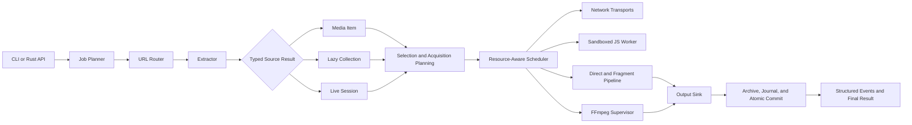
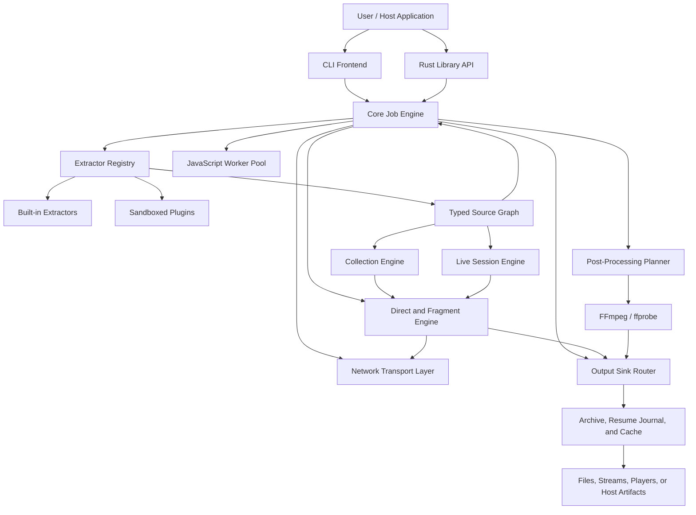
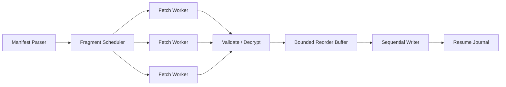

<topic id="ferric-forager-technical-design" status="phase-0-charter" version="0.3.0" wp="WP-FF-002-architecture-review-merge-v1" summary="Preservation-first Ferric Forager architecture, contracts, gates, and complete-product scope" updated_at="2026-07-19" ingestable="true">

# Ferric Forager — Technical Design

> **Ferric Forager — a Rust-native media extraction and acquisition engine**
> **Canonical CLI command:** `fforager`
> **Authority status:** Phase 0 architecture and executable-contract charter
> **Baseline:** yt-dlp `2026.07.04`
> **Deployment model:** Standalone project with a first-class Handshake adapter
> **Primary objective:** Complete Rust rewrite with executable behavioral compatibility, bounded and recoverable execution, and equivalent-work performance proof.

---

## Table of Contents

1. [Preamble](#1-preamble)
2. [Executive Summary](#2-executive-summary)
3. [Problem Statement](#3-problem-statement)
4. [Goals](#4-goals)
5. [Non-Goals](#5-non-goals)
6. [Design Principles](#6-design-principles)
7. [Baseline System and Constraints](#7-baseline-system-and-constraints)
8. [Proposed System Architecture](#8-proposed-system-architecture)
9. [Workspace and Module Layout](#9-workspace-and-module-layout)
10. [Core Domain Model](#10-core-domain-model)
11. [Extractor Architecture](#11-extractor-architecture)
12. [URL Routing and Extractor Selection](#12-url-routing-and-extractor-selection)
13. [Networking Architecture](#13-networking-architecture)
14. [Cookie, Authentication, and Session Handling](#14-cookie-authentication-and-session-handling)
15. [Manifest and Fragment Pipeline](#15-manifest-and-fragment-pipeline)
16. [Scheduler and Resource Governance](#16-scheduler-and-resource-governance)
17. [Collection, Playlist, Channel, Feed, and Live Processing](#17-collection-playlist-channel-feed-and-live-processing)
18. [JavaScript Challenge Execution](#18-javascript-challenge-execution)
19. [FFmpeg and Post-Processing Integration](#19-ffmpeg-and-post-processing-integration)
20. [CLI and Behavioral Compatibility](#20-cli-and-behavioral-compatibility)
21. [Plugin System](#21-plugin-system)
22. [CPU, Memory, and I/O Efficiency Design](#22-cpu-memory-and-io-efficiency-design)
23. [Persistence, Resume, and Crash Recovery](#23-persistence-resume-and-crash-recovery)
24. [Security Model](#24-security-model)
25. [Observability and Diagnostics](#25-observability-and-diagnostics)
26. [Testing and Verification Strategy](#26-testing-and-verification-strategy)
27. [Benchmark Plan and Performance Gates](#27-benchmark-plan-and-performance-gates)
28. [Implementation Sequence](#28-implementation-sequence)
29. [Compatibility and Migration Policy](#29-compatibility-and-migration-policy)
30. [Risks and Mitigations](#30-risks-and-mitigations)
31. [Acceptance Criteria](#31-acceptance-criteria)
32. [Peer-Review Questions](#32-peer-review-questions)
33. [Decision Log](#33-decision-log)
34. [References](#34-references)
35. [Appendix A — Example Data Types](#appendix-a--example-data-types)
36. [Appendix B — Example Execution Flow](#appendix-b--example-execution-flow)
37. [Appendix C — Benchmark Matrix](#appendix-c--benchmark-matrix)
38. [Appendix D — Review Checklist](#appendix-d--review-checklist)
39. [Appendix E — Peer-Review Finding Disposition](#appendix-e--peer-review-finding-disposition)
40. [Appendix F — Architecture and Build Enforcement Contract](#appendix-f--architecture-and-build-enforcement-contract)

---

# 1. Preamble

## 1.1 Reason for the Rust rewrite

Ferric Forager is proposed as a standalone Rust-native media extraction and acquisition engine. Its behavioral baseline is yt-dlp, whose current implementation is mature, broad, and operationally useful, but whose architecture has accumulated around a large Python application, thousands of site-specific extractors, mutable dictionaries, synchronous orchestration, thread-based fragment concurrency, external media tools, optional browser-impersonation transports, and increasingly complex JavaScript challenge handling.

The rewrite is not proposed because every slow download is caused by Python. Download speed is often constrained by the remote server, network path, CDN throttling, disk throughput, or FFmpeg. A language rewrite cannot remove those external limits.

The rewrite is proposed because a native Rust implementation creates an opportunity to redesign the parts that the downloader does control:

- process startup and module initialization;
- URL routing and extractor activation;
- metadata parsing and allocation behavior;
- asynchronous network orchestration;
- fragment scheduling and ordered assembly;
- playlist pipelining;
- retry and backoff policy;
- filesystem churn and resume bookkeeping;
- progress-event overhead;
- process supervision;
- cancellation and shutdown behavior;
- plugin isolation;
- memory safety and concurrency safety;
- integration as a reusable native library rather than only a command-line program.

The intended result is not a literal transliteration of Python classes into Rust. A line-for-line port would preserve most architectural costs while adding migration risk. The intended result is a behaviorally compatible Rust-native system with a cleaner execution model and benchmarked efficiency improvements.

## 1.2 Goal

Build **Ferric Forager**, a complete Rust-native replacement for yt-dlp, that:

1. requires no Python runtime or Python fallback in production builds;
2. preserves the practical command-line behavior and extraction capabilities users depend on;
3. supports direct media, HLS, DASH, Microsoft Smooth Streaming (MSS), heterogeneous collections, playlists, channels, feeds, live sessions, subtitles, thumbnails, metadata, authentication, cookies, proxies, format selection, resume, archive tracking, output sinks, and post-processing;
4. treats individual media, collections, and live sessions as first-class typed source results rather than forcing every URL into a single-file video model;
5. retains FFmpeg as a supervised external media engine rather than attempting to rewrite codecs;
6. supports modern YouTube challenge execution through a sandboxed JavaScript-engine abstraction;
7. reduces avoidable CPU consumption, memory allocation, context switching, file operations, and duplicated parsing;
8. remains maintainable as sites change;
9. can be embedded as a Rust library in a larger application without spawning a new downloader process for every URL.

## 1.3 How the finished system should look

The finished system should be a standalone native executable and reusable Rust library built from the same core crates. Its canonical CLI executable is `fforager`. The CLI should feel familiar to yt-dlp users, while the internal architecture should be a typed, bounded, event-driven pipeline.

The primary resolved object is a **source graph**, not immediately a destination file. A source graph may describe one media item, a lazy collection, or a live session. The planner converts that graph into one or more acquisition plans and output sinks. This permits the same resolved source to be saved, streamed to a player, piped to another process, inspected without downloading, or passed into Handshake without duplicating extractor logic.

Ferric Forager must remain independently buildable, testable, versioned, distributable, and usable without Handshake. Handshake integrates it through a dedicated adapter over the library API or an isolated local-worker protocol. The dependency direction is strictly `Handshake -> Ferric Forager`; the Ferric Forager core must not import Handshake concepts, schemas, UI state, or storage models.

At a high level:



The `fforager` executable should start quickly, initialize only the components required for the current URL, and remain efficient when used as a long-running ingestion service or Handshake-managed worker.

## 1.4 Why this shape is preferred

This shape separates responsibilities that are entangled in many mature downloader implementations:

- **Extractors describe media.** They do not own global execution policy.
- **The scheduler governs resources.** Extractors do not create arbitrary threads or subprocesses.
- **The network layer owns transport correctness.** Cookie scoping, redirects, proxying, TLS behavior, and impersonation are centralized.
- **The fragment pipeline owns ordering and recovery.** Individual HLS or DASH extractors do not reimplement download mechanics.
- **FFmpeg remains isolated.** Codec complexity and native crashes do not enter the Rust process address space.
- **JavaScript execution remains sandboxed.** Untrusted or rapidly changing challenge code is not granted unrestricted process access.
- **Compatibility is tested externally.** The Rust implementation must match observable behavior, not copy internal Python structure.

---

# 2. Executive Summary

Ferric Forager is a full rewrite of yt-dlp in Rust, with no Python production dependency. FFmpeg and ffprobe are the only currently authorized external runtime processes. Modern site challenge execution remains mandatory, but the authorized Phase 0 direction is a bounded Rust worker containing a pure-Rust engine candidate; an external JavaScript runtime is not an implicit fallback and requires explicit Operator approval after measured corpus evidence.

The design uses yt-dlp as the broad extraction and compatibility baseline, while deliberately studying three adjacent systems for capabilities that yt-dlp does not make central: gallery-dl for heterogeneous collections, filters, metadata sidecars, and archive-backed duplicate prevention; Streamlink for reconnectable live sessions and multiple player/output transport modes; and N_m3u8DL-RE for specialized HLS/DASH/MSS track selection, partial ranges, live recording, fragment validation, and mux workflows.[R10][R11][R12][R13][R14][R15] These projects are reference architectures, not runtime dependencies.

The design uses:

- a generated URL-routing index;
- statically compiled built-in extractors;
- strongly typed extraction results with an extension map for uncommon metadata;
- an asynchronous network runtime with bounded concurrency;
- separate resource classes for network, CPU-light parsing, CPU-heavy work, disk I/O, JavaScript, muxing, and transcoding;
- a streaming HLS/DASH/MSS fragment pipeline with a bounded reorder buffer;
- a unified source-result model for media items, lazy collections, and live sessions;
- collection filters, ranges, archive-backed duplicate prevention, and metadata sidecars;
- output sinks for files, standard output, named pipes, local HTTP delivery, players, and host callbacks;
- append-only, crash-safe resume state;
- persistent HTTP pools and persistent JavaScript workers;
- direct argument-vector process spawning without shell interpolation;
- capability-limited third-party plugins;
- differential compatibility tests against a pinned yt-dlp release;
- benchmark gates that reject unproven “optimizations.”

The main engineering difficulty is not downloading bytes. It is maintaining extraction logic for a large and changing set of sites while preserving edge-case behavior. The design therefore treats extractor maintainability, fixtures, routing, reusable site families, and differential testing as first-class concerns.

Version 0.3.0 promotes the completed peer-review recommendations into this design, preserves the entire complete-product scope, and replaces unresolved implementation choices with one of three explicit states: accepted contract, Phase 0 proof gate, or Operator decision required. It does not claim complete-product implementation readiness. The minimal Phase 0 bootstrap and bounded proof spikes are authorized; broad feature implementation remains blocked until the readiness gates in Section 31 pass.

---

# 3. Problem Statement

## 3.1 User-visible problem

Users can observe high startup overhead, high CPU use during metadata or batch operations, excessive resource use when downloading fragmented media, serial execution across playlist stages, process churn, or high disk activity. Some CPU load may actually come from FFmpeg transcoding or JavaScript execution rather than yt-dlp itself, but the current command does not always make the ownership of that cost obvious.

## 3.2 Architectural problem

The baseline system is a large Python application in which:

- the central `YoutubeDL` object receives a broad dictionary of options;
- extractors are registered and selected according to whether they report that they can handle a URL;
- extractors return dynamic information dictionaries;
- the central object processes results and selects a downloader;
- fragmented downloads can use a `ThreadPoolExecutor`;
- fragment data can be written to individual temporary files, reopened, read, appended, flushed, journaled, and removed;
- full YouTube support requires external JavaScript challenge scripts and a supported JavaScript runtime;
- some sites require browser-request impersonation because of TLS fingerprinting;
- plugins are imported as executable code and are explicitly trusted by the user.

These behaviors are not necessarily defects. They reflect years of compatibility work. They do, however, identify where a new implementation can establish stricter ownership boundaries and lower overhead.

## 3.3 Scope problem

A full rewrite must solve three coupled problems:

1. **Source resolution:** rapidly changing, site-specific reverse engineering and normalization.
2. **Acquisition execution:** networking, scheduling, direct and fragmented transfer, output sinks, resume, formatting, post-processing, logging, and state.
3. **Collection and live semantics:** lazy traversal, hierarchy, filters, archive identity, reconnect behavior, live-window refresh, and partial-result finalization.

The execution engine can be redesigned centrally. The extractor corpus must be migrated and maintained continuously. Collection and live semantics must be represented in the core model rather than added as CLI-only special cases. Success requires all three.

---

# 4. Goals

## 4.1 Functional goals

- Full Rust-native command-line application and library.
- No Python runtime in production.
- Broad behavioral parity with the pinned yt-dlp baseline.
- Direct HTTP and HTTPS downloads.
- HLS, DASH, Microsoft Smooth Streaming (MSS), and common segmented-media workflows.
- Live and video-on-demand handling with explicit session, reconnect, and finalization policy.
- Playlist, channel, gallery, album, post, feed, and heterogeneous collection traversal.
- Lazy collection consumption with bounded look-ahead.
- Collection filtering by metadata, date, size, media type, language, index/range, and extractor-defined fields.
- Archive-backed duplicate prevention with stable source identities.
- Output sinks for atomic files, standard output, named pipes, local HTTP delivery, players, host callbacks, and null/inspection mode.
- Partial segment and time-range acquisition where protocol semantics permit it.
- Multi-track selection for video, audio, and subtitles.
- Format listing, filtering, sorting, and selection.
- Subtitle, thumbnail, chapter, and metadata handling.
- Cookie-file and browser-cookie import.
- Authentication and per-site credentials.
- Proxy support and per-request headers.
- Browser impersonation where required.
- Resume and crash recovery.
- Archive tracking and duplicate prevention.
- FFmpeg probing, muxing, remuxing, transcoding, metadata embedding, and progress reporting.
- JavaScript challenge execution.
- Extensible extractor and post-processing plugin system.
- Windows, Linux, and macOS support.

## 4.2 Performance goals

- Lower cold-start CPU and latency.
- Lower metadata-only CPU use.
- Lower allocation count and peak resident memory.
- Fewer temporary files and filesystem metadata operations.
- Bounded memory under high concurrency.
- Better utilization overlap between extraction, collection traversal, downloading, live refresh, and post-processing.
- Bounded live-session memory independent of stream duration.
- Fast archive membership checks for large collections.
- No throughput regression for direct downloads.
- Efficient multi-job operation in a persistent process.
- Predictable CPU usage through resource-specific concurrency limits.

## 4.3 Quality goals

- Memory-safe core implementation.
- Deterministic and typed state transitions.
- Explicit error taxonomy.
- Structured diagnostics.
- Reproducible benchmark corpus.
- Differential behavior tests.
- Reference-behavior tests for collection, live-session, output-sink, and manifest workflows.
- Fuzz-tested parsers for untrusted manifests and metadata.
- Security boundaries around plugins, JavaScript, filenames, cookies, and subprocesses.

---

# 5. Non-Goals

The first complete release will not attempt to:

- rewrite FFmpeg, libavcodec, or media codecs in Rust;
- implement a new JavaScript language runtime;
- guarantee binary compatibility with Python yt-dlp plugins;
- guarantee byte-identical logs or progress-bar rendering;
- copy the internal class hierarchy of yt-dlp;
- reproduce every option or user-interface convention from gallery-dl, Streamlink, or N_m3u8DL-RE;
- become a general-purpose web crawler or search engine;
- make remote servers, CDNs, or ISP paths faster;
- reduce CPU consumed by an explicitly requested FFmpeg transcode beyond avoiding unnecessary transcoding and scheduling it correctly;
- bypass access controls, DRM, payment systems, or authorization requirements;
- discover, extract, purchase, or obtain decryption keys; only explicitly supplied lawful keys for supported non-DRM encryption may be used;
- preserve undocumented implementation quirks that are not required for practical compatibility unless a compatibility test demonstrates user impact.

---

# 6. Design Principles

## 6.1 Behavioral parity over structural parity

The implementation must reproduce useful external behavior, not Python internals.

## 6.2 Measure before and after

No optimization is accepted solely because it appears theoretically faster. Every significant optimization must include a benchmark or profile demonstrating its effect.

## 6.3 Bounded concurrency everywhere

Tasks, queues, fragment buffers, subprocesses, retries, and pending collection entries must have explicit limits.

## 6.4 Streaming by default

Media bytes, large playlists, manifests, and event output should be streamed rather than fully materialized when the operation permits it.

## 6.5 Strongly typed core, extensible edges

Core fields and state transitions should be typed. Rare or site-specific metadata may use a namespaced extension map.

## 6.6 No shell invocation

External tools are launched with an executable path and argument vector. User-controlled values are never interpolated into a shell command.

## 6.7 Resource ownership is explicit

Each operation declares whether it consumes network, CPU, disk, JavaScript, FFmpeg mux, or FFmpeg transcode capacity.

## 6.8 Compatibility is versioned

The project tests against a pinned baseline release and records intentional divergences. “Latest yt-dlp behavior” is not a stable specification.

## 6.9 Failures are resumable where safe

Interrupted downloads should preserve verified work without preserving untrusted or ambiguous final artifacts.

## 6.10 Security boundaries are default, not optional documentation

Plugins, JavaScript workers, output paths, redirects, cookies, and external downloaders are treated as security-sensitive components.

## 6.11 Source semantics precede destination policy

Extractors identify what a source contains. They do not decide whether the result is saved, streamed, inspected, piped, or registered with a host application. Destination behavior belongs to acquisition planning and output sinks.

## 6.12 Collections and live sessions are not disguised playlists

A finite ordered playlist, an incrementally discovered gallery, a nested feed, and a live sliding manifest have different identity, ordering, retry, and completion semantics. The model may share interfaces where useful, but it must preserve those distinctions.

## 6.13 Scope before simplicity

Accepted authority settles the required outcome. Ferric applies YAGNI only to capability or implementation complexity unnecessary to completely satisfy the current accepted closure unit. It may question the mechanism, never the accepted outcome. YAGNI never narrows the complete-product scope and never removes accepted behavior, requested risk/coverage cases, integrations, migrations, documentation, correctness, trust-boundary validation, error paths, compatibility, data integrity, bounded resources, timeouts, cancellation, security, diagnostics, observability, recovery, accessibility, or the verification that makes later refactoring safe. Canonical detail is FF-BUILD-064.

The implementation target is the **smallest complete, clear solution**, not the fewest lines. Required behavior and failure handling are proved before an overengineering review searches for deletion, reuse, or simplification. Line count, one-liner count, file count, abstraction count, and diff size are diagnostics only and can never be acceptance criteria.

## 6.14 Reuse and abstraction ladder

Before adding code or a dependency, record each candidate inspected and why the preceding rung cannot completely satisfy the accepted outcome:

1. whether the accepted outcome needs a separate mechanism at all;
2. whether existing Ferric code already provides it;
3. whether Rust `core`, `std`, or the approved platform surface provides it;
4. whether an already-approved dependency provides it without widening the dependency boundary;
5. only then, the smallest complete and clear new implementation.

Artifact-specific gates prevent a generic “boundary” label from approving its own complexity:

- a trait or dynamic-dispatch seam needs two current production implementations, or one necessary current invariant, contract, isolation boundary, or named deterministic test that concrete static private code cannot satisfy;
- a physical crate needs one Section 9.2 split trigger with evidence that a private module is insufficient;
- a configuration key, generic extension, or optional feature needs a current acceptance scenario, owner, bounds, lifecycle, governed profile, and either a removal condition or a stable-contract designation with a retention test;
- a one-to-one delegation layer needs review evidence for the current invariant, translation, ownership, failure, compatibility, or observability responsibility it alone enforces; this remains review/evidence enforcement unless a dedicated semantic checker exists.

Process, network, storage, watcher, compatibility, security, OS, public-protocol, and deterministic-test seams are candidate categories, not automatic exceptions. Each must cite a pre-existing accepted requirement/invariant/compatibility ID and prove direct private code insufficient. Every deliberate simplification with a real ceiling records the ceiling, a current observable replacement trigger, the likely upgrade path, and a detecting test, metric, benchmark, compatibility probe, or Operator threshold; vague future scaffolding is forbidden.

## 6.15 Malleability is required by YAGNI

Fowler identifies refactoring, self-testing code, and continuous delivery as enabling practices rather than YAGNI violations.[R23] Ferric's enforceable adaptation adds pinned CI, readable naming, narrow modules, and explicit contracts. A shortcut that makes the current design materially harder to change safely is not a simple solution; it is deferred cost. Every accepted behavior and failure path therefore needs a runnable proof method or an explicit validated not-applicable result before simplification is accepted.

## 6.16 Ponytail and YAGNI research disposition

The relevant Ponytail project is `DietrichGebert/ponytail`, pinned for this research to main commit `16f29800fd2681bdf24f3eb4ccffe38be3baec6b` on 2026-07-18. After tracing the real code path, its ladder prefers no code, reuse, standard/platform capability, an installed dependency, one line, and finally the minimum working implementation.[R18] Its separate overengineering review explicitly does not replace correctness, security, or performance review.[R19]

The evidence supports guarded adoption, not wholesale installation as project authority:

- Ponytail's corrected agentic benchmark reports a mean code reduction around 54% across twelve feature tasks with four repetitions on one model, with smaller gains on irreducible backend work; its authors disclose the narrow model/sample/tool limitations.[R18][R20]
- Issue 126 showed the earlier 80–94% headline was inflated by a verbose baseline. The project accepted the critique and corrected the headline and methodology.[R20]
- Independent benchmark issue 236 found substantial reductions in code and logical statements without an aggregate correctness/security loss, but also found robustness losses on tasks whose edge cases were unstated, worsening at stronger simplification levels.[R21]
- Open pull request 608 proposes “scope before simplicity” after an incomplete-test-coverage complaint. Because it is not merged, it is treated as critique and directional evidence rather than Ponytail authority.[R22]
- An independent, non-peer-reviewed reproduction reported large code reduction but also incomplete persistence, type, test, and guard behavior in some simplified results; Ferric treats it as adversarial evidence, not a benchmark authority.[R28]
- Draft pull request 592 proposes fixing the narrowest layer that owns the violated invariant while preserving verification, recovery, cleanup, and all affected callers. It is unmerged directional evidence, not Ponytail authority.[R29]
- Fowler's YAGNI definition applies to complexity for presumptive future capabilities, while refactoring, self-testing code, and continuous delivery are enabling practices that keep YAGNI safe.[R23]

Ferric therefore adopts the reuse ladder, root-cause preference, deletion of presumptive scaffolding, and evidence-triggered abstractions. A root-cause fix belongs at the narrowest layer that owns the violated invariant and must inspect every affected caller; a convenient shared choke point is insufficient when it does not own that invariant. Ferric rejects one-line or LOC optimization, blanket bans on single-implementation traits, simplification before scope proof, omission of tests/guards, and always-on high-intensity enforcement.

---

# 7. Baseline System and Constraints

## 7.1 Baseline release

This document uses yt-dlp `2026.07.04` as the fixed behavioral and source baseline. The official project describes yt-dlp as a feature-rich command-line audio/video downloader supporting thousands of sites. The baseline supports CPython and PyPy, recommends FFmpeg and ffprobe, requires `yt-dlp-ejs` for full YouTube support, and uses an external JavaScript runtime such as Deno, Node, or QuickJS for those challenge scripts.[R1][R2]

## 7.2 Extraction and processing flow

The baseline `YoutubeDL` documentation states that information extractors are registered in order, the first suitable extractor extracts information, and `YoutubeDL` processes that information, potentially using a file downloader.[R3]

This produces an observable pipeline that the Rust design must preserve conceptually:

```text
URL -> extractor selection -> extraction result -> format selection
    -> downloader selection -> download -> post-processing -> final output
```

## 7.3 Fragmented downloading

The baseline exposes concurrent native HLS/DASH fragment downloading, with a default concurrency of one.[R4] The pinned fragment implementation uses a thread pool when concurrency exceeds one. It downloads fragments through temporary fragment files, reads fragment contents, appends them to the destination, flushes output, updates a `.ytdl` JSON state file, and removes fragment files unless retention is requested.[R5]

This provides compatibility and granular resume behavior, but it also creates a clear design target for reducing file operations and duplicate I/O.

## 7.4 JavaScript challenges

The baseline requires external challenge scripts and a supported JavaScript runtime for full YouTube support. Deno is recommended and runs code with restricted filesystem and network permissions. The previous native interpreter approach is no longer used for YouTube.[R2][R6]

The Rust rewrite must therefore provide a JavaScript-engine abstraction and sandbox. Rewriting Python in Rust does not remove the need to execute JavaScript supplied or transformed from site player code.

## 7.5 Browser impersonation

The baseline recommends `curl_cffi`/`curl-impersonate` for browser-request impersonation, which may be required for sites using TLS fingerprinting.[R1]

A standard Rust HTTP client alone is not sufficient for full compatibility. The transport layer must model browser fingerprints or provide a compatibility transport.

## 7.6 FFmpeg

The baseline identifies FFmpeg and ffprobe as strongly recommended and required for merging separate audio/video files and many post-processing operations.[R1] FFmpeg supports stream copy, which avoids re-encoding when the source streams can be placed directly in the target container.[R7]

The Rust rewrite should preserve FFmpeg as an external process and prefer stream copy whenever it satisfies the requested output.

## 7.7 Plugin trust

The baseline documentation warns that plugins are imported even when not invoked and that plugin code is not checked.[R8]

The Rust design should not reproduce this trust model by default.

## 7.8 Security lessons from recent releases

The baseline release history includes fixes concerning command injection, cookie leakage, unsafe output file types, and arbitrary code execution through external downloader handling.[R9]

These classes of failure inform the subprocess, cookie, filename, manifest, and plugin designs below.


## 7.9 Adjacent reference architectures

Ferric Forager is not designed only from yt-dlp. Three adjacent projects expose mature behaviors that should inform the Rust design.

| Project | Primary strength | Adopted design lessons | Explicit non-copying boundary |
|---|---|---|---|
| gallery-dl | Galleries, posts, albums, metadata-rich collections | Lazy extractor initialization, collection ranges and filters, metadata sidecars, hierarchical child extraction, archive-backed duplicate prevention, configurable naming and post-processing | Ferric Forager will not copy gallery-dl's Python object model or configuration grammar verbatim |
| Streamlink | Live-stream resolution and player delivery | A live session as a durable object; stream qualities; reconnect/refresh policy; transport to players through stdin, named pipe, HTTP, or passthrough; low-latency options as explicit policy | Ferric Forager will not be playback-only and will retain archival, metadata, and collection capabilities |
| N_m3u8DL-RE | Specialized HLS/DASH/MSS acquisition | Track selection, concurrent media-track download, custom segment/time ranges, segment-count validation, live recording controls, real-time or post-download muxing, and explicit user-supplied-key adapters | Ferric Forager will not make a direct manifest URL mandatory, acquire keys, bypass DRM, or move webpage/source resolution into the protocol engine |

Official gallery-dl documentation describes galleries and collections, file ranges and filters, SQLite/PostgreSQL-backed archives, metadata files, and post-processors.[R10][R11][R12] Streamlink documents a plugin-oriented live-stream resolver and three primary player transports: standard input, named pipe, and HTTP, with optional URL passthrough.[R13][R14] N_m3u8DL-RE identifies itself as a cross-platform DASH/HLS/MSS downloader and exposes track selectors, thread counts, partial ranges, live recording, segment validation, real-time muxing, and post-download muxing.[R15][R16]

These references establish requirements and comparison tests. They are not runtime dependencies, compatibility promises, or permission to duplicate implementation details.

## 7.10 Fixed dependency and readiness boundary

The production dependency boundary is normative:

- shipped Ferric Forager and watcher code are Rust;
- FFmpeg and ffprobe are required supervised external processes;
- Python and yt-dlp execution are research/oracle tools only;
- Deno, Node.js, QuickJS as an external runtime, Wasmtime, BoringSSL-backed transports, SQLite native bindings, and any other runtime or native dependency require explicit Operator approval backed by current research and measured need;
- Rust executable plugins over bounded, versioned process IPC are the accepted v1 plugin direction;
- the archive backend remains undecided pending a pure-Rust store spike;
- a pure-Rust JavaScript engine and a pure-Rust fingerprint-capable transport are Phase 0 candidates, not proven selections.

The complete product is not implementation-ready. The minimal Phase 0 bootstrap workspace, inventory, corpus generation, contract definition, benchmark design, and bounded risk prototypes are authorized. Broad feature implementation remains blocked by the executable gates in Section 31; creating the validator and prototype skeleton that makes those gates executable is not broad implementation.

---

# 8. Proposed System Architecture

## 8.1 System context



## 8.2 Main layers

### Frontends

- CLI parser and compatibility aliases.
- Rust library API.
- Optional daemon/service frontend.

### Core planning

- configuration resolution;
- job creation;
- URL normalization;
- extractor routing;
- source-graph validation;
- collection and live-session policy resolution;
- format and track selection;
- output-sink and path planning;
- execution graph creation.

### Execution services

- networking;
- cookies and sessions;
- JavaScript workers;
- HLS/DASH/MSS manifest parsing;
- fragment downloading;
- direct downloading;
- collection traversal and filtering;
- live refresh and reconnect control;
- output sinks and disk writer;
- archive, deduplication, and cache;
- FFmpeg supervision.

### Extension boundary

- built-in extractors are statically linked;
- third-party extractors run behind a versioned capability-limited interface;
- post-processors use the same policy.

## 8.3 Job graph

Each media operation is represented as a directed acyclic graph where possible. Live streams may use a controlled cyclic refresh loop inside a node, but the external job state remains explicit.

```mermaid
flowchart LR
    A[Resolve URL] --> B[Acquire Session]
    B --> C[Extract Source Graph]
    C --> D{Source Kind}
    D -- Media --> E[Select Formats and Tracks]
    D -- Collection --> F[Apply Range, Filter, Archive, and Ordering Policy]
    D -- Live --> G[Create Live Session and Refresh Policy]
    F --> H[Resolve Entries Lazily]
    H --> E
    G --> E
    E --> I{JS Challenge Required?}
    I -- Yes --> J[Solve Challenge]
    I -- No --> K[Build Acquisition Plan]
    J --> K
    K --> L{Direct or Manifest?}
    L -- Direct --> M[Direct Transfer]
    L -- HLS/DASH/MSS --> N[Fetch and Refresh Manifest]
    N --> O[Download, Validate, and Order Fragments]
    M --> P[Output Sink]
    O --> P
    P --> Q{Post-process?}
    Q -- No --> R[Archive and Finalize]
    Q -- Yes --> S[FFmpeg Plan and Execute]
    S --> R
```



## 8.4 Control plane and data plane

The design separates small metadata and planning operations from bulk media movement.

**Control plane:**

- configuration;
- URL matching;
- extraction;
- metadata parsing;
- format selection;
- scheduling;
- state transitions;
- events.

**Data plane:**

- media response bodies;
- fragment buffers;
- direct file writes;
- decrypt/pack operations;
- FFmpeg input/output.

This separation allows the control plane to remain typed and low-allocation while the data plane uses streaming buffers and backpressure.

## 8.5 Dependency rings and composition roots

The initial implementation uses four inward-facing rings:

1. **Contracts:** `fforager-contracts` holds the versioned serializable source graph, identities, configuration, errors, product events, process protocols, and compatibility schemas. A separate `fforager-diagnostics-contract` holds only the cross-process watcher envelope, health, crash, and capability schemas. Contract packages contain no Tokio types, filesystem handles, sockets, processes, or runtime trait objects.
2. **Engine:** pure planning, state-transition calculation, resource admission, cancellation, and narrow effect ports. The engine depends only on contracts.
3. **Adapters:** networking, extractors, HLS/DASH/MSS acquisition, storage, FFmpeg, JavaScript worker hosting, and plugin process IPC. Adapters depend inward on contracts and engine ports. Adapter-to-adapter dependencies require an explicit architecture-policy exception.
4. **Composition and frontends:** the `fforager` library facade, launcher, CLI, worker, and Handshake adapter assemble one engine with concrete adapters. Frontends contain no duplicated product logic. The Handshake adapter depends on the facade; the facade and engine contain no Handshake types.

The independent watcher is outside the engine rings. Among Ferric workspace packages, it depends only on the diagnostic contract and its own bounded persistence and OS-observation adapters; third-party crates follow normal dependency policy. Ferric product code never depends on watcher code, and watcher acknowledgements never determine Ferric correctness or success.

## 8.6 Owned state machines

Every externally observable or durable lifecycle has one named owner and an executable transition model. Required models cover:

- job and cancellation;
- source resolution, redirects, graph continuation, and recursion budgets;
- atomic multi-resource admission;
- fragments and received, validated/written, and durable-contiguous byte positions;
- live-window refresh and continuity;
- per-sink fanout and loss policy;
- FFmpeg/ffprobe invocation and reaping;
- JavaScript worker requests, recycling, and quarantine;
- plugin process IPC;
- output commit, archive insertion, cleanup, and startup reconciliation;
- watcher startup, ready, serving, degraded, stale, draining, and stopped states.

Preconditions, invariants, postconditions, cancellation outcomes, and failure-prefix recovery are part of each model. A prose lifecycle without an executable transition or fault-injection surface is not an accepted contract.

---

# 9. Workspace and Module Layout

The repository has three non-overlapping roots. `.GOV/` owns governance and execution authority, `product/` owns shipped runtime code, applications, assets, the independent watcher, package-local tests, and the model manual, and `build/` owns the Cargo workspace plus shared build and test infrastructure. The repository-root `rust-toolchain.toml` is the sole rustup selector. The product begins with coarse packages that correspond to present contracts and failure boundaries; logical modules inside those packages remain private until evidence justifies another physical crate.

```text
.
├── rust-toolchain.toml
├── .GOV/
│   └── ... governance, packets, rules, registries, and evidence
├── product/
│   ├── MODEL_MANUAL.md
│   ├── crates/
│   │   ├── fforager/
│   │   ├── fforager-contracts/
│   │   ├── fforager-diagnostics-contract/
│   │   ├── fforager-core/
│   │   ├── fforager-net/
│   │   ├── fforager-protocol/
│   │   ├── fforager-extractors/
│   │   ├── fforager-storage/
│   │   ├── fforager-ffmpeg/
│   │   ├── fforager-javascript/
│   │   └── fforager-plugin-host/
│   ├── apps/
│   │   ├── fforager-cli/
│   │   ├── fforager-launcher/
│   │   └── fforager-worker/
│   ├── integrations/
│   │   └── fforager-handshake-adapter/
│   ├── assets/
│   └── watcher/
└── build/
    ├── Cargo.toml
    ├── Cargo.lock
    ├── architecture-policy.toml
    ├── tooling-policy.toml
    ├── rule-to-proof.toml
    ├── crates/
    │   └── fforager-testkit/
    ├── tools/
    │   └── fforager-xtask/
    ├── fixtures/
    ├── integration-tests/
    ├── fuzz/
    ├── benches/
    ├── reports/
    └── target/
```

The names above are the accepted initial physical topology. Package-local unit, integration, documentation, and compile-time tests remain inside the owning package under `product/`; reusable test support, shared fixtures, cross-package integration harnesses, fuzz targets, benchmarks, reports, and Cargo outputs live under `build/`. Extractor families, configuration, events, selectors, templates, collections, live behavior, sinks, archive, deduplication, and scheduling begin as modules within their owning coarse package.

## 9.1 Crate-boundary rules

- `fforager-contracts` contains serializable product data only and has no product-runtime dependency.
- `fforager-diagnostics-contract` contains only the versioned watcher wire, health, crash, and capability schemas and depends on no product-runtime package.
- `fforager-core` owns planning, state machines, resource admission, cancellation, and effect-port traits; it depends only on contracts.
- `fforager` is the reusable library facade and composition API over core ports and selected adapters; it exposes no CLI, watcher, or Handshake types.
- extractors request scoped effects through engine ports and never spawn tasks, threads, or processes directly.
- `fforager-net` owns request execution, origin/credential policy, cookies, redirects, DNS provenance, transport identity, and replay transcripts.
- `fforager-protocol` owns direct/HLS/DASH/MSS acquisition, byte-credit flow, live continuity, fragment state, and built-in sink fanout.
- `fforager-storage` owns rooted path operations, resume journals, archive identity/claims, staged commit, and reconciliation.
- `fforager-ffmpeg`, `fforager-javascript`, and `fforager-plugin-host` own their respective process/security boundaries.
- CLI, launcher, worker, library facade, and Handshake adapter are composition roots over the same engine; no product behavior is implemented twice. The launcher owns worker/watcher sibling lifecycle, while embedded hosts either provide an equivalent separate watcher launch path or explicitly report diagnostic degradation.
- `fforager-handshake-adapter` depends on the `fforager` facade and Handshake-facing contracts; no Ferric package depends on it.
- `build/crates/fforager-testkit` may be a dev-dependency of shipped packages but cannot appear in their normal/build graph or shipped artifacts.
- `product/watcher/` is a separate binary/package and, among Ferric workspace packages, depends only on the diagnostic contract plus watcher-local adapters; third-party crates follow normal dependency policy.
- `build/tools/fforager-xtask` is build/test tooling, never shipped product behavior.
- Ferric Forager runtime code never reads `.GOV/` or `build/` and never requires either root at runtime.
- cycles are forbidden.

## 9.2 Evidence-triggered split rules

A new physical crate is accepted only when at least one current trigger is recorded in `build/architecture-policy.toml`, cites a pre-existing accepted authority/invariant/compatibility ID, and proves a private module cannot enforce it:

- security or process boundary;
- independent public/versioned contract;
- independent lifecycle or update cadence;
- ownership isolation with distinct current lifecycle or change authority;
- required feature/dependency isolation that changes a shipped dependency or supported build profile;
- measured clean or incremental build improvement;
- demonstrated dependency-cycle pressure that cannot be removed more simply.

Crate count, symmetry, anticipated team structure, and a possible future implementation are not split triggers.

## 9.3 Mechanically enforced dependency direction

`build/architecture-policy.toml` is the machine-readable declaration of workspace members, layer, allowed direct edges, forbidden edges, production dependency constraints, unsafe-code references, and split rationale. It cannot authorize its own exception: every exception cites a stable decision ID present in the separate canonical allowlist in `.GOV/rules/build-rules.yaml`, and the build fails if the reference is absent. `build/tooling-policy.toml` pins each external validator by tool ID, exact version/source/checksum or toolchain/Cargo.lock identity, supported hosts, and invocation. The sole rustup selector is the repository-root `rust-toolchain.toml`; selectors under `.GOV/`, `product/`, or `build/` are forbidden. Shipped runtime code never reads `.GOV/` or `build/`; governed build tooling receives governance inputs explicitly.

The canonical architecture command is run from the repository root:

```bash
cargo run --manifest-path build/Cargo.toml --locked -p fforager-xtask -- architecture-check
```

It separates proof classes. In Phase 0, `architecture-check` uses Cargo metadata for normal/build/dev, target, optional, and transitive graph facts; conservatively scans product Rust source for forbidden `.GOV/` or `build/` runtime reads; inventories the exact transitive custom-build and proc-macro packages; rejects undeclared Cargo `links`; and fails closed when a REQUIRED architecture rule has no exact assigned proof/validator/fixture contract. Process-invocation, build-script source, FFI, downloaded/prebuilt binary, undeclared native-compilation, clean-artifact, and runtime-fault proof activate with the first shipped or corresponding risk-bearing package and MUST remain explicit `NOT_IMPLEMENTED` or `NOT_APPLICABLE` before their trigger, never PASS. `verify-pr` or a triggered deep gate runs clean artifact smoke tests outside the repository with `.GOV/` and `build/` absent. Release artifact inspection covers dynamic linkage/provenance; runtime fault tests cover behavioral boundaries such as watcher independence. `Cargo links` is evidence but never the only native-dependency detector.

Graph/source/build/packaging prohibitions have proof-class-appropriate negative fixtures; behavioral prohibitions have fault tests. Module privacy is preferred over a new crate when a private module enforces the required boundary.

---

# 10. Core Domain Model

## 10.1 Canonical serializable source graph

The baseline's dynamic information dictionary is flexible but makes field validity, identity, overlay behavior, ownership, and cloning difficult to reason about. Ferric Forager uses one versioned, serializable graph as the canonical persisted, IPC, native-JSON, and compatibility-comparison model.

```rust
pub struct SourceGraph {
    pub schema: SourceGraphVersion,
    pub roots: Vec<NodeId>,
    pub nodes: Vec<SourceNode>,
    pub edges: Vec<SourceEdge>,
    pub continuations: Vec<ContinuationDescriptor>,
}

pub enum NodeKind {
    Media,
    Collection,
    Live,
    Redirect,
    MetadataRecord,
    UnsupportedOrProtected,
}

pub enum EdgeKind {
    Contains,
    Embeds,
    TransparentlyOverlays,
    Alternate,
    Complementary,
    Additional,
    Continuation,
    DerivedOutput,
}
```

The graph contains only bounded serializable descriptors. Runtime entry streams, network bodies, file handles, tasks, transport sessions, and trait objects live in runtime cursor/provider state keyed by graph and continuation IDs; they are never serialized as source data.

An internal `SourceResult` enum may remain as an ergonomic dispatch view, but it is not the persistence or public wire model. Public entrypoints expose stable typed views such as media resolution, collection streaming, and live-session opening over the graph.

The graph contract defines:

- stable node and edge IDs;
- separate item, representation, track, asset, and derived-output identities;
- normative field overlay behavior for transparent redirects: replace, inherit, append, or never-cross;
- parent/child and output-template context ownership;
- lazy continuation and pagination semantics without making a cursor part of source identity;
- cycle detection, redirect budgets, and recursion budgets;
- explicit unknown, not-applicable, and present metadata states;
- size bounds for all extension and collection fields.

A media node contains:

- stable extractor key and source identity;
- canonical webpage URL;
- title and description;
- uploader/channel metadata;
- timestamps and durations;
- alternative and complementary media assets;
- subtitles, thumbnails, chapters, and attachments;
- comments or auxiliary data where requested;
- typed availability and access status;
- namespaced extension metadata.

The acquisition planner maps a `SourceGraph` plus user policy into one or more `AcquisitionPlan` objects. JavaScript, transport, cookie/session, and cache services are available during graph extraction because they may be required to construct the graph; they are not deferred to a later linear step.

## 10.2 Format model

A `MediaFormat` must distinguish:

- direct URL versus manifest reference;
- video, audio, subtitle, image, attachment, document, or combined stream;
- container;
- codecs;
- bitrate;
- resolution and frame rate;
- language;
- dynamic-range and color metadata;
- protocol;
- fragment information;
- required request headers;
- cookie/session binding;
- DRM or unsupported protection indication;
- expiration time where known.

## 10.3 Validity states

Extraction data may be incomplete or provisional. The model should represent that explicitly rather than using sentinel values.

Examples:

```rust
pub enum Availability {
    Public,
    AuthenticationRequired,
    SubscriptionRequired,
    GeoRestricted,
    PasswordRequired,
    Scheduled,
    Processing,
    Removed,
    Unavailable,
    Unknown,
}
```

## 10.4 Ownership and allocation

- Response bodies use reference-counted immutable byte buffers.
- Parsers borrow from buffers where lifetime and complexity remain manageable.
- Long-lived normalized fields are allocated once.
- Metadata is not cloned merely to cross pipeline stages; stages share immutable records and produce explicit deltas.
- Large optional fields are loaded on demand.

## 10.5 Extension fields

The extension map must be namespaced to avoid collisions:

```text
youtube.po_token_context
soundcloud.track_station_urn
site_name.custom_field
```

Extension values must be serializable and size-limited.


## 10.6 Acquisition and output-sink model

The same resolved media source may have multiple destinations. Output is represented explicitly rather than inferred only from a filename.

```rust
pub enum OutputSinkSpec {
    AtomicFile { path: PathBuf },
    Stdout,
    NamedPipe { path: PathBuf },
    LocalHttp { bind: SocketAddr, token: Option<Secret> },
    Player { executable: PathBuf, transport: PlayerTransport },
    HostCallback { endpoint: HostSinkId },
    Null,
}

pub enum PlayerTransport {
    Stdin,
    NamedPipe,
    LocalHttp,
    UrlPassthrough,
}
```

The sink contract includes backpressure, cancellation, seekability, expected lifetime, atomicity, and whether post-processing may require a temporary seekable file. Streamlink's documented stdin, named-pipe, HTTP, and passthrough player modes motivate these transport classes.[R14]

---

# 11. Extractor Architecture

## 11.1 Extractor contract

An extractor receives a normalized URL and a restricted context. It returns structured extraction data or a typed error.

```rust
pub trait Extractor: Send + Sync {
    fn descriptor(&self) -> &'static ExtractorDescriptor;

    fn extract<'a>(
        &'a self,
        context: &'a ExtractionContext,
        url: &'a CanonicalUrl,
    ) -> ExtractFuture<'a>;
}
```

The context exposes:

- scoped HTTP requests;
- cookie/session access;
- credential lookup;
- cache access;
- JavaScript challenge requests;
- logging and trace spans;
- cancellation;
- extractor arguments;
- recursion/redirect budget.

It does not expose:

- arbitrary process spawning;
- unrestricted filesystem access;
- raw scheduler internals;
- global mutable configuration;
- unrestricted cookie stores belonging to other sessions.

## 11.2 Extractor descriptors

Each built-in extractor declares static metadata:

```rust
pub struct ExtractorDescriptor {
    pub key: &'static str,
    pub display_name: &'static str,
    pub domains: &'static [&'static str],
    pub path_prefixes: &'static [&'static str],
    pub url_patterns: &'static [PatternId],
    pub priority: i32,
    pub capabilities: ExtractorCapabilities,
}
```

Descriptors are collected by a build step into the generated registry.

## 11.3 Shared extractor families

Many site extractors share APIs, players, embeds, or authentication systems. The port should identify and build shared families before migrating individual sites.

Examples of shared components:

- common embedded-player parsers;
- GraphQL clients;
- JSON-LD and Open Graph parsing;
- WordPress media extraction;
- Brightcove-family extraction;
- Vimeo embeds;
- common HLS/DASH normalizers;
- shared social-platform APIs;
- common login/token flows.

## 11.4 Extractor determinism

Given the same fixture responses, configuration, and clock inputs, an extractor should produce the same normalized result. Nondeterministic values such as current time, random request IDs, and temporary tokens are supplied through the context and can be controlled in tests.

## 11.5 Extractor maintenance requirements

Every extractor must include:

- URL-routing tests;
- at least one recorded metadata fixture where legally and technically possible;
- expected normalized result snapshot;
- error-case tests;
- declared network endpoints;
- authentication requirements;
- known live-only behavior;
- ownership or maintenance group;
- last verified date.

---

# 12. URL Routing and Extractor Selection

## 12.1 Problem

Evaluating a large set of full regular expressions against every input URL wastes CPU and complicates priority behavior.

## 12.2 Routing pipeline

```text
Parse URL
  -> normalize scheme and host
  -> domain/suffix index
  -> path-prefix index
  -> candidate extractor list
  -> final pattern validation
  -> priority resolution
  -> generic fallback
```

## 12.3 Generated index

The build process generates:

- exact-domain map;
- domain-suffix trie;
- path-prefix index;
- candidate arrays sorted by priority;
- precompiled final matchers;
- collision report.

The registry must support inspection:

```text
--explain-extractor URL
```

Expected output:

```text
Normalized host: www.example.com
Domain candidates: example:video, example:playlist
Path candidates: example:video
Selected extractor: example:video
Reason: full URL pattern matched; priority 100
```

## 12.4 Lazy initialization

Only the selected extractor and its shared dependencies are initialized. Built-in registry metadata is static. Expensive state such as API clients, token managers, or JavaScript workers is acquired only when required.

## 12.5 Generic fallback

The generic extractor is always last. It must not mask a more specific extractor failure unless compatibility policy explicitly allows fallback.

---

# 13. Networking Architecture

## 13.1 Transport capability contract

A single transport is not assumed to provide both maximum native efficiency and compatibility with all fingerprint-sensitive sites. The engine exposes one logical streaming request contract and requires explicit capability negotiation; no extractor selects a concrete library or silently downgrades a requested fingerprint.

```rust
pub trait HttpTransport: Send + Sync {
    fn execute<'a>(&'a self, request: HttpRequest) -> StreamingHttpFuture<'a>;
    fn capabilities(&self) -> TransportCapabilities;
}
```

Required capability classes:

1. **Standard pure-Rust transport** for HTTP/1.1, HTTP/2, proxies, compression, ranges, streaming, and connection pooling.
2. **Fingerprint-capable transport** for mandatory cases requiring controlled TLS, HTTP/2, header, and wire identity. No production backend is selected until the pure-Rust Phase 0 corpus passes or the Operator approves a specific exception.
3. **WebSocket capability** where a mandatory extractor declares it.

An arbitrary external downloader adapter is not a default architecture path. Any compatibility behavior that historically executed an arbitrary command must become a typed supervised operation or an explicit approved divergence.

## 13.2 Transport selection

Selection is based on:

- extractor request requirements;
- explicit user setting;
- site compatibility policy;
- proxy type;
- protocol support;
- fingerprint profile;
- security restrictions.

The decision, requested capabilities, satisfied capabilities, pool identity, and any blocked capability are visible in structured diagnostics and sanitized replay transcripts.

## 13.3 Connection pools

Connection pools are keyed by security-relevant context:

- scheme;
- origin;
- proxy;
- impersonation profile;
- client certificate context;
- cookie/session partition where required.

Connections must not be reused across incompatible credential or fingerprint contexts.

## 13.4 Request model

Requests use typed headers and immutable bodies. Header cloning should be minimized through shared base-header sets plus small per-request overlays.

Request fields include:

- method;
- URL;
- scoped headers;
- optional body;
- redirect policy;
- retry class;
- timeout class;
- expected response type;
- credential policy;
- byte range;
- transport requirement;
- response-size limit for metadata requests.

## 13.5 Redirect policy

On cross-origin redirects:

- authorization headers are stripped unless explicitly allowed;
- cookies are re-evaluated against the destination URL;
- origin-bound headers are removed;
- redirect count is bounded;
- downgrade from HTTPS to HTTP is rejected by default;
- every submitted, redirected, and nested URL must use an allowed scheme and pass the mandatory SSRF destination policy; policy configuration may tighten the default but cannot disable it for ordinary network acquisition.

## 13.6 Retries

Retries are classified, not blanket repeated.

Retryable examples:

- transient connection reset;
- timeout;
- selected 5xx responses;
- selected 429 responses with backoff;
- incomplete fragment body;
- recoverable range failure.

Non-retryable examples:

- invalid URL;
- authentication rejection without refreshed credentials;
- deterministic parser failure;
- unsupported encryption;
- output permission failure;
- policy rejection.

Retry budgets exist per request, per fragment, per media item, and per overall job.

## 13.7 Streaming, identity, and replay requirements

The transport contract includes:

- streaming response bodies governed by byte credits before bytes are accepted;
- cancellation acknowledgement and a defined pool-reuse outcome;
- DNS results and provenance, selected remote address, proxy path, ALPN, negotiated protocol, and wire/fingerprint identity;
- pool keys containing every behavior-affecting credential, proxy, TLS, HTTP, fingerprint, and connection-bound authentication input;
- redirect and nested-resource SSRF revalidation on every hop;
- validation of every resolved address against loopback, private, link-local, multicast, unspecified, documentation, reserved, and other governed special-use ranges before connection, followed by binding the connection to one approved result so DNS rebinding cannot substitute another address;
- proxy mode either enforces the same destination policy at a trusted proxy with verifiable destination evidence or reports address-level SSRF protection unavailable and rejects operations that require it;
- origin-tagged credential and cookie authorization evaluated by the adapter, not caller-supplied headers alone;
- bounded request/response metadata, decompression, redirects, and replayable body rules;
- sanitized request/response transcripts with secret-field normalization;
- timing phases and request IDs sufficient for equivalent-work comparison.

Standard HTTP success does not prove fingerprint compatibility. Each mandatory extractor declares its required transport capabilities, and complete replacement cannot pass while a mandatory corpus case requires an unavailable capability.

---

# 14. Cookie, Authentication, and Session Handling

## 14.1 Session partitions

Cookies, authorization tokens, impersonation profiles, and extractor state are held in explicit session partitions. A job references a partition ID rather than a global mutable cookie jar.

## 14.2 Cookie correctness

The implementation must enforce:

- domain matching;
- host-only cookies;
- path matching;
- secure-only transmission;
- expiry;
- same-site semantics where relevant to simulated browser flows;
- public-suffix rejection and host-only preservation;
- control-character and invalid-domain/path rejection;
- redirect re-evaluation;
- cross-origin sensitive headers are stripped and cookies recomputed from the destination jar;
- raw `Cookie` header forwarding is forbidden across transport adapters;
- no forwarding to an external process unless that exact supervised dependency is approved and receives a scoped temporary jar or typed cookie callback rather than an unscoped string or browser store.

## 14.3 Browser-cookie import

Browser database reading is implemented as a separate component with:

- read-only database access;
- platform-specific decryption adapters;
- explicit browser/profile selection;
- domain filters;
- one consistent snapshot of the browser database, or a clean typed failure when a consistent snapshot cannot be obtained;
- access-restricted temporary snapshots with best-effort cleanup and no handoff of a browser database to JS/plugin workers;
- no permanent copying of unrelated cookies;
- redaction in logs.

## 14.4 Credentials

Credential sources are resolved in order:

1. explicit per-job value;
2. named credential profile;
3. netrc-compatible source;
4. extractor-specific secure storage adapter;
5. interactive prompt when allowed.

Secrets are wrapped in redacting types and never included in ordinary serialization.

---

# 15. Manifest and Fragment Pipeline

## 15.1 Supported manifest classes

The manifest layer should support at minimum:

- HLS master and media playlists;
- DASH MPD;
- Microsoft Smooth Streaming manifests where non-DRM acquisition is supported;
- common byte-range media;
- initialization segments;
- encryption metadata used by supported non-DRM streams;
- live-window refresh;
- discontinuities;
- alternate video, audio, and subtitle tracks;
- multi-period and segment timelines;
- user-selected fragment-index and time ranges;
- live recording limits and start policies;
- fragment URL inheritance and query propagation.

## 15.2 Streaming pipeline



## 15.3 Bounded reorder buffer

Concurrent fragments complete out of order. The system retains only a bounded window of completed fragments. When the next expected fragment is available, it is passed to the writer and released.

Limits are defined by:

- maximum fragment count in memory;
- maximum bytes in memory;
- maximum out-of-order distance;
- per-job memory budget;
- global memory budget.

If the buffer reaches a limit, fetch workers are backpressured.

## 15.4 Memory versus disk spill

Fragments remain in memory when small and within budget. A fragment is written to a spill file when:

- it exceeds the in-memory threshold;
- global memory pressure is high;
- the user selects crash-durable fragment mode;
- the output protocol requires deferred assembly;
- decryption or packing requires random access.

Spill files are not the default path for every fragment.

## 15.5 Output writing

The writer:

- writes in sequence;
- avoids flushing on every fragment unless durability policy requires it;
- updates a coalesced journal checkpoint;
- maintains byte and fragment checksums where configured;
- exposes progress through rate-limited events;
- supports cancellation at safe boundaries.

## 15.6 Adaptive concurrency

Concurrency begins with a fixed, conservative, deterministic policy. An optional controller may be introduced only after the fixed policy passes correctness, saturation, cancellation, and equivalent-work gates. The controller may adjust within declared bounds using:

- smoothed throughput;
- round-trip time;
- error rate;
- 429/503 responses;
- queue occupancy;
- disk-writer backlog;
- memory pressure;
- origin-specific connection policy.

Adaptive changes are bounded by user and extractor limits. The controller must be benchmarked against fixed concurrency and can be disabled.

## 15.7 Fragment integrity

Validation may include:

- expected byte length;
- HTTP range correctness;
- content-range validation;
- decrypt block size;
- container/header sanity checks;
- checksum when supplied by the manifest;
- sequence number consistency.

A fragment is journaled as complete only after validation and successful handoff to durable output state.


## 15.8 Track selection and partial acquisition

The manifest engine exposes protocol-level track descriptors independently of webpage-level format selection. Selection predicates may use media type, language, role, codec, resolution, frame rate, channel count, dynamic range, bitrate, group ID, and playlist duration.

Example:

```bash
fforager manifest URL \
  --video 'resolution>=3840,codec~=hevc,best=1' \
  --audio 'language in [en,ja],best=2' \
  --subtitle 'language=en,all'
```

Partial acquisition supports segment-index and time ranges when the manifest and container permit correct initialization and timestamp reconstruction:

```bash
fforager manifest URL --range 00:05:00-00:20:00
fforager manifest URL --segments 100-399
```

N_m3u8DL-RE exposes comparable track filtering, custom ranges, concurrent selected-track download, segment-count validation, and mux controls; these are treated as reference behaviors for the Ferric Forager protocol engine.[R15]

## 15.9 Live manifest execution

A live source is not considered complete when the first manifest snapshot is exhausted. The live engine maintains:

- refresh cadence derived from protocol metadata and bounded user policy;
- media-sequence and timeline continuity;
- duplicate and gap detection;
- discontinuity and rendition-switch handling;
- reconnect budget and backoff;
- recording limit or operator stop condition;
- partial-output finalization after a clean stop or recoverable failure;
- bounded retention of fragment identity independent of stream duration.

The system supports two mux strategies:

1. **record then mux**, which is more recoverable and should be the default;
2. **real-time pipe mux**, which reduces intermediate storage but increases sensitivity to stalls and downstream process failure.

N_m3u8DL-RE documents both post-download muxing and real-time live pipe muxing and warns that pipe-based operation can lose live data in unstable environments.[R15] Ferric Forager therefore treats real-time pipe mux as an explicit opt-in mode with diagnostics and a documented recovery tradeoff.

## 15.10 End-to-end byte credits and durability positions

Every variable-size stage is governed before allocation by per-job and global byte credits. Credits cover HTTP receive chunks, decompression, decrypt/pack input and output, reorder state, writer buffers, journal staging, FFmpeg pipes, spill extents, and every sink queue. Transform stages transfer credit ownership; when simultaneous input and output must coexist, both are reserved first. Unknown or dishonest content lengths stream into bounded chunks or a preselected spill file and never bypass admission.

The fragment lifecycle records three distinct positions:

- `received`: bytes entered a bounded Ferric-owned buffer or spill extent;
- `validated_written_contiguous`: verified bytes were written contiguously to the working output;
- `durable_contiguous`: the data durability policy completed before the journal record that references the prefix became durable.

Resume always starts at or before `durable_contiguous`. Fast and balanced policies may redownload a declared bounded suffix; neither may advance durable state optimistically. Lossless recording credits have priority over lossy playback/telemetry credits, and a slow auxiliary sink cannot consume the recorder's budget.

---

# 16. Scheduler and Resource Governance

## 16.1 Atomic resource vectors

Every executable node submits one immutable resource vector before starting:

```rust
pub struct ResourceVector {
    pub metadata_requests: u32,
    pub media_requests: u32,
    pub memory_bytes: u64,
    pub disk_read_bytes_in_flight: u64,
    pub disk_write_bytes_in_flight: u64,
    pub open_handles: u32,
    pub cpu_light_slots: u32,
    pub cpu_heavy_slots: u32,
    pub javascript_workers: u32,
    pub ffmpeg_processes: u32,
    pub ffmpeg_cpu_threads: u32,
    pub archive_writer_slots: u32,
    pub sink_bytes: u64,
}
```

One central broker grants the complete vector atomically or grants nothing. A task never waits for a second scheduler permit while holding the first. The grant is one RAII-owned object released on success, error, panic, or cancellation.

## 16.2 Declared limits

Example policy:

```toml
[scheduler]
metadata_requests = 16
media_downloads = 6
fragments_per_download = 8
cpu_light_jobs = 8
cpu_heavy_jobs = 2
javascript_jobs = 2
ffmpeg_mux_jobs = 2
ffmpeg_transcode_jobs = 1
pending_collection_entries = 128
live_sessions = 4
player_sinks = 2
```

These values are configuration examples, not universal defaults.

Speed limiting is a first-class governed resource policy. Per-job and per-origin token buckets cover metadata and media bytes, burst size, minimum/maximum request delay, fragment pacing, and randomized sleep ranges required by the compatibility profile. Limits use a controlled monotonic clock, compose deterministically with retries and fairness, do not accumulate unbounded burst credit while paused, and have cancellation/replay tests. The native profile may expose clearer controls, while every pinned yt-dlp rate/sleep option maps to an equivalent compatibility row or an accepted divergence.

## 16.3 Task ownership

- Network tasks run on the async runtime.
- Blocking filesystem calls use a bounded blocking pool where native async file APIs are not appropriate.
- CPU-heavy parsing or cryptography can use a dedicated CPU pool.
- FFmpeg and JavaScript are subprocess or embedded-engine jobs behind permits.
- Extractors request work; they do not select executor threads.

## 16.4 Fairness

The scheduler must prevent one large collection or live stream from starving other jobs. Fairness is applied at:

- job level;
- origin level;
- resource class;
- fragment queue;
- FFmpeg queue.

The fixed initial policy uses deterministic per-job weighted deficit or round-robin scheduling, explicit origin caps/token buckets, and a declared tie-break for composite resource vectors. Starvation assumptions and bounds are tested under a controlled clock before any adaptive policy is enabled.

## 16.5 Cancellation

Cancellation propagates from job to child nodes. Components must distinguish:

- immediate cancellation;
- graceful stop after current fragment;
- finish current media item but stop collection traversal;
- stop downloading but allow already-started post-processing;
- live-stream stop with valid partial finalization.

## 16.6 Backpressure

Backpressure is mandatory between:

- collection extraction and media resolution;
- live manifest refresh and fragment acquisition;
- fragment fetch and reorder buffer;
- reorder buffer and disk writer;
- download completion and FFmpeg queue;
- event producers and UI/log consumers.

## 16.7 Saturation and cancellation proof

Saturation tests must demonstrate that admission is all-or-nothing, memory and handles remain within declared bounds, cancelled waiters make progress, permits cannot leak, large composite requests cannot starve indefinitely, one collection cannot monopolize child work, and every queue exposes item and byte occupancy. Independent semaphores are implementation details at most; they are not the scheduling contract.

---

# 17. Collection, Playlist, Channel, Feed, and Live Processing

## 17.1 Unified collection stream

A collection extractor returns a lazy runtime cursor rather than a fully populated vector whenever the source allows incremental traversal. The cursor is engine state keyed by a serializable continuation descriptor; it is not stored inside the canonical `SourceGraph`.

```rust
pub trait CollectionEntryStream: Send {
    fn next_entry<'a>(&'a mut self) -> CollectionFuture<'a>;
    fn checkpoint(&self) -> Option<CollectionCheckpoint>;
}
```

An entry can be media, a nested collection, a redirect, or a metadata-only record. This supports galleries, albums, posts with multiple attachments, channels, feeds, playlists, manga chapters, and nested collection hierarchies.

## 17.2 Collection identity and hierarchy

Each collection and entry receives a typed stable identity derived from extractor namespace and source-provided identifiers. URLs alone are not sufficient because signed URLs expire and the same logical item may have multiple representations.

```rust
pub struct ItemIdentity {
    pub extractor: ExtractorKey,
    pub namespace: String,
    pub source_id: String,
}

pub struct RepresentationIdentity {
    pub item: ItemIdentity,
    pub representation_key: String,
}

pub struct TrackIdentity {
    pub representation: RepresentationIdentity,
    pub track_key: String,
}

pub struct AssetIdentity {
    pub item: ItemIdentity,
    pub asset_key: String,
}

pub struct DerivedOutputIdentity {
    pub inputs: Vec<AssetIdentity>,
    pub operation: OperationIdentity,
    pub policy_version: String,
}
```

Collection identity is a distinct `CollectionIdentity` with extractor, namespace, collection ID, and hierarchy context. Identity fields that depend on account, session, cookies, locale, region, or request policy are explicitly versioned and included only when they change the logical item; transient signed URLs, pagination cursors, and transport sessions never become identity. Archive schemas store the identity kind and schema version and require a migration or explicit divergence before any identity rule changes.

Parent-child relationships are preserved so output templates and archive policy can use account, gallery, album, post, chapter, and asset context.

## 17.3 Filtering, ranges, and selection

Filtering occurs as early as correctness permits:

1. metadata-only predicates before asset resolution;
2. source-level ranges before child extraction;
3. asset predicates after file metadata is known;
4. size predicates after headers when size was unavailable earlier.

Supported predicate classes include:

- collection index or slice;
- creation date;
- media type;
- language;
- width, height, duration, and file size;
- tags and creator metadata;
- extractor-specific typed fields;
- duplicate/archive status.

Filter evaluation is three-valued: `true`, `false`, or `unknown`. Every command/profile declares its `on_unknown` policy. Only fields declared listing-available may be evaluated before asset resolution; resolution-dependent fields remain unknown until the relevant request completes. Post, child, item, representation, track, and asset ranges are distinct contracts.

Example:

```bash
fforager collect URL \
  --range '1:500' \
  --filter 'media_type in [image,video] and width >= 1920' \
  --date-after 2026-01-01
```

Gallery-dl's documented file ranges, metadata-aware filtering, child extraction, and powerful naming/configuration behavior provide reference cases for this layer.[R10][R11][R12]

## 17.4 Archive-backed duplicate prevention

The archive records stable source identities only after the configured success event. It must support:

- transactionally recording completed assets;
- checking large archives without loading all IDs into memory;
- separate namespaces for source assets, generated metadata, and post-processing actions;
- configurable record timing: per asset or successful collection completion;
- import from compatible text-based yt-dlp archives where identity mapping is known;
- one bounded archive actor with transactional uniqueness and lease/reconciliation rules;
- a pure-Rust store selected only after Phase 0 crash, concurrency, migration, and performance evidence;
- SQLite or a remote database only after a named dependency-boundary decision and the same contract evidence.

Gallery-dl uses database-backed archives to skip previously downloaded files and supports both SQLite and PostgreSQL-backed archive storage.[R11] Ferric Forager adopts the scalable membership-check concept, not gallery-dl's exact schema or dependency choice.

## 17.5 Metadata sidecars and organization

Collections can emit versioned JSON or JSON Lines metadata sidecars independently of media download. Sidecar generation supports include/exclude projections, custom derived fields, stable schema versioning, and path templates. Metadata-only mode must not require downloading media bodies.

```bash
fforager collect URL --no-media --metadata jsonl --output metadata.jsonl
```

## 17.6 Pipeline overlap

The system can overlap:

- traversing later collection pages;
- resolving current entries;
- downloading previous entries;
- generating metadata sidecars;
- muxing completed entries.

The overlap remains bounded by scheduler policy and archive lookups.

## 17.7 Ordering policy

User-visible output order and final filename sequence must remain deterministic even when execution overlaps. Entries carry logical indices and hierarchy paths. Event consumers may select:

- real-time completion order;
- logical source order;
- grouped-by-parent order;
- compact progress summary.

## 17.8 Failure and resume policy

The planner supports:

- abort on first error;
- skip failed entries;
- maximum total or consecutive errors;
- retry failed entries after a collection pass;
- checkpoint pagination cursors;
- checkpoint nested collection state;
- continue from the first uncommitted entry;
- preserve completed archive records without marking incomplete assets.

## 17.9 Live-session sinks

A live session may have one or more sinks, subject to an explicit fan-out buffer budget:

```text
Live source
├── atomic recording file
├── player transport
├── Handshake frame/audio consumer
└── metadata and health event stream
```

A slow sink must not cause unbounded memory growth. The planner either backpressures the source, drops data only under an explicit lossy policy, or disconnects the lagging sink. Streamlink's player transports demonstrate the practical need for standard-input, named-pipe, HTTP, and URL-passthrough modes.[R14]

The sink contract is explicit rather than one generic callback:

| Sink | Loss/default | Reconnect/disappearance | Finalization and archive effect |
|---|---|---|---|
| atomic recording | lossless, highest priority | source reconnect follows the live continuity contract | only a validated committed recording can satisfy the media archive row |
| stdout/player stdin | bounded backpressure, disconnect on deadline | process exit closes only that sink | operational completion is reported separately from deterministic media-result projection |
| named pipe | bounded wait then typed unavailable/disconnected | disappearance never stalls recording; reconnect only when the selected policy permits | never marks the recording archived |
| local HTTP | per-client bounded queues; lagging clients disconnect | reconnect replays required headers/init data and begins at a governed continuity point | client success/failure never controls recording commit |
| host/Handshake callback | isolated bounded queue and callback deadline | slow or failed host disconnects independently | host-delivery result is a separate channel from the deterministic job result |
| metadata sidecar | lossless when selected as required; explicit best-effort otherwise | retry policy is bounded | required-sidecar failure blocks the corresponding archive success; best-effort failure is recorded without falsifying media success |

The default result projection is logical source order; real-time operational events are a separate channel. Every sink declares capabilities, loss policy, reconnect/header-replay behavior, queue byte/item limits, completion predicate, and whether its failure affects job success, archive state, or only that sink.

Example:

```bash
fforager watch URL --quality best --record stream.mkv --player vlc
fforager watch URL --serve-http 127.0.0.1:0 --record-limit 02:00:00
```

---

# 18. JavaScript Challenge Execution

## 18.1 Requirement

Some modern extractors require real JavaScript execution. The Rust rewrite must not depend on Python’s previous interpreter model.

## 18.2 Authorized Phase 0 direction

```rust
pub trait JavaScriptEngine: Send + Sync {
    fn execute<'a>(&'a self, request: JsRequest) -> JsFuture<'a>;
    fn capabilities(&self) -> JsCapabilities;
}
```

The only currently authorized production candidate is a Ferric-owned Rust executable worker containing a pure-Rust JavaScript engine candidate. The worker creates a fresh capability-free per-job context and communicates through bounded, length-prefixed, versioned IPC. Boa or another maintained pure-Rust engine may be evaluated, but standards conformance alone is not acceptance; it must pass the pinned yt-dlp EJS/challenge corpus and Ferric's termination, memory, isolation, and performance cases.

Deno, Node.js, Bun, an external QuickJS runtime, or another external runtime is not a fallback. A failed Rust-only spike records the exact corpus failures and returns evidence-backed choices to the Operator.

## 18.3 Persistent workers

Workers may remain alive across jobs to avoid repeated process startup and script initialization, but a job receives a new isolated context. The parent communicates through framed, versioned IPC containing protocol version, globally unique request ID, job/session partition, script hash, deadline, input/output limits, structured result/error, and cancellation acknowledgement.

Cache keys include:

- script content hash;
- challenge implementation version;
- engine identity and version;
- execution mode;
- relevant extractor version.

The host recycles a worker after a bounded job count, wall age, RSS threshold, timeout, protocol violation, or crash. Worker heap state is never durable cross-job state. Compiled/player artifacts are host-owned and keyed by content hash and version.

## 18.4 Sandbox policy

Default JavaScript workers receive:

- no arbitrary filesystem access;
- no arbitrary network access;
- no inherited secrets;
- fixed memory limit;
- execution timeout;
- bounded output size;
- restricted environment variables;
- isolated temporary directory only when required.

## 18.5 Failure handling

Failures are classified as:

- runtime unavailable;
- incompatible runtime version;
- script parse error;
- challenge mismatch;
- timeout;
- memory limit;
- protocol error;
- sandbox violation.

Debug diagnostics include hashes and versions, not sensitive input values.

---

# 19. FFmpeg and Post-Processing Integration

## 19.1 Boundary

FFmpeg and ffprobe remain external executables. They are discovered, version-probed, capability-probed, and supervised by Rust.

## 19.2 Post-processing plan

The planner creates a typed operation graph rather than directly constructing arbitrary command text.

Examples:

- merge separate video and audio;
- remux container;
- transcode audio;
- transcode video;
- embed subtitles;
- convert subtitles;
- embed thumbnail;
- write metadata;
- split chapters;
- remove sponsor segments where supported;
- normalize file timestamps.

## 19.3 Stream-copy preference

The planner should prefer packet/stream copy when:

- no filter requires decoded frames;
- selected source codecs are compatible with the target container;
- timestamps can be represented safely;
- the requested operation is merge or remux only.

Transcoding is selected only when required by the requested output or container constraints.

## 19.4 Process execution

- Executable and arguments are passed directly to the OS.
- No shell is involved.
- File paths are separate arguments.
- Standard streams are controlled.
- Progress uses FFmpeg’s machine-readable progress mode where possible.
- Process groups/job objects support full-tree cancellation.
- Exit status, stderr tail, and operation plan are retained in structured diagnostics.

## 19.5 Concurrency classes

Mux and transcode jobs use separate permits. A cheap stream-copy merge must not be queued behind an unrelated long transcode if resources allow both.

## 19.6 Temporary outputs

FFmpeg writes to a job-scoped temporary path. The result is validated and atomically renamed into the final destination.

## 19.7 Supervised-process contract

The versioned FFmpeg/ffprobe invocation contract requires:

- a configured or discovered trusted absolute executable path and identity-bound capability/version probe;
- explicit stream maps and `-c copy` for every stream-copy plan;
- a scrubbed environment, governed working directory, `-nostdin`, and an allowlist of protocols and input mechanisms;
- a dedicated framed progress channel, bounded progress cadence/parser, continuous stdout/media and stderr draining, and a bounded diagnostic stderr tail;
- lifecycle `Spawned -> Running -> GracefulStopRequested -> ForcedKillRequested -> Reaped -> Validated`, with every terminal path awaiting reaping;
- a Unix process group or Windows Job Object attached at creation, bounded graceful stop, and descendant-tree kill when required;
- compound admission for process slots, CPU threads, memory, disk I/O, and pipe bytes;
- ffprobe-normalized output validation before commit or archive insertion.

Missing, wrong-version, hung, chatty, crashed, cancelled, partial-output, and descendant-process cases are mandatory cross-platform tests. Basic discovery, stream-copy, progress, cancellation, and reaping are proven in the first vertical slice rather than deferred to post-processing completion.

---

# 20. CLI and Behavioral Compatibility

## 20.1 Product and command identity

The formal product name is **Ferric Forager**.

> **Ferric Forager — a Rust-native media extraction and acquisition engine**

The canonical executable and command name is:

```text
fforager
```

Examples:

```bash
fforager inspect URL
fforager formats URL
fforager fetch URL
fforager fetch --audio-only URL
fforager collect URL
fforager watch URL --record stream.mkv
fforager manifest URL --range 00:05:00-00:20:00
fforager pipe URL --player vlc
fforager --compat-report
```

`fforager` is the stable command identity used by documentation, scripts, packages, worker discovery, and Handshake integration. A `yt-dlp` compatibility alias may be offered separately for migration testing, but it is not the canonical product or executable name.

## 20.2 Compatibility objective

Compatibility is exhaustive over the generated pinned-profile matrix, not an informal “majority” target. Every generated yt-dlp option, configuration/default interaction, output artifact, and active mandatory extractor row is either behaviorally equivalent under the compatibility profile or carries an explicit accepted divergence ID. Ferric-native behavior and the yt-dlp compatibility profile remain separate so neither silently redefines the other.

Categories include:

- general options;
- network options;
- authentication;
- video selection;
- download options;
- filesystem and output templates;
- format selection;
- subtitles;
- thumbnails;
- metadata;
- post-processing;
- extractor arguments;
- plugins;
- archive and duplicate behavior;
- collection filtering and ranges;
- live-session and output-sink policy;
- verbosity and simulation.

## 20.3 Parsing strategy

The parser supports:

- long options;
- short aliases;
- repeated options;
- config files;
- environment-aware defaults;
- preset aliases;
- per-extractor arguments;
- argument provenance inspection.

## 20.4 Compatibility report

```text
fforager --compat-report
```

Outputs:

- implemented options;
- partially implemented options;
- intentionally unsupported options;
- semantic differences;
- required external dependencies;
- active compatibility profile.

## 20.5 Output templates

The output-template engine is a dedicated parser and evaluator, not string replacement scattered through the codebase. It supports:

- typed fields;
- date formatting;
- numeric formatting;
- conditional alternatives;
- path sanitization;
- missing-field policy;
- shell-safe formatting only as explicit output data, never implicit execution.

## 20.6 Format selector

Format selection is implemented as a parsed expression language with:

- selection operators;
- fallbacks;
- filters;
- sorting;
- merge planning;
- explanatory output.

```text
fforager --explain-format-selection URL
```

The explain mode records why each candidate was accepted, rejected, or ranked.

## 20.7 Machine-readable API stability

JSON output schemas are versioned. The project may provide:

- yt-dlp-compatible JSON mode;
- native typed JSON schema;
- event stream schema.

---

# 21. Plugin System

## 21.1 Built-in versus third-party code

Built-in extractors compile into the binary. Third-party code is not loaded into the core process by default.

## 21.2 Stable extension protocol

Rust does not provide a stable native ABI suitable for arbitrary dynamic libraries across toolchain versions. The accepted v1 plugin boundary is a separately executed Rust plugin over bounded, versioned process IPC. Frames include protocol/core ranges, request IDs, capability grants, deadlines, byte/collection/depth bounds, structured errors, cancellation acknowledgement, and provenance. Stdout pollution, partial/oversized frames, crash, timeout, incompatible versions, and quarantine are explicit failure cases.

WebAssembly hosting requires an unapproved runtime and is not a coequal default. It may be reconsidered only after a separate security/dependency proposal and explicit Operator approval.

## 21.3 Capabilities

Plugins request explicit capabilities:

- network to declared origins;
- cookie access for declared domains;
- JavaScript execution;
- temporary storage quota;
- metadata cache;
- post-processing request construction.

Plugins do not receive arbitrary filesystem, process, or environment access.

## 21.4 Plugin lifecycle

Plugins are discovered from manifests. Code is loaded only after routing selects a plugin candidate or the user invokes it explicitly.

## 21.5 Python plugin compatibility

Python plugin binary compatibility is outside the no-Python target. Existing Python plugins must be ported to Rust and the process protocol. A production legacy Python bridge is excluded from the architecture and replacement claim.

## 21.6 Update and rollback contract

The update architecture begins in Phase 0/1. Core binaries, compatibility profiles, challenge data, schemas, and plugin protocols are independently versioned. Signed stable/candidate/hotfix metadata provides hashes, compatibility ranges, expiry, atomic activation, health checks, quarantine, rollback, last-known-good selection, and audit receipts. New executable Rust logic ships through binary releases unless the Operator approves another execution mechanism; data/profile/challenge updates never become an unreviewed code-loading path.

---

# 22. CPU, Memory, and I/O Efficiency Design

## 22.1 CPU-efficiency rules

1. No polling loop where an event, timer, or completion signal exists.
2. No unbounded task spawning.
3. No unbounded channel or queue.
4. No initialization of unrelated extractors.
5. No repeated compilation of static matchers.
6. No full response buffering for media bodies.
7. No per-fragment temporary file by default.
8. No destination flush after every fragment by default.
9. No metadata clone without an ownership reason.
10. No blocking process wait on an async executor thread.
11. No global progress mutex on the hot path.
12. No post-processing transcode when stream copy satisfies the request.
13. No high-frequency terminal redraw; progress updates are coalesced.
14. No optimization merged without measurement.

## 22.2 Startup optimization

- generated static registry;
- lazy extractor construction;
- lazy JavaScript worker startup;
- lazy FFmpeg probe with cached result;
- no plugin code import at startup;
- single config-resolution pass;
- minimal logging initialization;
- release build with link-time optimization evaluated by benchmark, not assumed.

## 22.3 Parsing optimization

- parse only required metadata fields where possible;
- borrow from immutable response buffers;
- retain raw JSON slices for optional subtrees;
- avoid converting every number or timestamp until requested;
- reuse parser state where safe;
- cap metadata response size;
- use specialized parsers only after profiling identifies a real bottleneck.

## 22.4 Network optimization

- persistent connection pools;
- DNS caching through the selected transport;
- protocol-aware connection limits;
- direct streaming to the writer;
- response decompression in the streaming path;
- byte-range resume;
- request deduplication for shared manifests/player scripts;
- conditional caching with validators where sites allow it.

## 22.5 Fragment optimization

- bounded async fetch tasks rather than one OS thread per fragment;
- ordered in-memory handoff;
- optional spill files;
- coalesced journal updates;
- cached encryption keys;
- no duplicate read after write for normal fragments;
- batch progress aggregation.

## 22.6 Collection and live optimization

- consume collection entries lazily and retain only the metadata required by downstream policy;
- pipeline traversal, archive checks, resolution, download, metadata output, and post-processing;
- batch archive membership queries without loading the entire archive into memory;
- keep pending collection entries bounded;
- preserve logical ordering through stable identities and indices rather than serial execution;
- retain only a bounded live continuity window rather than every observed segment ID;
- share one fetched live stream across multiple sinks only through a bounded fan-out buffer;
- avoid repeated metadata serialization when several sinks consume the same immutable event.

## 22.7 Progress and logging optimization

Progress producers update atomic or job-local counters. A separate aggregator emits at a configured frequency, for example 5–10 updates per second for an interactive terminal and lower frequency for structured logs.

High-frequency fragment events remain available in trace mode but are disabled by default.

## 22.8 Allocator strategy

The default system allocator is retained unless profiling demonstrates allocator contention. Alternative allocators are an evidence-driven deployment option, not a design dependency.

---

# 23. Persistence, Resume, and Crash Recovery

## 23.1 Job directory

Each job uses a scoped work directory:

```text
<output>.work-<job-id>/
├── state.journal
├── media.part
├── fragments/
├── ffmpeg/
└── diagnostics/
```

The visible final output is created only by atomic commit.

## 23.2 Journal model

The resume journal is append-only and versioned. Records include:

- job created;
- extraction completed;
- selected formats;
- output plan;
- manifest identity;
- fragment verified;
- contiguous output checkpoint;
- direct-download byte checkpoint;
- FFmpeg started;
- FFmpeg completed;
- final validation completed;
- `commit_prepared` with final rooted path, working-path identity, validated artifact identities/sizes/hashes, required sidecar set, filesystem capability profile, and synchronization result;
- `commit_renamed` with final handle/path identity, replacement/collision decision, and durable directory-sync result;
- `archive_committed` with archive transaction/row identity, item/asset/derived identity schema, uniqueness claim, output provenance, and commit sequence;
- `cleanup_completed` with removed/retained temporary artifacts and diagnostic-retention references.

Every record includes journal schema, job/producer instance, monotonically increasing sequence, prior-record hash, payload checksum, and durability class. A transition becomes authoritative only after its record and the data/directory prerequisites named by that transition are durable in the defined order.

## 23.3 Checkpoint policy

Journal durability is configurable:

- **fast:** periodic flush;
- **balanced:** flush after bounded byte/time interval;
- **durable:** flush after every critical checkpoint.

The default should not force a full filesystem flush after each fragment.

## 23.4 Resume validation

Before resuming, the system validates:

- source identity;
- selected format identity;
- manifest identity or safe evolution;
- output size;
- contiguous fragment checkpoint;
- file checksum/checkpoint where available;
- cookie/session requirements;
- temporary path confinement.

If state is inconsistent, the system preserves diagnostics and restarts safely rather than appending to ambiguous data.

## 23.5 Atomic commit

Commit is a durable, idempotent state machine rather than an assumed indivisible sequence:

1. `PREPARED`: writers are closed; output and metadata are validated; data and required directories are synchronized according to the supported filesystem contract.
2. `RENAMED`: the same-filesystem working output is atomically moved to the final rooted path and the transition record is durable.
3. `ARCHIVED`: the archive transaction records the reconciled committed output identity with uniqueness and provenance.
4. `CLEANED`: temporary state is removed only after the prior prefixes are recoverable.

Startup reconciliation handles every crash prefix, including committed output without an archive row, archive row without an output, collision, stale lease, partial cleanup, and interrupted schema migration. No job reports success before output validation and archive reconciliation complete.

Reconciliation reads the last valid durable prefix and is idempotent: before `commit_prepared`, resume or restart from verified data; after `commit_prepared` but before rename, revalidate then rename or safely abandon; after rename but before archive, verify the final handle/artifact then insert the unique archive row; after archive but before cleanup, preserve the final output and repeat cleanup; after cleanup, report success only when archive/output identities still reconcile. An archive row without the expected output is never silently accepted: restore from an intact staged artifact when proven, otherwise mark the row/output inconsistent and require governed recovery. Torn, duplicated, reordered, or checksum-invalid transition records stop at the prior valid prefix and preserve diagnostics.

## 23.6 Filesystem capability and rooted path contract

The work directory is created on the final output filesystem by default. Linux uses root-directory handles with `openat2`-style beneath/no-symlink resolution when available and a component-by-component no-follow handle walk otherwise. Windows uses root-handle-relative opens, reparse-point inspection, and final-handle path/volume verification. Normalization alone is never treated as protection from symlink, junction, reparse-point, or time-of-check/time-of-use races. If a supported platform cannot establish an equivalent confined handle path for a security-sensitive write, that mode fails closed; a degraded mode may relax durability or performance, never path confinement.

Each supported OS/filesystem pair declares capabilities for atomic replacement, file and directory synchronization, locking/leases, sparse files, case sensitivity, Unicode normalization, path-length behavior, and crash recovery. A cross-volume destination uses a copy-then-sync-then-rename operation inside the destination filesystem and is never described as atomic across the copy boundary. Unsupported or network filesystems are rejected or run in an explicit degraded mode whose guarantees and redownload window are tested and visible.

---

# 24. Security Model

## 24.1 Threat model

The application processes untrusted:

- URLs;
- HTTP responses;
- manifests;
- subtitles;
- metadata;
- filenames;
- JavaScript challenge code;
- plugin packages;
- external-tool output;
- user-provided templates and arguments.

It may also hold sensitive cookies and credentials.

## 24.2 Subprocess safety

- Never invoke a shell for FFmpeg, JavaScript runtimes, or external downloaders.
- Validate executable paths.
- Use argument vectors.
- Restrict inherited environment variables.
- Restrict working directories.
- Apply process memory/time limits where supported.
- Kill complete process trees on cancellation.
- Treat stderr as untrusted text.

## 24.3 Output path safety

- Sanitize platform-invalid characters.
- Prevent path traversal.
- Resolve final output under the selected root unless absolute paths are explicitly allowed.
- Reject reserved device names.
- Restrict dangerous shortcut or executable extensions according to operation context.
- Do not overwrite unrelated files without explicit policy.
- Use no-follow/open flags where supported to reduce symlink attacks.

## 24.4 Manifest safety

- Parse with versioned numeric per-input and per-job budgets for compressed/decompressed bytes, XML depth/attributes, URI count/length, rendition count, segment/key/init counts, playlist recursion, redirect count, timeline entries/duration, live deduplication state, and parser time/allocation.
- Disable XML external entities and external DTD resolution.
- Use checked arithmetic for every size, offset, duration, count, timeline, and byte-range calculation; overflow is a typed rejection.
- Bound combined expansion, not only each individual field.
- Validate nested URLs.
- Do not interpret manifest text as command-line arguments.
- Restrict local-file and special schemes unless explicitly enabled.
- Apply the mandatory Section 13 SSRF and credential policy to every nested URL.

## 24.5 Cookie safety

- Re-evaluate scope on every redirect.
- Do not leak cookies to a different origin.
- Redact logs.
- Do not forward a complete cookie jar to external tools.
- Use temporary scoped cookie files only when unavoidable and delete them securely according to platform capability.

## 24.6 JavaScript safety

- Default-deny filesystem and network.
- Bound memory, execution time, and output.
- No secrets in environment.
- Verify challenge bundle provenance when downloaded.
- Cache by cryptographic content hash.

## 24.7 Plugin safety

- Signed packages may be supported, but signatures do not replace capability restrictions.
- Plugin manifests declare permissions.
- Native in-process third-party code is disabled by default.
- Plugin protocol inputs and outputs are size-limited and schema-validated.

## 24.8 Supply-chain policy

- Lock dependencies.
- Generate a software bill of materials.
- Audit licenses.
- Scan known vulnerabilities.
- Reproducible builds are a release goal.
- External binary hashes may be pinned or verified when the project distributes them.

---

# 25. Observability and Diagnostics

## 25.1 Structured events

All components emit typed events:

- job state changes;
- extractor selected;
- request started/completed;
- retry scheduled;
- fragment completed;
- throughput sample;
- queue pressure;
- JavaScript worker action;
- FFmpeg plan and status;
- output committed;
- warning/error.

## 25.2 Event consumers

- terminal renderer;
- JSON Lines event stream;
- host-application callback;
- trace file;
- metrics exporter;
- benchmark recorder.

## 25.3 Diagnostic ownership

CPU and wall-time reports separate:

- Rust process CPU;
- JavaScript worker CPU;
- FFmpeg CPU;
- external downloader CPU;
- network wait;
- disk wait where measurable.

This prevents FFmpeg transcoding cost from being misattributed to the Rust downloader.

## 25.4 Explain modes

Planned explain commands:

```text
--explain-config
--explain-extractor URL
--explain-transport URL
--explain-format-selection
--explain-postprocess
--diagnostic-summary
```

## 25.5 Privacy

Diagnostics redact:

- cookies;
- authorization headers;
- passwords;
- signed URLs according to policy;
- local user paths where requested;
- personal identifiers in browser profiles.

## 25.6 Independent Ferric Forager watcher

`product/watcher/` is a separately executed Rust diagnostic application maintained for the full project lifecycle. `fforager-launcher` owns the worker and watcher as separately terminable siblings so an uncommanded worker crash does not kill the watcher. Windows job/process-handle and Unix process-group/session ownership are specified and tested, including launcher crash and terminal/session loss. Embedded-library hosts either provide an equivalent separate watcher path or report diagnostics unavailable; no hidden in-process watcher is substituted.

Governed startup applies a bounded watcher-ready timeout. Missing, corrupt, incompatible, hung, or storage-failed watcher startup returns a separate `diagnostics_degraded` or `diagnostics_incompatible` result while Ferric starts with identical product behavior and success semantics. Governed shutdown requests a bounded flush-and-exit, but watcher death or flush timeout cannot change an already determined Ferric job result and cannot hold launcher exit beyond the bound.

Among Ferric workspace packages, the watcher depends only on the versioned diagnostic wire contract and watcher-local bounded storage/OS probes; third-party crates follow normal dependency policy. It cannot issue product control or data-path commands. Crash evidence survives watcher restart and ordinary shutdown; only explicit collection acknowledgement or retention expiry deletes it. Restart and shutdown may reconcile or flush evidence, never silently resolve it.

## 25.7 Watcher liveness and freshness contract

Process existence is not health. Versioned heartbeat/health records include watcher and Ferric instance IDs, process-start identity, paired artifact/build IDs, protocol major/minor and schema hash, monotonic observation time, last admitted and durably stored event identity, queue depth/high-water/drop counters, and a typed health state/reason. Event sequence identity is `(producer_instance, boot_session, channel, sequence)` with defined start, maximum/no-wrap policy, duplicate and out-of-order handling, reconnect replay window, and durable-ack semantics.

The watcher state model is `Starting -> Ready -> Serving | Degraded | Stale -> Draining -> Stopped`. Watcher-local `Ready` requires protocol negotiation, storage self-test, retention-policy load, and a watcher-self canary. End-to-end `Serving` additionally requires a Ferric-origin canary after the producer path starts; the two states are not conflated.

Ingest, persistence, health-serving, and retention loops expose `Idle(until_or_dependency)`, `Working(work_id, deadline)`, `Blocked(reason, deadline)`, or `Failed(reason)`. Completion generations advance only for admitted work. An independent responsiveness canary checks legitimately idle loops and handoffs; a free-running timer cannot hide a stalled downstream operation. Monotonic time governs in-boot freshness, with explicit startup grace, fairness assumptions, expected next deadline, and missed-heartbeat tolerance.

## 25.8 Watcher protocol and coverage freshness

One shared diagnostic schema provides major/minor negotiation, a canonical schema-hash input/algorithm, required/optional field rules, sensitivity classification, size/depth/string/collection bounds, stable event IDs, and sequence-gap detection. Redaction occurs producer-side before framing. An older watcher preserves a bounded unknown optional field only as non-exportable opaque data when envelope sensitivity metadata permits; otherwise it discards it with a counter. It never persists or exports unknown plaintext by default.

Every event kind declares criticality and an exhaustive legal watcher policy. Mandatory terminal, crash, and invariant-breach events use the durable critical lane or emit an explicit scoped gap marker. `reject` is limited to invalid or unsupported-major input; `drop_with_counter` is limited to declared lossy telemetry. The watcher preallocates/reserves bounded critical capacity or a separately proven emergency sink. Critical evidence is never intentionally dropped after watcher admission and before acknowledged durable write while the watcher and critical sink are healthy. If all persistence paths are unavailable, Ferric still does not block or change success: health exposes a residual loss state, and a hard producer exit yields watcher-authored `process_exit_observed` with provenance and the last durable producer sequence rather than a fictional producer terminal event.

Governed queue, external-process, durable-transition, state-machine, and subsystem constructors require a diagnostic capability ID from the independent architecture-policy inventory; raw constructors exist only in audited adapter modules. This prevents a new subsystem from making both registry and watcher agree by forgetting itself.

Freshness is a three-way gate: checked-in previous/canonical wire fixtures; a registry-generated synthetic corpus containing every event kind and every state transition; and a real trace from the current Ferric binary. Negative fixtures delete one registration, event, policy, or criticality mapping and must fail. Updating producer, watcher policy, and natural golden output together cannot replace the independent inventory and canonical corpus.

Release packaging records the exact Ferric/watcher artifact IDs, producer schema hash, and watcher accepted protocol/schema set. The supported compatibility window is producer N with watcher N and N-1 on every supported OS/architecture; reverse compatibility is not promised unless a release manifest adds it. Canonical prior wire corpora or signed provenance-bound artifacts are retained immutably. Unknown-minor/schema-different-but-compatible is a positive case; a major mismatch produces `diagnostics_incompatible` without becoming a product correctness dependency.

---

# 26. Testing and Verification Strategy

## 26.1 Test layers

1. unit tests;
2. parser property tests;
3. extractor fixture tests;
4. differential compatibility tests;
5. integration tests with local HTTP servers;
6. live opt-in tests;
7. fuzz tests;
8. performance benchmarks;
9. security regression tests;
10. platform packaging tests.

## 26.2 Differential test harness

For a controlled URL/fixture corpus, run both:

- pinned yt-dlp `2026.07.04`;
- Rust implementation.

Compare normalized observable results:

- extractor key;
- media ID;
- title and timestamps;
- formats and ordering;
- selected format;
- subtitles;
- playlist entries;
- output filename;
- request headers where behaviorally relevant;
- post-processing plan;
- error category.

Differences are classified as:

- Rust defect;
- baseline defect intentionally corrected;
- nondeterministic site response;
- accepted compatibility difference;
- missing feature.

## 26.3 Recorded network fixtures

Fixtures store sanitized request/response exchanges. Sensitive values are removed or replaced with deterministic tokens. Fixtures include clock and random inputs.

## 26.4 Local protocol test server

A local server simulates:

- redirects;
- range requests;
- truncated bodies;
- connection resets;
- slow responses;
- 429 and retry-after;
- cookie scoping;
- HLS live windows;
- DASH timelines;
- invalid manifests;
- changing ETags;
- expired signed URLs;
- proxy behavior.

## 26.5 Fuzzing targets

- M3U8 parser;
- MPD parser;
- MSS parser;
- output-template parser;
- format-selector parser;
- cookie parser;
- subtitle parsers;
- JSON normalization;
- plugin protocol;
- JavaScript IPC protocol;
- resume journal reader;
- external-tool progress parser.

Fuzz or property harnesses assert versioned allocation, time, recursion/depth, output-expansion, collection-count, checked-arithmetic, and semantic invariants in addition to crash freedom. Parser seeds combine individually legal dimensions to attack aggregate expansion; XML harnesses prove external entities remain disabled.

## 26.6 Concurrency tests

Use deterministic schedulers or controlled barriers to test:

- cancellation races;
- fragment reordering;
- journal checkpoint races;
- playlist shutdown;
- worker crashes;
- FFmpeg process-tree termination;
- permit leaks;
- queue shutdown;
- duplicate final commit.

## 26.7 Platform tests

Windows, Linux, and macOS tests cover:

- path rules;
- atomic rename behavior;
- process termination;
- browser-cookie access;
- proxy configuration;
- terminal rendering;
- packaged binary startup;
- Unicode filenames.

## 26.8 Mandatory build and architecture gates

The canonical built-in bootstrap invocation from the repository root is `cargo run --manifest-path build/Cargo.toml --locked -p fforager-xtask -- <gate>`. A `.cargo/config.toml` alias may be convenient but is never proof authority. Every dependency-resolving Cargo invocation uses the explicit manifest and `--locked`; non-resolving subcommands use the explicit manifest where supported. The repository-root `rust-toolchain.toml` is the sole rustup selector, so the same pinned toolchain is selected regardless of whether Cargo operates on a `product/` member or the `build/` virtual workspace. `verify-env` checks `build/tooling-policy.toml` for exact tool version/source/checksum or toolchain/Cargo.lock identity, host support, and invocation, emits those identities in the report, and never auto-installs tools.

`cargo run --manifest-path build/Cargo.toml --locked -p fforager-xtask -- verify-pr --evidence-from-taskboard` runs, at minimum:

1. `cargo fmt --manifest-path build/Cargo.toml --all -- --check`;
2. workspace check for all targets and declared feature profiles;
3. Clippy for workspace/all targets with warnings denied on the pinned toolchain;
4. workspace tests plus doctests;
5. rustdoc with warnings denied for public contract surfaces;
6. the architecture command over explicitly manifested locked Cargo metadata plus source/build-script policy and the rule-to-proof map;
7. dependency advisory, ban, license, and source policy;
8. clean artifact smoke tests outside the repository with `.GOV/` and `build/` absent;
9. when the watcher package exists, watcher schema, replay, current/current pairing, and governed lifecycle tests.

Scheduled or risk-triggered gates add feature-combination checks, unused-dependency analysis, Miri for approved unsafe/low-level crates, Loom/model tests for concurrency state machines, mutation tests for critical transition logic, fuzzing, duplicate-dependency reporting, binary dependency provenance, cross-platform packaging, and fault injection. Tool limitations remain explicit: these checks provide evidence, not proof that arbitrary code is bug-free.

The architecture checker proves graph and source/build-script policy and validates assignment of packaging/artifact and runtime-fault proof classes without claiming to execute those other classes. Adding a workspace member, dependency, feature, unsafe allowance, or architecture exception without updating the machine-readable policy, a separately accepted allowlist decision, and its assigned proof fails the build.

## 26.9 Rust coding discipline

Workspace lint policy is inherited by every member. The pinned toolchain makes warning behavior reproducible. Defaults are:

- every ordinary crate root uses `#![forbid(unsafe_code)]`; a separately authorized boundary crate retains `deny(unsafe_code)` and allows only scoped reasoned unsafe uses with documented safety invariants, Miri where applicable, and dedicated review;
- no `unwrap`, `expect`, `panic`, `todo`, `unimplemented`, `dbg`, leaked must-use results, blocking while holding an async lock, or process exit from shipped library paths; tests and proven impossible-state assertions use reasoned scoped exceptions;
- no blanket Clippy restriction group; restriction lints are selected individually because some conflict with idiomatic Rust;
- every lint/architecture exception includes a stable rule or decision ID and a concrete reason; blanket crate-level allowances require an explicit policy entry;
- incomplete compatibility paths return typed unsupported/not-implemented errors and appear in compatibility reports;
- public contract crates require versioned schema documentation and examples;
- dependency version/feature constraints are centralized and default features are disabled unless justified. Architecture policy records human decisions—purpose, owner, allowed consumers, reason, removal trigger, and approval—while validation derives versions, sources, licenses, selected features, consumers, and native links from Cargo/lock/dependency tooling.

Review has three mandatory recorded gates: prove the active accepted closure unit and complete risk/coverage matrix; perform simplification/reuse/dependency review; then rerun the complete acceptance, risk, and scope matrix after simplification. The active work packet `extensions.change_evidence` is canonical; diffs are linked evidence only. A smaller diff that omits required behavior fails.

## 26.10 Watcher anti-staleness test matrix

The always-on watcher core suite includes:

1. watcher-local `Ready`, later Ferric-origin `Serving`, and persisted/retrievable canaries;
2. missing, corrupt, incompatible, storage-failed, and hung watcher startup with bounded diagnostic degradation and unchanged Ferric result semantics;
3. normal bounded flush plus already-dead/hung/full-store shutdown that cannot change the decided Ferric result;
4. hard-killed Ferric with watcher-authored exit observation, last durable producer sequence, and retained evidence;
5. killed watcher with Ferric continuity, diagnostic degradation, and evidence-preserving watcher restart;
6. launcher crash, terminal/session loss, launcher restart, and explicit Windows/Unix child-ownership outcomes;
7. stalls in ingest, persistence, health-serving, retention, and every handoff, plus legitimate idle time longer than the stale threshold;
8. persistence stall, fill-to-boundary, one-byte-over, permission failure, reserved critical admission, residual gap state, watcher crash/restart, and retrieval;
9. current/current plus producer N with watcher N-1 on each supported OS/architecture, including schema-different compatible minor input and major incompatibility;
10. optional unknown secret-bearing fields, mandatory unknown kinds, illegal criticality/policy combinations, oversized/malformed/partial frames, and producer-side redaction;
11. duplicate, reordered, replayed, gapped, reconnect, producer restart, and near-overflow sequence cases;
12. burst saturation with explicit lossy counters and scoped critical-lane guarantees before/after enqueue, write, and sync;
13. torn/corrupt final record recovery and evidence retention until collection acknowledgement or expiry;
14. PID reuse and stale-process cleanup using instance/start identity rather than PID alone;
15. wall-clock jumps without false freshness results;
16. Windows/Linux/macOS package tests that launch the exact paired artifacts and inspect linkage/provenance;
17. independent inventory coverage, canonical previous fixtures, generated all-event/all-transition corpus, real current-binary replay, and mutation fixtures that remove registrations/events/policies;
18. a negative test proving the watcher cannot control product behavior and Ferric never awaits a watcher acknowledgement for correctness, progress, commit, archive, or success.

Every product work packet that changes a state, failure path, process, queue, durable transition, event, or schema runs the core suite and adds risk-triggered deep cases from the architecture-policy trigger map. Triggered cases cannot be silently deselected; an explicit authority skip cannot produce a release PASS.

---

# 27. Benchmark Plan and Performance Gates

## 27.1 Benchmark philosophy

Performance claims are relative to a fixed build, machine, fixture set, and configuration. Network benchmarks use local or replayed servers for repeatability. Live internet measurements are supplementary.

## 27.2 Metrics

- wall-clock duration;
- user CPU time;
- kernel CPU time;
- peak resident memory;
- allocation count and bytes;
- context switches;
- tasks/threads created;
- files opened;
- bytes written and read;
- journal writes;
- HTTP request count;
- retry count;
- throughput;
- time to first progress event;
- time to first downloaded byte;
- FFmpeg CPU reported separately.

## 27.3 Equivalent-work manifests and statistical gates

Correctness and work equivalence are prerequisites for admitting a sample into a performance comparison. Every versioned benchmark manifest pins:

- exact Ferric commit, Rust toolchain/profile/features/allocator, FFmpeg/ffprobe identity, challenge backend, transport, and archive backend;
- exact yt-dlp `2026.07.04` artifact and one-process/multi-URL topology where applicable;
- fixture/corpus hashes, bytes, fragment distribution, request sequence, normalized source graph, selected streams, output/ffprobe equivalence, metadata/sidecar/archive work, and failure class;
- machine, OS, filesystem, storage, antivirus, power/governor, CPU affinity, memory pressure, and cold/warm filesystem/DNS/cache policy;
- randomized paired order, warmup, repetitions, outlier policy, noise threshold, distributions, and 95% confidence bounds;
- total-system CPU, wall, memory, and I/O plus separated Ferric, JavaScript worker, and FFmpeg costs.

A benchmark must reject deliberately cheaper work: lower-quality stream selection, omitted merge/sidecar/archive action, reduced validation, changed cache state, different process topology, or shifted work into another process. The upper confidence bound must satisfy the no-regression threshold and the lower bound must satisfy any claimed improvement. A single mean never passes a gate.

The following v0.2.0 values are retained as **Phase 0 hypotheses**, not release gates. Phase 0 replaces each percentage with a threshold justified by measured baseline variance and the equivalent-work manifest:

| Workload | Required gate | Target |
|---|---:|---:|
| `--version` / no-network startup | No regression | At least 50% lower wall time and CPU |
| URL routing across full registry | No regression | At least 70% fewer full-pattern evaluations |
| Metadata-only fixture corpus | No regression | At least 30% lower Rust-process CPU |
| Direct large-file download | At least 95% of baseline throughput | Lower or equal CPU per GiB |
| HLS, 10,000 local fragments | No throughput regression | At least 25% lower CPU and 80% fewer file opens |
| DASH audio+video merge | Equivalent output | No unnecessary transcode; mux CPU separated |
| 10,000-entry lazy playlist | Bounded memory | At least 40% lower peak memory |
| Persistent 1,000-URL batch | No leaks or unbounded growth | At least 40% lower process-start overhead |
| Cancellation | No corrupt final output | Bounded shutdown latency |

A hypothesis becomes a gate only through a recorded design decision containing its measured variance, threshold, timeout, report schema, and failure oracle.

## 27.4 Profiles

Required benchmark profiles:

- cold process;
- warm persistent process;
- single URL;
- batch URLs;
- high-latency network;
- high-throughput local network;
- slow disk;
- memory-constrained;
- Windows antivirus-sensitive filesystem scenario;
- with and without JavaScript challenge;
- 1,000 and 1,000,000-entry archive membership workloads;
- live session with stable, rotating, and discontinuous manifests;
- file, pipe, HTTP, player, and host-callback sinks;
- mux versus transcode.

---

# 28. Implementation Sequence

No phase is considered complete without tests, benchmarks, documentation, and a compatibility report.

## Phase 0 Bootstrap — Executable gate skeleton

Before any compiled risk spike, atomically create the repository-root `rust-toolchain.toml` as the sole toolchain selector and the minimal `build/Cargo.toml`, `build/Cargo.lock`, `build/tools/fforager-xtask`, `build/architecture-policy.toml`, `build/tooling-policy.toml`, `build/rule-to-proof.toml`, shared negative fixtures, reports path, and CI invocation. The bootstrap architecture and applicable PR gates must pass before any shipped product crate is added; watcher validation activates when the Phase 1 watcher package appears. Prototype-only packages are policy-marked non-shipped under `build/`. `product/MODEL_MANUAL.md` explains repository-root commands, current inputs/outputs, safety constraints, unimplemented gates, and recovery; it becomes the runnable product manual as real commands appear.

## Phase 0A — Compatibility inventory and executable oracle

- generate the yt-dlp `2026.07.04` option/config/default/interaction manifest;
- generate extractor and URL-class inventory;
- define the native Ferric semantic specification;
- create source-graph, sanitized network-transcript, filesystem/process artifact, error, archive, and migration oracle planes;
- version every normalization and intentional divergence;
- create representative mandatory deterministic corpora and an opt-in live-canary policy.

## Phase 0B — Contracts and state machines

- freeze versioned graph, identity, event/error, cancellation, process, plugin IPC, JS-worker IPC, diagnostic, and public JSON contracts;
- define atomic resource-vector and byte-credit models;
- define job, redirect, live, sink, FFmpeg, JS, plugin, commit/archive, filesystem-capability, and watcher state machines;
- give every gate a command, corpus version, artifact, threshold, timeout, failure oracle, and report schema.

## Phase 0C — Dependency and risk spikes

- bounded Rust-only EJS/YouTube challenge worker corpus;
- pure-Rust fingerprint-capable transport corpus;
- pure-Rust archive-store crash/concurrency/migration/performance corpus;
- FFmpeg process-containment and cross-platform path/durability prototypes;
- failed spikes produce Operator-ready evidence and never silently add a dependency.

## Phase 0D — Equivalent-work benchmark design

- pin baseline artifact variants and process topology;
- establish replay hardware/state profiles;
- define equality gates before speed gates;
- measure variance and replace provisional hypotheses with statistical thresholds;
- version machine-readable benchmark manifests and reports.

## Phase 1 — Coarse workspace and lifecycle skeleton

- extend the passing Phase 0 bootstrap into the complete Section 9 coarse workspace;
- contracts, core engine, library facade, launcher, CLI/worker, Handshake adapter, and generated registry skeleton;
- job/resource/cancellation state machines and typed events/errors;
- update activation/rollback skeleton;
- minimum independent watcher with handshake, canary, bounded store, crash retention, and replay coverage;
- no broad implementation until all nine consensus blockers have executable closure evidence.

## Phase 2 — Cross-boundary proof slice

- direct HTTP plus representative HLS acquisition;
- serializable source graph and selection;
- atomic resource grant and end-to-end byte credits;
- FFmpeg stream-copy discovery, progress, cancellation, reaping, and ffprobe validation;
- same-filesystem staged commit, resume, crash reconciliation, and archive insertion;
- watcher crash evidence and alive-but-stalled detection;
- equivalent-work benchmark against the pinned oracle;
- thin YouTube/challenge canary only after Phase 0C selects an authorized passing path.

## Phase 3 — Complete network and protocol foundation

- streaming transport, cookies, proxies, redirects, DNS/SSRF, retries, replay, fingerprint capability, and range resume;
- governed per-job/per-origin speed limiting and compatibility behavior for yt-dlp rate/sleep controls;
- HLS, DASH, MSS, initialization/range segments, supported non-DRM encryption metadata, discontinuities, and timelines;
- track selection, partial segment/time ranges, live refresh/reconnect/continuity/recording limits;
- file, stdout, named-pipe, local-HTTP, and bounded fanout sinks;
- fragment/durability state, fuzzing, saturation, cancellation, and end-to-end protocol corpus.

## Phase 4 — Collection, archive, and output semantics

- hierarchy, continuations, tri-state filters, and ranges by semantic level;
- item/representation/track/asset/derived identity;
- the approved archive backend, claims, leases, migration, and reconciliation;
- metadata sidecars and deterministic logical-result projection;
- player and host-callback sinks with explicit loss/reconnect policies;
- format-selector and output-template grammars;
- native/compatibility JSON, explain commands, and differential cases.

## Phase 5 — Full FFmpeg and post-processing

- extend the already-proven supervisor to all typed operation plans;
- mux/remux/transcode, metadata, subtitles, thumbnails, chapters, and timestamps;
- resource-class/thread accounting and process containment;
- record-then-mux recovery first;
- real-time mux only after crash, cancellation, partial-output, and replay-equivalence gates pass.

## Phase 6 — Generic extractor

- HTML media tags;
- gallery/album/post relationship detection;
- Open Graph;
- JSON-LD;
- common embedded player detection;
- HLS/DASH detection;
- canonical URLs;
- generic fallback policy.

## Phase 7 — Full YouTube family

- expand the authorized, corpus-proven Rust worker path;
- challenge bundle management, quarantine, rollback, and player-code cache;
- YouTube URL routing;
- Innertube/client logic;
- signature and challenge flows;
- playlists/channels;
- live streams;
- subtitles and auxiliary data;
- YouTube-specific benchmark and fixture corpus.

## Phase 8 — Extractor-family migration

Port in order of:

1. usage;
2. shared-family leverage;
3. fixture availability;
4. protocol simplicity;
5. maintenance activity;
6. authentication complexity;
7. fingerprinting complexity.

Do not port alphabetically.

## Phase 9 — Plugin ecosystem and packaging

- build on the already-versioned Rust process protocol;
- capability enforcement;
- SDK and scaffolding;
- package manifests;
- signed release artifacts;
- cross-platform packaging;
- dependency and license audit.

## Phase 10 — Parity hardening and release readiness

- pass the complete mandatory corpus and every active pinned URL class or record an explicitly approved divergence;
- close option/config/template/format/artifact gaps;
- fuzzing campaign;
- security review;
- watcher protocol/current-build replay, crash, saturation, and paired-artifact gates;
- update rollback, quarantine, and last-known-good gates;
- performance gate validation;
- comparative behavior report against gallery-dl, Streamlink, and N_m3u8DL-RE reference scenarios;
- migration guide;
- known-difference document;
- release-channel policy.

---

# 29. Compatibility and Migration Policy

## 29.1 Compatibility levels

Each feature is assigned one level:

- **Equivalent:** expected same practical result.
- **Compatible with documented difference:** behavior differs but migration is straightforward.
- **Partial:** common path works; edge cases remain.
- **Not implemented:** explicit gap.
- **Intentionally removed:** rejected for security or architecture reasons.

## 29.2 Configuration migration

Provide a migration command:

```text
migrate-config --from yt-dlp.conf --report migration-report.json
```

It reports:

- translated options;
- ambiguous options;
- unsupported options;
- security-sensitive changes;
- generated new configuration.

## 29.3 Archive migration

Text download archives remain readable. A native indexed archive may be introduced, but import/export to the compatible text format is required.

## 29.4 Output compatibility

The default should minimize unexpected filename changes. Platform-security fixes may require intentional differences, documented in the compatibility report.

## 29.5 Extractor status

The project publishes an automatically generated support table with:

- extractor key;
- supported URL classes;
- authentication status;
- live/VOD support;
- last verified date;
- baseline parity status;
- known failures.


## 29.6 Reference-project comparison policy

Ferric Forager does not promise command-line compatibility with gallery-dl, Streamlink, or N_m3u8DL-RE. Instead, the test suite maintains representative behavior scenarios:

- collection filtering, ranges, sidecars, archive skips, and hierarchy;
- live stream resolution, reconnect, player delivery, and recording;
- HLS/DASH/MSS track selection, partial acquisition, live recording, validation, and muxing.

Each scenario records whether Ferric Forager provides equivalent capability, an intentional alternative, or no support. This prevents vague claims that the project has “combined” the other tools.

---

# 30. Risks and Mitigations

## 30.1 Extractor maintenance dominates effort

**Risk:** Site logic changes continuously, and a full port can fall behind before parity is reached.

**Mitigation:** Port shared families first, generate status reports, use recorded fixtures, prioritize high-usage sites, and keep the baseline pinned for parity claims.

## 30.2 Rust rewrite does not improve network-bound downloads

**Risk:** Users expect every download to become faster.

**Mitigation:** Publish workload-specific benchmarks and separate network, Rust, JavaScript, FFmpeg, and disk costs in diagnostics.

## 30.3 Browser impersonation is difficult in a pure Rust stack

**Risk:** Standard TLS and HTTP behavior may be rejected by sites using browser fingerprints.

**Mitigation:** Design transport pluggability from the beginning, implement fingerprint profiles as a dedicated subsystem, and permit a compatibility transport while native coverage matures.

## 30.4 JavaScript challenge changes

**Risk:** YouTube or other sites change challenge behavior faster than release cadence.

**Mitigation:** Versioned challenge bundles, persistent general-purpose JavaScript runtime fallback, content-hash caching, and independent challenge-component updates.

## 30.5 Over-abstracted architecture

**Risk:** Excessive crate boundaries and traits create complexity without benefit.

**Mitigation:** Require a concrete second implementation before generalizing most interfaces, except known necessary boundaries such as transport, JavaScript engine, storage, and plugin protocol.

## 30.6 Async overhead or blocking mistakes

**Risk:** An async implementation can perform worse if blocking work runs on executor threads or too many tasks are spawned.

**Mitigation:** Bounded task creation, dedicated blocking/CPU pools, scheduler instrumentation, and task-count performance gates.

## 30.7 Resume corruption

**Risk:** Faster journal batching can lose recent progress or produce inconsistent state after a crash.

**Mitigation:** Monotonic journal records, contiguous checkpoints, checksums, validation before resume, and configurable durability.

## 30.8 Plugin ecosystem fragmentation

**Risk:** Existing Python plugins cannot run natively.

**Mitigation:** Publish a small stable Rust plugin SDK, automated scaffolding, clear porting guide, and versioned process-protocol compatibility tests. A production Python legacy bridge is not an allowed mitigation.

## 30.9 Feature parity delays architectural validation

**Risk:** The team spends effort porting rare extractors before proving the new engine.

**Mitigation:** Engine milestones use direct, HLS, DASH, generic, and YouTube workloads before broad extractor migration.

## 30.10 Licensing and redistribution

**Risk:** Dependencies and bundled external components impose different license obligations.

**Mitigation:** Maintain dependency-level license inventory, separate optional components, generate third-party notices, and conduct legal review before distribution.

## 30.11 Capability-synthesis scope expansion

**Risk:** Combining yt-dlp, gallery-dl, Streamlink, and N_m3u8DL-RE ideas can turn one rewrite into four simultaneous rewrites.

**Mitigation:** Keep one shared source model but stage capability delivery. Core direct/manifest transfer and source resolution precede broad collection, live-sink, and long-tail extractor parity. Reference-project features require explicit acceptance criteria rather than general aspirations.

## 30.12 Archive identity errors

**Risk:** An unstable or overly broad archive identity can skip distinct assets or redownload identical assets indefinitely.

**Mitigation:** Define extractor-owned stable identity components, version archive schemas, expose explain-identity diagnostics, and test migrations before changing identity rules.

## 30.13 Live sink backpressure

**Risk:** A slow player or host callback causes memory growth or loss of the recording sink.

**Mitigation:** Bound every fan-out queue, classify sinks as lossless or lossy, isolate sink cancellation, and make disconnect/drop policy explicit.

---

# 31. Acceptance Criteria

The first production release is accepted only when all mandatory criteria pass. Every criterion is represented in the active work packet or phase manifest by a stable ID, exact command, input/corpus version, expected artifact, quantitative threshold or equality predicate, timeout, failure oracle, machine-readable report, and source revision. Words such as “bounded,” “safe,” “atomic,” “compatible,” and “validated” are not proof without that surface.

## 31.1 Architecture

- No Python runtime or Python module dependency.
- Core library and CLI share one execution engine.
- Bounded queues and task counts are enforced.
- Coarse-package dependency direction passes the architecture-policy checker and all negative fixtures.
- External processes use direct argument vectors.
- Built-in extractor registry is generated and lazily activates extractors.
- Watcher depends only on the diagnostic contract and cannot control or become a correctness dependency of Ferric.

## 31.2 Functionality

- Direct HTTP/HTTPS downloads.
- HLS, DASH, and MSS support for the defined compatibility corpus.
- Track selection, byte/segment/time-range acquisition, initialization/range segments, supported non-DRM encryption metadata and decrypt flow, discontinuities/timelines, segment-count/hash/size validation, live refresh/continuity, and protocol-specific retries.
- Resume and crash recovery.
- Collections, playlists, channels, feeds, and lazy traversal.
- Metadata filters, ranges, sidecars, and archive-backed duplicate prevention.
- Live-session reconnect, recording limits, and valid partial finalization.
- File, stdout, named-pipe, local-HTTP, player, and host-callback sink contracts.
- Format selection and output templates.
- Cookies, authentication, proxies, and headers.
- FFmpeg merge/remux/transcode execution, stream-copy preference, real-time/live merge behavior, metadata/subtitle/thumbnail/chapter handling, progress, cancellation, validation, and deterministic mux artifacts.
- JavaScript challenge execution.
- Generic extractor.
- YouTube-family support at the declared parity level.
- Published extractor support matrix.

## 31.3 Performance

- All required benchmark gates pass.
- No unbounded memory growth in persistent batch or long-running live tests.
- Large archive membership tests meet the selected latency and memory gates.
- No per-fragment temporary file in the default fast path.
- Rust-process and external-process CPU are reported separately.

## 31.4 Reliability

- Cancellation leaves no corrupt final output.
- Resume validation rejects inconsistent state.
- Atomic finalization works on supported platforms.
- Worker crashes are isolated and reported.
- Watcher startup, shutdown, Ferric-crash survival, watcher-crash isolation, stalled-loop detection, current-build replay, protocol compatibility, saturation, full storage, partial write, restart, and stale-process cleanup pass.

## 31.5 Security

- Security threat model reviewed.
- Path traversal tests pass.
- Cookie-scope tests pass.
- Command-injection regression tests pass.
- Manifest fuzzing produces no memory-safety violation or unbounded allocation.
- JavaScript and plugin sandbox policies are enforced.
- Dependency audit and license report are generated.

## 31.6 Compatibility

- Compatibility matrix is generated.
- The mandatory deterministic corpus and every active pinned extractor URL class pass, or each divergence has an explicit accepted decision.
- Every intentional divergence is documented.
- Configuration and archive migration paths are tested.

## 31.7 Broad-feature implementation readiness gates

The Phase 0 bootstrap and bounded proof spikes are authorized specifically to make these gates executable. Broad feature implementation beyond the skeleton remains blocked until all are proven:

1. generated versioned yt-dlp compatibility profile and mandatory corpus;
2. accepted public behavior, dependency, security, identity, durability, and performance decisions;
3. Rust-only YouTube challenge corpus result or Operator-resolved evidence;
4. approved Rust transport result for fingerprint, redirect, cookie, SSRF, replay, streaming, pooling, and cancellation cases;
5. approved archive store result for crash, concurrent claims, migration, leases, reconciliation, and filesystem behavior;
6. versioned serializable source graph, identity, plugin IPC, event, error, cancellation, process, and diagnostic protocols;
7. atomic resource-vector and byte-credit invariants with saturation/model/cancellation evidence;
8. commit/archive/resume fault injection across every durable prefix and supported filesystem mode;
9. FFmpeg supervision failure and descendant-process tests on Windows and Unix;
10. equivalent-work benchmark manifests with correctness gates and confidence bounds;
11. executable phase gates with machine-readable reports;
12. Phase 0 no-context manual stub plus runnable instructions for every implemented command, structured diagnostics, stable identifiers, health checks, reproduction data, and parallel-agent-safe receipts; full-product manual completeness is a release gate, not a prerequisite for creating its own commands.

## 31.8 Simplicity and coding-quality acceptance

Every behavior, configuration key, public API, feature, and dependency maps to a current accepted requirement, invariant, or compatibility row. Traits/dynamic seams, physical crates, configuration/generic/optional features, and delegation layers satisfy their distinct Section 6.14 gates; a named boundary justifies structure only and never creates or narrows behavior. The active work packet records the complete pre-review scope/risk matrix, every reuse candidate and result, artifact-specific justification, simplification changes, and the complete post-simplification rerun. Exceptions and deliberate ceilings carry separately accepted stable IDs, reasons, observable triggers, and verification. Per FF-BUILD-067, line count, one-liner count, file count, abstraction count, and diff size are never acceptance proxies for completeness or quality.

---

# 32. Peer-Review Questions

The v0.2.0 peer-review questions are resolved as follows and promoted into the referenced normative sections:

1. Use native Ferric semantic contracts plus a generated yt-dlp `2026.07.04` profile and oracle corpus.
2. Keep typed core fields and bounded namespaced extensions; behavior, identity, security, and naming fields remain typed, and persisted data is fully serializable.
3. V1 plugins are Rust executables over bounded versioned process IPC; Wasm requires explicit future approval.
4. Extend transport with streaming, cancellation, pool/wire identity, DNS/SSRF, redirects, cookies, fingerprints, replay, and sanitized transcripts.
5. Impersonation blocks only claims that require it, but full replacement cannot pass while a mandatory case needs an unavailable capability.
6. Start with a bounded Rust worker and pure-Rust engine candidate; no external runtime is authorized.
7. Require per-job capability-free contexts, deterministic bounded IPC, resource/recursion/time limits, recycling, OS containment, and quarantine.
8. Use byte credits and distinct received, validated/written, and durable-contiguous positions.
9. Specify and test exact local-filesystem guarantees; reject or explicitly degrade unsupported/network modes.
10. Account for FFmpeg process slots plus aggregate CPU, memory, disk, and pipe use; transcodes receive stricter admission.
11. Logical source order controls identity and naming; completion-order operational events carry logical sequence and stable identity.
12. Use equivalent-work manifests, distributions, and confidence bounds; correctness runs first.
13. Generate the full CLI/config inventory; unsafe arbitrary-command behavior becomes typed Rust behavior or an approved divergence.
14. Pass 100% of the mandatory deterministic corpus and every active pinned URL class, or record explicit approved divergences.
15. Use trusted absolute FFmpeg/ffprobe paths or an Operator-selected verified bundle; no JavaScript runtime bundle is authorized.
16. Start with the coarse Section 9 topology and split only on recorded present evidence.
17. Model job/cancel, source/redirect, admission, fragment/durability, live, sink, FFmpeg, JavaScript, plugin, commit/archive, and watcher lifecycles.
18. Fuzz manifests, templates/selectors/paths, journals, IPC frames, cookies, and FFmpeg progress with allocation/time/recursion bounds.
19. No Python production bridge; port plugins/extractors to Rust and the Rust process protocol.
20. Use signed stable/hotfix channels, independent data/protocol versions, atomic activation, rollback, quarantine, last-known-good, and receipts; executable Rust logic ships in binaries.
21. The canonical persisted/IPC model is a serializable graph; public APIs expose stable typed views.
22. Filter only listing-known fields early with explicit tri-state semantics; resolve asset fields later and expose avoided requests.
23. SQLite is not approved by default; test a pure-Rust store, separate identity levels, and archive only reconciled committed outputs.
24. Use bounded trusted in-process fanout; isolate untrusted/blocking sinks and make loss/backpressure policy explicit.
25. Preserve all listed HLS/DASH/MSS/live/range/encryption/discontinuity/recording/mux behaviors; real-time mux follows record-then-mux recovery proof.

---

# 33. Decision Log

| ID | Decision | Status | Rationale |
|---|---|---|---|
| D-001 | Implement the canonical system fully in Rust | Accepted | Removes Python runtime and enables native integration |
| D-002 | Preserve behavior, not internal Python architecture | Accepted | Avoids porting historical coupling |
| D-003 | Keep FFmpeg and ffprobe external and supervised | Accepted | Codec rewrite is outside project scope and process isolation is useful |
| D-004 | Use a bounded Rust JavaScript-worker abstraction | Accepted with Phase 0 backend gate | Real JavaScript execution is required; no external runtime is silently authorized |
| D-005 | Use a serializable typed source graph with bounded extension metadata | Accepted | Preserves graph relationships, identity, validity, and wire compatibility |
| D-006 | Use generated staged URL routing | Accepted | Reduces unnecessary matcher work and startup activation |
| D-007 | Use atomic resource-vector admission and byte credits | Accepted | Controls coupled CPU, memory, network, disk, handle, sink, and subprocess pressure |
| D-008 | Replace default per-fragment files with credited streaming assembly | Accepted | Reduces duplicate I/O without losing durable resume boundaries |
| D-009 | Keep built-ins static and use Rust process IPC for third-party plugins | Accepted | Improves startup and avoids in-process third-party execution and an unapproved Wasm runtime |
| D-010 | Use native Ferric semantics plus a generated pinned compatibility oracle | Accepted | Makes compatibility enumerable and executable |
| D-011 | Reject optimizations without equivalent-work statistical evidence | Accepted | Prevents false speed wins and speculative complexity |
| D-012 | Separate component costs and report total-system cost | Accepted | Produces honest performance diagnosis |
| D-013 | Name the project Ferric Forager | Accepted | Establishes an independent, memorable product identity |
| D-014 | Use `fforager` as the canonical CLI command | Accepted | Provides a distinctive and stable executable name |
| D-015 | Keep Ferric Forager standalone with a first-class Handshake adapter | Accepted | Preserves independent use, contribution, release cadence, and fault isolation |
| D-016 | Model media, collections, and live sessions as distinct first-class source results | Accepted | Prevents forcing incompatible source semantics through a single-video abstraction |
| D-017 | Adopt archive-backed collection filtering and deduplication as core capabilities | Accepted | Generalizes beyond video and supports repeatable large collection acquisition |
| D-018 | Use an explicit output-sink abstraction | Accepted | Allows the same source to be saved, piped, played, served, or consumed by Handshake |
| D-019 | Treat gallery-dl, Streamlink, and N_m3u8DL-RE as reference architectures, not runtime dependencies | Accepted | Captures mature capabilities while preserving a coherent independent Rust design |
| D-020 | Begin with the coarse Section 9 workspace | Accepted | Preserves seams without freezing approximately thirty premature crates |
| D-021 | Use a pure-Rust archive-store spike before considering SQLite | Accepted proof order | SQLite remains unapproved pending evidence and Operator decision |
| D-022 | Use staged commit and startup reconciliation | Accepted | Makes every crash prefix recoverable and prevents false success/archive state |
| D-023 | Keep the watcher process-independent and contract-only | Accepted | Prevents diagnostic staleness and preserves a separate failure domain |
| D-024 | Enforce scope-before-simplicity YAGNI | Accepted | Avoids presumptive code without rewarding incomplete or fragile implementations |
| D-025 | Enforce architecture and coding policy through versioned manifests and executable gates | Accepted | Prose-only rules drift from code |
| D-026 | Move compatibility/update contracts and high-risk proof into Phase 0/1 | Accepted | Retires rework risks before broad implementation |
| D-027 | Select Tokio or another runtime only through a recorded dependency decision | Pending Phase 0 | Tokio is a researched candidate, not yet an adjudicated dependency |
| D-028 | Require explicit Operator approval for new runtimes/native dependencies | Accepted boundary | Preserves the authorized Rust plus FFmpeg/ffprobe production model |

---

# 34. References

## 34.1 Document revision note

Version `0.3.0` preserves the full v0.2.0 unified media-acquisition scope and integrates the completed architecture/performance, compatibility/product, and security/reliability peer reviews. It adds executable contracts, coarse enforceable Rust architecture, an independent watcher freshness model, and a guarded scope-before-simplicity interpretation of Ponytail/YAGNI research.

Original v0.2.0 references were accessed on 2026-07-16. Added v0.3.0 research references were accessed on 2026-07-18.

- **[R1]** yt-dlp project README and dependency documentation, pinned project repository.
  https://github.com/yt-dlp/yt-dlp

- **[R2]** yt-dlp External JavaScript Scripts setup guide.
  https://github.com/yt-dlp/yt-dlp/wiki/EJS

- **[R3]** `YoutubeDL.py`, baseline architecture documentation.
  https://github.com/yt-dlp/yt-dlp/blob/2026.07.04/yt_dlp/YoutubeDL.py

- **[R4]** yt-dlp README, `--concurrent-fragments`, default value and retry options.
  https://github.com/yt-dlp/yt-dlp/blob/2026.07.04/README.md

- **[R5]** yt-dlp fragmented downloader implementation, release `2026.07.04`.
  https://github.com/yt-dlp/yt-dlp/blob/2026.07.04/yt_dlp/downloader/fragment.py

- **[R6]** yt-dlp announcement explaining the external JavaScript runtime requirement for YouTube.
  https://github.com/yt-dlp/yt-dlp/issues/14404

- **[R7]** FFmpeg official documentation, stream selection and stream-copy behavior.
  https://ffmpeg.org/ffmpeg.html

- **[R8]** yt-dlp plugin documentation and trust warning.
  https://github.com/yt-dlp/yt-dlp/blob/2026.07.04/README.md#plugins

- **[R9]** yt-dlp release history, including recent security-related fixes.
  https://github.com/yt-dlp/yt-dlp/releases/tag/2026.07.04


- **[R10]** gallery-dl project README: galleries, collections, naming, authentication, and optional integrations.
  https://github.com/mikf/gallery-dl

- **[R11]** gallery-dl configuration documentation: lazy initialization, child extraction, filters, metadata, and SQLite/PostgreSQL-backed download archives.
  https://github.com/mikf/gallery-dl/blob/master/docs/configuration.rst

- **[R12]** gallery-dl command-line options: file ranges, date filters, archives, metadata sidecars, ZIP/CBZ output, and post-processors.
  https://github.com/mikf/gallery-dl/blob/master/docs/options.md

- **[R13]** Streamlink project README and plugin architecture: resolving streams from supported services and piping or writing them through multiple output methods.
  https://github.com/streamlink/streamlink

- **[R14]** Streamlink player transport documentation: standard-input pipe, named pipe, HTTP transport, continuous HTTP, and URL passthrough.
  https://streamlink.github.io/players.html

- **[R15]** N_m3u8DL-RE official repository and command documentation: DASH/HLS/MSS, track selectors, thread counts, custom ranges, live recording, validation, decryption adapters for user-supplied lawful keys, and muxing.
  https://github.com/nilaoda/N_m3u8DL-RE

- **[R16]** N_m3u8DL-RE release history: large-file range splitting, MPD parsing, live-stream, subtitle, decryption, and single-file multithreaded-download improvements.
  https://github.com/nilaoda/N_m3u8DL-RE/releases

- **[R17]** Ferric Forager peer-review synthesis and implementation-readiness matrix.
  `../reviews/peer-review-v0.2.0/primary-synthesis.md` and `../reviews/peer-review-v0.2.0/implementation-readiness-matrix.json`

- **[R18]** Ponytail project and current simplification ladder.
  https://github.com/DietrichGebert/ponytail/tree/16f29800fd2681bdf24f3eb4ccffe38be3baec6b and https://raw.githubusercontent.com/DietrichGebert/ponytail/16f29800fd2681bdf24f3eb4ccffe38be3baec6b/skills/ponytail/SKILL.md

- **[R19]** Ponytail overengineering-review scope, which explicitly does not replace correctness, security, or performance review.
  https://raw.githubusercontent.com/DietrichGebert/ponytail/16f29800fd2681bdf24f3eb4ccffe38be3baec6b/skills/ponytail-review/SKILL.md

- **[R20]** Ponytail benchmark baseline critique and the project's corrected headline/method.
  https://github.com/DietrichGebert/ponytail/issues/126 and https://raw.githubusercontent.com/DietrichGebert/ponytail/16f29800fd2681bdf24f3eb4ccffe38be3baec6b/benchmarks/results/2026-06-18-agentic.md

- **[R21]** Independent Ponytail v3 benchmark: substantial code reduction with robustness losses on unstated edge cases at stronger levels.
  https://github.com/DietrichGebert/ponytail/issues/236

- **[R22]** Open Ponytail hardening proposal “scope before simplicity”; evidence of an active critique, not merged authority.
  https://github.com/DietrichGebert/ponytail/pull/608

- **[R23]** Martin Fowler, YAGNI: applies to presumptive features, while refactoring, self-testing code, and continuous delivery enable safe evolutionary design.
  https://martinfowler.com/bliki/Yagni.html

- **[R24]** Cargo metadata resolved workspace/dependency graph contract.
  https://doc.rust-lang.org/cargo/commands/cargo-metadata.html

- **[R25]** Rust Clippy configuration and CI guidance; restriction lints must be selected rather than enabled wholesale.
  https://doc.rust-lang.org/stable/clippy/configuration.html and https://doc.rust-lang.org/stable/clippy/continuous_integration/index.html

- **[R26]** cargo-deny dependency advisory, license, ban, and source checks.
  https://github.com/EmbarkStudios/cargo-deny

- **[R27]** Progress-sensitive watchdog/probe patterns and absent-signal detection.
  https://www.freedesktop.org/software/systemd/man/latest/sd_watchdog_enabled.html, https://kubernetes.io/docs/concepts/workloads/pods/probes/, and https://prometheus.io/docs/prometheus/latest/querying/functions/#absent_over_time

- **[R28]** Independent, non-peer-reviewed Ponytail measurement and critique; useful adversarial evidence, not project authority.
  https://wuwei.page/en/blog/ponytail-less-code-measured/

- **[R29]** Draft/unmerged Ponytail root-cause and safety-preservation proposal.
  https://github.com/DietrichGebert/ponytail/pull/592

---

# Appendix A — Example Data Types

The following types are illustrative, not final API commitments.

```rust
pub struct AcquisitionJob {
    pub id: JobId,
    pub input: InputTarget,
    pub policy: AcquisitionPolicy,
    pub session: SessionId,
    pub cancellation: CancellationToken,
}

pub enum InputTarget {
    Url(CanonicalUrl),
    Manifest(CanonicalUrl),
    Batch(Vec<CanonicalUrl>),
    Stdin,
}

pub struct SourceGraph {
    pub schema: SourceGraphVersion,
    pub roots: Vec<NodeId>,
    pub nodes: Vec<SourceNode>,
    pub edges: Vec<SourceEdge>,
    pub continuations: Vec<ContinuationDescriptor>,
}

pub struct MediaItem {
    pub identity: ItemIdentity,
    pub webpage_url: CanonicalUrl,
    pub title: Option<String>,
    pub description: Option<String>,
    pub duration: Option<Duration>,
    pub timestamp: Option<MediaTimestamp>,
    pub creator: Option<Creator>,
    pub assets: Vec<MediaAsset>,
    pub subtitles: SubtitleSet,
    pub thumbnails: Vec<Thumbnail>,
    pub chapters: Vec<Chapter>,
    pub availability: Availability,
    pub extensions: ExtensionMap,
}

pub struct MediaCollection {
    pub identity: CollectionIdentity,
    pub kind: CollectionKind,
    pub title: Option<String>,
    pub ordering: CollectionOrdering,
    pub estimated_len: Option<u64>,
    pub archive_namespace: ArchiveNamespace,
    pub continuations: Vec<ContinuationId>,
}

pub struct LiveSessionDescriptor {
    pub identity: ItemIdentity,
    pub variants: Vec<MediaFormat>,
    pub refresh: RefreshPolicy,
    pub reconnect: ReconnectPolicy,
    pub continuity: ContinuityPolicy,
    pub finalization: PartialFinalizationPolicy,
}

pub enum MediaSource {
    Direct(DirectSource),
    Hls(HlsSource),
    Dash(DashSource),
    SmoothStreaming(SmoothStreamingSource),
    FragmentList(FragmentSource),
    ExternalProtocol(ExternalSource),
}

pub enum OutputSinkSpec {
    AtomicFile { path: PathBuf },
    Stdout,
    NamedPipe { path: PathBuf },
    LocalHttp { bind: SocketAddr },
    Player { executable: PathBuf, transport: PlayerTransport },
    HostCallback { endpoint: HostSinkId },
    Null,
}

pub struct ExecutionPlan {
    pub nodes: Vec<PlanNode>,
    pub edges: Vec<PlanEdge>,
    pub outputs: Vec<OutputSinkSpec>,
    pub resource_budget: ResourceBudget,
}

pub enum JobState {
    Created,
    Resolving,
    Extracting,
    TraversingCollection,
    SelectingFormats,
    WaitingForLive,
    Downloading,
    Streaming,
    PostProcessing,
    Finalizing,
    Completed,
    Failed,
    Cancelled,
}
```

---

# Appendix B — Example Execution Flow

```text
1. CLI parses arguments and records the source of every effective option.
2. Core creates a job and resolves a session partition.
3. URL router selects a small candidate set by domain and path.
4. Final matcher chooses the extractor.
5. Extractor requests metadata through the scoped network context.
6. Extractor optionally requests JavaScript challenge execution.
7. Extractor returns or extends the canonical serializable source graph.
8. Core validates graph identity, overlays, continuations, cycles, and bounds.
9. Collection policy applies ranges, filters, hierarchy, and archive checks lazily.
10. Live policy establishes refresh, reconnect, continuity, stop, and partial-finalization rules.
11. Format and track selectors create selected asset sets.
12. Output planner creates file, pipe, HTTP, player, or host-callback sinks.
13. Scheduler constructs resource-bounded execution nodes.
14. Downloader streams direct bytes or schedules HLS/DASH/MSS fragments.
15. Writer or stream router maintains ordering, backpressure, and journal checkpoints.
16. Post-processing planner chooses stream copy, remux, or transcode.
17. FFmpeg supervisor executes the typed plan when required.
18. Core validates and atomically commits seekable outputs.
19. Archive entries are committed only for configured success events.
20. Final structured result is returned to CLI or host API.
```

---

# Appendix C — Benchmark Matrix

| ID | Scenario | Primary metric | Secondary metrics |
|---|---|---|---|
| B-001 | Empty startup / version | wall time | CPU, RSS, files opened |
| B-002 | Route 100,000 URLs | CPU per URL | patterns evaluated, allocations |
| B-003 | Metadata-only generic HTML | CPU | wall time, allocations |
| B-004 | Large JSON metadata | CPU | peak memory, bytes copied |
| B-005 | Direct 10 GiB local HTTP | CPU/GiB | throughput, syscalls |
| B-006 | Resume direct download | correctness | requests, duplicate bytes |
| B-007 | HLS 100 fragments | CPU | file opens, memory |
| B-008 | HLS 10,000 fragments | CPU | throughput, journal writes |
| B-009 | Out-of-order fragment completion | memory bound | throughput, stalls |
| B-010 | DASH video+audio | wall time | CPU, final equivalence |
| B-011 | Live HLS window rotation | correctness | missed/duplicate segments |
| B-012 | 10,000-entry playlist | peak memory | time to first download |
| B-013 | 1,000 persistent jobs | total CPU | leak check, pool reuse |
| B-014 | JavaScript cold worker | latency | CPU, process start |
| B-015 | JavaScript warm worker | latency | cache hit rate |
| B-016 | FFmpeg stream-copy merge | wall time | FFmpeg CPU, I/O |
| B-017 | FFmpeg transcode | classification | Rust CPU versus FFmpeg CPU |
| B-018 | Cancellation under load | shutdown time | orphan processes, corruption |
| B-019 | Slow disk | bounded memory | queue pressure, throughput |
| B-020 | Retry storm | CPU | task count, backoff correctness |
| B-021 | 1,000,000 archive identities | lookup latency | RSS, storage size, write amplification |
| B-022 | Nested gallery with filters | time to first accepted asset | requests avoided, peak memory |
| B-023 | Metadata-only JSONL collection | CPU/item | allocations, serialization throughput |
| B-024 | Live HLS 24-hour simulation | bounded memory | duplicates, gaps, reconnects |
| B-025 | Live fan-out to file and slow player | recording continuity | queue size, player drops |
| B-026 | Named-pipe and local-HTTP sinks | delivery latency | CPU, context switches |
| B-027 | DASH multi-track selection | correctness | unnecessary bytes, planning CPU |
| B-028 | Time-range acquisition | boundary correctness | bytes downloaded, timestamp continuity |
| B-029 | MSS fixture corpus | protocol correctness | CPU, allocation, mux result |

---

# Appendix D — Review Checklist

## Scope

- [ ] Full Rust/no-Python requirement is unambiguous.
- [ ] External FFmpeg and JavaScript boundaries are accepted.
- [ ] Functional parity scope is sufficiently defined.
- [ ] Non-goals prevent uncontrolled expansion.

## Architecture

- [ ] Dependency direction is enforceable.
- [ ] Core domain model distinguishes media, collections, and live sessions.
- [ ] Collection hierarchy and stable identity are sufficiently expressive.
- [ ] Output-sink contracts define backpressure and finalization.
- [ ] Extractor API does not leak execution policy.
- [ ] Scheduler owns all concurrency.
- [ ] Transport abstraction supports impersonation.
- [ ] HLS/DASH/MSS fragment pipeline is bounded and resumable.
- [ ] Live refresh and fan-out remain bounded.
- [ ] Archive commit semantics prevent false skips.
- [ ] FFmpeg plans distinguish stream copy and transcode.
- [ ] Plugin boundary is stable and secure.

## Performance

- [ ] Baseline metrics are reproducible.
- [ ] Performance gates are realistic.
- [ ] CPU ownership is separated by process.
- [ ] Memory and I/O metrics are included.
- [ ] Progress/event overhead is measured.

## Reliability

- [ ] Resume semantics are defined.
- [ ] Journal corruption handling is defined.
- [ ] Atomic finalization is platform-aware.
- [ ] Cancellation policy is complete.
- [ ] Live-stream partial output behavior is defined.

## Security

- [ ] No-shell policy is complete.
- [ ] Cookie scoping is tested.
- [ ] Path confinement is enforceable.
- [ ] JavaScript sandbox is sufficient.
- [ ] Plugin capabilities are sufficient.
- [ ] External downloader policy is acceptable.
- [ ] Supply-chain and licensing review is planned.

## Compatibility

- [ ] Differential test schema captures required yt-dlp behavior.
- [ ] Reference scenarios cover gallery-dl, Streamlink, and N_m3u8DL-RE capabilities without claiming CLI parity.
- [ ] Intentional differences have an approval process.
- [ ] Config migration is viable.
- [ ] Archive migration is viable.
- [ ] Extractor parity threshold is defined.

---

# Appendix E — Peer-Review Finding Disposition

Every v0.2.0 finding is preserved below. `ACCEPTED` means its remediation is promoted into v0.3.0; `PROOF_GATE` means the required architecture is accepted but the backend/claim remains blocked on Phase 0 evidence. No finding is silently discarded.

| Finding | Disposition | v0.3.0 integration |
|---|---|---|
| SYN-001 | PROOF_GATE | §7.10, §13, §18, §21, D-021/D-027/D-028 preserve the boundary and require JS, transport, and store evidence. |
| SYN-002 | ACCEPTED | §6.8, §20, §26.2, Phase 0A, §31.6-31.7 define dual authority and a generated oracle. |
| SYN-003 | ACCEPTED | §27.3 requires equivalent work, paired topology, total-system cost, distributions, and confidence bounds. |
| SYN-004 | ACCEPTED | §10.1 and Appendix A use a serializable graph with separate runtime cursors; extraction can call JS/transport services. |
| SYN-005 | ACCEPTED | §15.10 and §16 define byte credits, atomic resource vectors, RAII grants, fairness, and saturation proof. |
| SYN-006 | ACCEPTED | §23.5-23.6 define staged commit, rooted paths, filesystem modes, and startup reconciliation. |
| SYN-007 | ACCEPTED | §19.7 defines executable identity, containment, pipe draining, stop/reap, admission, and ffprobe validation. |
| SYN-008 | ACCEPTED | §21.6 and Phase 0/1 move signed compatibility/update contracts, rollback, quarantine, and last-known-good earlier. |
| SYN-009 | ACCEPTED | §31 requires command, corpus, artifact, threshold, timeout, failure oracle, and report for every gate. |
| P0-AP-001 | ACCEPTED | §27.3 replaces false-win proxy gates with equivalent-work statistical manifests. |
| P0-AP-002 | ACCEPTED | §16.1-16.7 uses one atomic broker rather than independently awaited semaphores. |
| P0-AP-003 | ACCEPTED | §15.10 accounts for all pipeline bytes and separates received/written/durable positions. |
| P1-AP-004 | PROOF_GATE | §13 defines the required streaming/wire contract; fingerprint backend selection remains a Phase 0 gate. |
| P1-AP-005 | ACCEPTED | §19.7 promotes FFmpeg supervision into a versioned process protocol. |
| P1-AP-006 | ACCEPTED | §8.5 and §9 replace approximately thirty crates with coarse rings and evidence-triggered splits. |
| P1-AP-007 | PROOF_GATE | §18 selects a bounded Rust-worker direction while keeping the engine choice blocked on the EJS corpus. |
| P1-AP-008 | PROOF_GATE | §17.4 and §23 define the store/filesystem contract; backend selection remains blocked on evidence. |
| P1-AP-009 | ACCEPTED | §10.1 removes runtime trait objects from persisted source data. |
| P2-AP-010 | ACCEPTED | §15.6 requires a proven fixed deterministic policy before adaptive concurrency. |
| P2-AP-011 | ACCEPTED | §15.10, §25, and §26.10 bound diagnostics/fanout and expose loss counters. |
| P2-AP-012 | ACCEPTED | Phase 2 and §19.7 move minimum FFmpeg proof into the cross-boundary slice. |
| FCP-000 | PROOF_GATE | §7.10, §13, and §18 keep JS and impersonation feasibility explicit without unauthorized fallbacks. |
| FCP-001 | ACCEPTED | Phase 0A and §31.6 define invocation, graph, transcript, artifact, error, and archive oracle planes. |
| FCP-002 | ACCEPTED | §21.6 makes update/version/rollback architecture a Phase 0/1 contract. |
| FCP-003 | ACCEPTED | §10.1 adds graph node/edge/overlay/identity/continuation semantics and typed public views. |
| FCP-004 | ACCEPTED | §20 plus Phase 0A require generated CLI/config/default/template/format/artifact compatibility. |
| FCP-005 | ACCEPTED | Phase 0C and Phase 2 retire JS/transport/store/FFmpeg risks before broad feature work. |
| FCP-006 | ACCEPTED | §17.3, §15.10, and §25 define tri-state filters, ordering, continuity, sink loss, and diagnostics. |
| FCP-007 | ACCEPTED | §27.3 rejects shifted/omitted work and reports component plus total-system cost. |
| FCP-008 | ACCEPTED | §10.1, §17.4, and §23 separate identities and archive only reconciled committed outputs. |
| FCP-009 | ACCEPTED | §21.2 selects Rust executable process IPC as the canonical v1 plugin boundary. |
| FCP-010 | ACCEPTED | §15, Phase 3/5, and §31.2 preserve the full protocol/recording/mux acceptance surface. |
| FCP-011 | ACCEPTED | §9 establishes the coarse physical topology and split triggers. |
| SR-001 | ACCEPTED | §23.5 makes commit/archive/journal prefixes explicit and reconciled. |
| SR-002 | ACCEPTED | §23.6 requires root-relative no-follow operations and tests symlink/junction/reparse races. |
| SR-003 | ACCEPTED | §18 and §21 use separately executed Rust workers/plugins within the authorized boundary. |
| SR-004 | ACCEPTED | §13.5/13.7 revalidates every redirect/nested resource and origin-tags credentials. |
| SR-005 | ACCEPTED | §19.7 closes trusted executable, environment, protocol, pipe, containment, and validation gaps. |
| SR-006 | ACCEPTED | §15.10 forbids resume state beyond the durable contiguous prefix. |
| SR-007 | ACCEPTED | §23.6 declares supported, degraded, and rejected filesystem modes. |
| SR-008 | ACCEPTED | §16 defines owned grants, cancellation outcomes, starvation policy, and leak tests. |
| SR-009 | ACCEPTED | §13.3/13.7 and §14 make cookie/session scope an adapter and pool-identity contract. |
| SR-010 | ACCEPTED | §10.1, §17.4, and §23.5 define granular identity, unique claims, and reconciliation. |
| SR-011 | ACCEPTED | §15.10 and §25 make recording priority, sink bounds, loss policy, and counters explicit. |
| SR-012 | ACCEPTED | §13.7, §18, §21.2, §24.4, and §26.5 require numeric size/depth/time/allocation bounds. |
| SR-013 | ACCEPTED | §21.6, §24.8, §26.8-26.9 add locked sources, dependency policy, provenance, signed updates, and rollback. |
| SR-014 | ACCEPTED | §31 converts qualitative claims into executable evidence contracts. |

The peer-review corpus did not review the independent watcher. Sections 25.6-25.8 and 26.10 are a new v0.3.0 addition governed by the canonical build rules and require independent validation before they can be called proven.

---

# Appendix F — Architecture and Build Enforcement Contract

## F.1 Machine-readable product policy

`build/architecture-policy.toml` is created with the Phase 0 bootstrap Cargo workspace and contains:

- schema/version and accepted design decision IDs;
- every workspace member, layer, shipped/test-only status, and split trigger;
- allowed and forbidden direct internal dependency edges;
- allowed production runtimes/native dependencies and Cargo `links` policy;
- direct dependency purpose, owner, allowed consumers, reason, removal trigger, and approval ID; versions, selected features, sources, licenses, actual consumers, and native links are derived from Cargo/lock/dependency tooling;
- unsafe-code allowlist and required proof;
- optional feature owner, supported combinations, and removal condition;
- architecture/lint exceptions with stable IDs, reasons, scope, expiry/review trigger, and verification.

The policy is build/test configuration, not product runtime input or governance authority. It lives under `build/`, is consumed only by build/test tooling, and cannot become a runtime dependency of shipped code. Shipped runtime behavior must remain operable with both `.GOV/` and `build/` absent. The policy cannot approve its own exceptions: every exception references a stable decision in the separately maintained canonical allowlist in `.GOV/rules/build-rules.yaml`.

`build/tooling-policy.toml` is the canonical external-validator inventory. Each row records tool ID, exact version, source and checksum or toolchain/Cargo.lock identity, supported hosts, invocation, and owning gate. The repository-root `rust-toolchain.toml` is the only toolchain selector; `verify-env` fails before validation if a required tool is missing or mismatched and records the resolved inventory without installing or updating anything.

## F.2 Canonical validation surfaces

| Gate | Required result |
|---|---|
| `cargo run --manifest-path build/Cargo.toml --locked -p fforager-xtask -- architecture-check` | Graph, source/build-script policy, three-root ownership, sole toolchain selector, rule-to-proof map, and assigned negative fixtures pass without overclaiming runtime or artifact proof. |
| `cargo run --manifest-path build/Cargo.toml --locked -p fforager-xtask -- verify-pr --evidence-from-taskboard` | Tool preflight, active change evidence, format, compile, selected feature profiles, Clippy, tests/doctests, docs, architecture, dependency policy, clean-artifact smoke, and phase-applicable watcher gates pass. |
| `cargo run --manifest-path build/Cargo.toml --locked -p fforager-xtask -- verify-deep --evidence-from-taskboard` | Deterministically triggered model, fuzz, mutation, unsafe, feature-combination, fault, replay, benchmark, cross-version watcher, and packaging gates pass. |
| `cargo run --manifest-path build/Cargo.toml --locked -p fforager-xtask -- verify-release` | Hashed mandatory per-target CI reports for one source/lock/toolchain/artifact manifest aggregate without missing-platform skips. |

Each wrapper emits one versioned machine-readable report that records exact commands, exit states, inputs, trigger IDs, skipped gates with authority, and artifacts. A triggered release row cannot be skipped into PASS. Multi-platform release verification aggregates signed/hashed per-target reports tied to the same source, lockfile, toolchain, and artifact manifest; a local deep run may say `NOT_RUN`, but only the complete aggregate can pass release. A wrapper may orchestrate established tools, but it cannot reinterpret a failing tool as success.

## F.3 Change-level simplicity evidence

The active work packet `extensions.change_evidence` is the canonical machine-readable record and contains, field-for-field with `build-rules.yaml`:

1. applicable rule IDs;
2. accepted requirement/authority IDs;
3. complete scope and risk matrix;
4. every reuse candidate inspected in order and its result;
5. artifact-specific justification, including why private/static/direct code is insufficient where applicable;
6. pre-simplification verdict;
7. simplification changes;
8. post-simplification verdict and complete rerun of the acceptance/risk/scope matrix;
9. ceilings, exceptions, triggers, and linked evidence.

Architecture policy is updated only when the validated artifact-specific decision requires it, and post-change evidence is captured only after the complete rerun. Code and policy diffs are linked evidence, never a second editable record.

## F.4 Watcher freshness release gate

A release report is invalid unless it identifies exact artifacts, producer schema hash, watcher accepted protocol/schema set, independent capability inventory coverage, canonical and synthetic corpus results, current-binary replay, scoped critical-evidence/gap results, every loop/hand-off stall and legitimate-idle result, bounded/reserved storage results, privacy result, and producer N with watcher N/N-1 per supported platform. File modification times, self-declared registry agreement, one natural trace, and “watcher was touched” are not evidence of freshness.

---

**End of document — FERRIC-FORAGER-DESIGN v0.3.0**

</topic>
